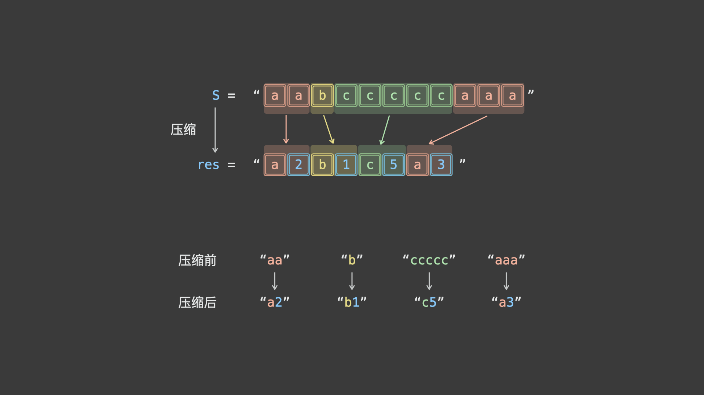

## 1. 字符串压缩

字符串压缩。利用字符重复出现的次数，编写一种方法，实现基本的字符串压缩功能。比如，字符串 aabcccccaaa 会变为 a2b1c5a3。若“压缩”后的字符串没有变短，则返回原先的字符串。你可以假设字符串中只包含大小写英文字母（a至z）。

1. 示例1

   输入："aabcccccaaa"

   输出："a2b1c5a3"

2. 示例2

   输入："abbccd"

   输出："abbccd"

   解释："abbccd"压缩后为"a1b2c2d1"，比原字符串长度更长。

提示：字符串长度在[0, 50000]范围内。


### 解法



考虑借助双指针 $i$ , $j$ 解题，算法流程为：

1. 令 i 指向字符串的首个字符，j 向前遍历，直到访问到不同字符时停止，此时 $j−i$ 便是首个字符的连续出现次数，即可完成首个字符的压缩操作。
2. 接下来，从下个字符开始，重复以上操作，直到遍历完成即可。
3. 根据题目要求，最终返回「原字符串」和「压缩字符串」中长度较短的那个。

```java
public String compressString(String S) {
    int i=0, j=0, ls = S.length();
    StringBuilder sb = new StringBuilder();
    while(i < ls) {
        while(j < ls && S.charAt(i) == S.charAt(j)) {
            j++;
        }
        sb.append(S.charAt(i)).append(j-i);
        i = j;
    }
    return sb.length() < S.length() ? sb.toString(): S;
}

```

---


## 2. 反转字符串中的元音字母

给你一个字符串 s ，仅反转字符串中的所有元音字母，并返回结果字符串。

元音字母包括 'a'、'e'、'i'、'o'、'u'，且可能以大小写两种形式出现。

1. 示例 1

   输入：s = "hello"

   输出："holle"

2. 示例 2

   输入：s = "leetcode"

   输出："leotcede"


### 解法：双指针

我们可以使用两个指针 i 和 j 对字符串相向地进行遍历。

具体地，指针 i 初始时指向字符串 s 的首位，指针 j 初始时指向字符串 s 的末位。在遍历的过程中，我们不停地将 i 向右移动，直到 i 指向一个元音字母（或者超出字符串的边界范围）；同时，我们不停地将 j 向左移动，直到 j 指向一个元音字母。此时，如果 i<j，那么我们交换 i 和 j 指向的元音字母，否则说明所有的元音字母均已遍历过，就可以退出遍历的过程。

```java
public String reverseVowels(String s) {
    char[] chars = s.toCharArray();
    int i = 0, j = chars.length-1;
    while (i < j) {
        while (i < j && !isVowel(chars[i])) i++;
        while (i < j && !isVowel(chars[j])) j--;
        swap(chars, i, j);
        i++;
        j--;
    }
    return new String(chars);
}

public boolean isVowel(char ch) {
    return "aeiouAEIOU".indexOf(ch) >= 0;
}

public void swap(char[] arr, int i, int j) {
    char temp = arr[i];
    arr[i] = arr[j];
    arr[j] = temp;
}

```

---


## 3. 找不同

给定两个字符串 s 和 t ，它们只包含小写字母。字符串 t 由字符串 s 随机重排，然后在随机位置添加一个字母。

请找出在 t 中被添加的字母。

1. 示例 1

   输入：s = "abcd", t = "abcde"

   输出："e"

   解释：'e' 是那个被添加的字母。

2. 示例 2

   输入：s = "", t = "y"

   输出："y"

**提示：**

1. 0 <= s.length <= 1000
2. t.length == s.length + 1
3. s 和 t 只包含小写字母


### 解法：求和

对组成 s、t 的字符进行求和，两者之差就是被添加的字符。

```java
public char findTheDifference(String s, String t) {
    char[] schs = s.toCharArray();
    char[] tchs = t.toCharArray();
    int sum = 0;
    for (int i = 0; i < schs.length; i++) {
        sum -= schs[i];
    }
    for (int i = 0; i < tchs.length; i++) {
        sum += tchs[i];
    }
    return (char)sum;
}

```

---


## 4. 密钥格式化

给定一个许可密钥字符串 s，仅由字母、数字字符和破折号组成。字符串由 n 个破折号分成 n + 1 组。你也会得到一个整数 k 。

我们想要重新格式化字符串 s，使每一组包含 k 个字符，除了第一组，它可以比 k 短，但仍然必须包含至少一个字符。此外，两组之间必须插入破折号，并且应该将所有小写字母转换为大写字母。

返回 重新格式化的许可密钥 。

1. 示例 1

   输入：S = "5F3Z-2e-9-w", k = 4

   输出："5F3Z-2E9W"

   解释：字符串 S 被分成了两个部分，每部分 4 个字符；注意，两个额外的破折号需要删掉。

2. 示例 2

   输入：S = "2-5g-3-J", k = 2

   输出："2-5G-3J"

   解释：字符串 S 被分成了 3 个部分，按照前面的规则描述，第一部分的字符可以少于给定的数量，其余部分皆为 2 个字符。


### 解法

首先我们取出所有不为破折号的字符，题目要求对取出的字符进行重新分组，使得每个分组恰好包含 $k$ 个字符，且必须满足第一个分组包含的字符个数必须小于等于 $k$，但至少要包含 $1$ 个字符。设已经取出的字符的总数为 $n$，只需满足第一个分组包含的字符数目刚好等于 $n \bmod k$，剩余的分组包含的字符数目刚好等于 $k$。

我们可以从字符串 $s$ 的末尾开始往前取出字符构建新的字符串 $ans$。每次取出字符时首先判断该字符是否为破折号，如果为破折号则跳过；否则将当前的字符计数 $cnt$ 加 1，同时检查如果当前字符为小写字母则将其转化为大写字母，将当前字符加入到字符串 $ans$ 的末尾。

对字符进行计数时，每隔 $k$ 个字符就在字符串 $ans$ 中添加一个破折号。特殊情况需要处理，字符串 $ans$ 的最后一个字符为破折号则将其去掉。我们对已经构建的字符串 $ans$ 进行反转即为返回结果。

```java
public String licenseKeyFormatting(String s, int k) {
    StringBuilder ans = new StringBuilder();
    int cnt = 0;

    for (int i = s.length() - 1; i >= 0; i--) {
        if (s.charAt(i) != '-') {
            cnt++;
            ans.append(Character.toUpperCase(s.charAt(i)));
            if (cnt % k == 0) {
                ans.append("-");
            }
        }
    }
    if (ans.length() > 0 && ans.charAt(ans.length() - 1) == '-') {
        ans.deleteCharAt(ans.length() - 1);
    }

    return ans.reverse().toString();
}

```

---


## 5. 反转字符串 ||

给定一个字符串 s 和一个整数 k，从字符串开头算起，每计数至 2k 个字符，就反转这 2k 字符中的前 k 个字符。

- 如果剩余字符少于 k 个，则将剩余字符全部反转。
- 如果剩余字符小于 2k 但大于或等于 k 个，则反转前 k 个字符，其余字符保持原样。

1. 示例 1

   输入：s = "abcdefg", k = 2

   输出："bacdfeg"

2. 示例 2

   输入：s = "abcd", k = 2

   输出："bacd"


### 解法：遍历

我们直接按题意进行模拟：反转每个下标从 2k2*k* 的倍数开始的，长度为 k*k* 的子串。若该子串长度不足 k*k*，则反转整个子串。

```java
public String reverseStr(String s, int k) {
    int n = s.length();
    char[] arr = s.toCharArray();
    for (int i = 0; i < n; i += 2 * k) {
        reverse(arr, i, Math.min(i + k, n) - 1);
    }
    return new String(arr);
}

public void reverse(char[] arr, int left, int right) {
    while (left < right) {
        char temp = arr[left];
        arr[left] = arr[right];
        arr[right] = temp;
        left++;
        right--;
    }
}

```

---


## 6. 计数二进制子串

给定一个字符串 `s`，统计并返回具有相同数量 `0` 和 `1` 的非空（连续）子字符串的数量，并且这些子字符串中的所有 `0` 和所有 `1` 都是成组连续的。

重复出现（不同位置）的子串也要统计它们出现的次数。

**示例1：**

```
输入：s = "00110011"
输出：6
解释：6 个子串满足具有相同数量的连续 1 和 0 ："0011"、"01"、"1100"、"10"、"0011" 和 "01" 。
注意，一些重复出现的子串（不同位置）要统计它们出现的次数。
另外，"00110011" 不是有效的子串，因为所有的 0（还有 1 ）没有组合在一起。
```

**示例2：**

```
输入：s = "10101"
输出：4
解释：有 4 个子串："10"、"01"、"10"、"01" ，具有相同数量的连续 1 和 0 。
```

**提示：**

- `1 <= s.length <= 105`
- `s[i]` 为 `'0'` 或 `'1'`


### 解法：按字符分组

我们可以将字符串 $s$ 按照 $0$ 和 $1$ 的连续段分组，存在 $countList$ 数组中。

例如 `s = 00111011`，可以得到这样的数组：`countList = {2,3,1,2}`。

这里 $countList$ 数组中两个相邻的数一定代表的是两种不同的字符。假设 $countList$ 数组中两个相邻的数字为 $u$ 或者 $v$，它们对应着 $u$ 个 $0$ 和 $v$ 个 $1$，或者 $u$ 个 $1$ 和 $v$ 个 $0$。它们能组成的满足条件的子串数目为 $min\{u,v\}$，即一对相邻的数字对答案的贡献。

我们只要遍历所有相邻的数对，求它们的贡献总和，即可得到答案。

对于 $countList$​ 中的某一个位置 $i$​，其实我们只关心 $countList[i-1]$​ 值是多少，所以可以用一个 $last$​ 变量来维护当前位置的前一个位置的 $count$​ 值，这样可以省去一个 $countList$​ 数组的空间。

代码如下：

```java
public int countBinarySubstrings(String s) {
    int ptr = 0, n = s.length(), last = 0, ans = 0;
    while (ptr < n) {
        char c = s.charAt(ptr);
        int count = 0;
        while (ptr < n && s.charAt(ptr) == c) {
            ++ptr;
            ++count;
        }
        ans += Math.min(count, last);
        last = count;
    }
    return ans;
}
```

---


## 7 字符串匹配

给你两个字符串 `haystack` 和 `needle` ，请你在 `haystack` 字符串中找出 `needle` 字符串的第一个匹配项的下标（下标从 0 开始）。如果 `needle` 不是 `haystack` 的一部分，则返回 `-1` 。

 

**示例 1：**

```
输入：haystack = "sadbutsad", needle = "sad"
输出：0
解释："sad" 在下标 0 和 6 处匹配。
第一个匹配项的下标是 0 ，所以返回 0 。
```


**示例 2：**

```
输入：haystack = "leetcode", needle = "leeto"
输出：-1
解释："leeto" 没有在 "leetcode" 中出现，所以返回 -1 。
```

 

**提示：**

- `1 <= haystack.length, needle.length <= 104`
- `haystack` 和 `needle` 仅由小写英文字符组成


### 解法：KMP算法

$Knuth-Morris-Pratt$ 算法，简称 $\text{KMP}$ 算法，算法的核心为前缀函数，记作 $\pi(i)$，其定义如下：

对于长度为 $m$ 的字符串 $s$，其前缀函数 $\pi(i)(0 \leq i < m)$ 表示 $s$ 的子串 $s[0:i]$ 最长的相等的真前缀与真后缀的长度。特别地，如果不存在符合条件的前后缀，那么 $\pi(i) = 0$。其中真前缀与真后缀的定义为不等于自身的的前缀与后缀。

我们举个例子说明：字符串 $aabaaab$ 的前缀函数值依次为 $0,1,0,1,2,2,3$。

- $\pi(0) = 0$，因为 $a$ 没有真前缀和真后缀，根据规定为 $0$ (可以发现对于任意字符串 $\pi(0)=0$ 必定成立)
- $\pi(1) = 1$，因为 $aa$ 最长的一对相等的真前后缀为 $a$，长度为 $1$
- $\pi(2) = 0$，因为 $aab$ 没有对应真前缀和真后缀，根据规定为 $0$
- $\pi(3) = 1$，因为 $aaba$ 最长的一对相等的真前后缀为 $a$，长度为 $1$
- $\pi(4) = 2$，因为 $aabaa$ 最长的一对相等的真前后缀为 $aa$，长度为 $2$
- $\pi(5) = 2$，因为 $aabaaa$ 最长的一对相等的真前后缀为 $aa$，长度为 $2$
- $\pi(6) = 3$，因为 $aabaaab$ 最长的一对相等的真前后缀为 $aab$，长度为 $3$

有了前缀函数，我们就可以快速地计算出模式串在主串中的每一次出现。


**如何求解前缀函数**

长度为 $m$ 的字符串 $s$ 的所有前缀函数的求解算法的总时间复杂度是严格 $O(m)$ 的，且该求解算法是增量算法，即我们可以一边读入字符串，一边求解当前读入位的前缀函数。

为了叙述方便，我们接下来将说明几个前缀函数的性质：

1. $\pi(i) \leq \pi(i-1) + 1$
   - 依据 $\pi(i)$ 定义得：$s[0:\pi(i)-1]=s[i-\pi(i)+1:i]$
   - 将两区间的右端点同时左移，可得：$s[0:\pi(i)-2] = s[i-\pi(i)+1:i-1]$
   - 依据 $\pi(i-1)$ 定义得：$\pi(i-1) \geq \pi(i) - 1$，即 $\pi(i) \leq \pi(i-1) + 1$

2. 如果 $s[i]=s[\pi(i-1)]$ ，那么 $\pi(i)=\pi(i-1)+1$
   - 依据 $\pi(i-1)$ 定义得：$s[0:\pi(i-1)-1]=s[i-\pi(i-1):i-1]$
   - 因为 $s[\pi(i-1)]=s[i]$ ，可得 $s[0:\pi(i-1)]=s[i-\pi(i-1):i]$
   - 依据 $\pi(i)$ 定义得：$\pi(i)\geq\pi(i-1)+1$，结合第一个性质可得 $\pi(i)=\pi(i-1)+1$

这样我们可以依据这两个性质提出求解 $\pi(i)$ 的方案：找到最大的 $j$，满足 $s[0:j−1]=s[i−j:i−1]$，且 $s[i]=s[j]$。这样就有 $s[0:j]=s[i−j:i]$，即 $\pi(i)=j+1$。

注意这里提出了两个要求：

1. $j$ 要求尽可能大，且满足 $s[0:j−1]=s[i−j:i−1]$
2. $j$ 要求满足 $s[i]=s[j]$

由 $\pi(i-1)$ 定义可知：
$$
s[0:\pi(i-1)-1]=s[i-\pi(i-1):i-1] \tag{1}
$$
那么 $j = \pi(i-1)$ 符合第一个要求。如果 $s[i]=s[\pi(i-1)]$，我们就可以确定 $\pi(i)$。

否则如果 $s[i]\neq s[\pi(i-1)]$，那么 $\pi(i) \leq \pi(i-1)$，因为 $j=\pi(i)-1$，所以 $j < \pi(i-1)$，于是可以取 $(1)$ 式两子串的长度为 $j$ 的后缀，它们依然是相等的：$s[\pi(i-1)-j:\pi(i-1)-1]=s[i-j:i-1]$。

当 $s[i]\neq s[\pi(i-1)]$ 时，我们可以修改我们的方案为：找到最大的 $j$，满足 $s[0:j-1]=s[\pi(i-1)-j:\pi(i-1)-1]$，且$s[i]=s[j]$，这样就有 $s[0:j]=s[\pi(i-1)-j:\pi(i-1)]$，即 $\pi(i)=\pi(i-1)+1$。

注意这里提出了两个要求：

1. $j$ 要求尽可能大，且满足 $s[0:j-1]=s[\pi(i-1)-j:\pi(i-1)-1]$
2. $j$ 要求满足 $s[i]=s[j]$

由 $\pi(\pi(i-1)-1)$ 定义可知 $j = \pi(\pi(i-1)-1)$ 符合第一个要求。如果 $s[i]=s[\pi(\pi(i-1)-1)]$，我们就可以确定 $\pi(i)$。

此时，我们可以发现 $j$ 的取值总是被描述为 $\pi(\pi(\pi(\ldots)-1)-1)$ 的结构，初始为 $\pi(i-1)$。于是我们可以描述我们的算法：

设定 $\pi(i)=j+1$，$j$ 的初始值为 $\pi(i-1)$。我们只需要不断迭代 $j$，令 $j$ 变为 $\pi(j-1)$，直到 $s[i]=s[j]$ 或 $j=0$ 即可，如果最终匹配成功，找到了 $j$ 使得 $s[i]=s[j]$，那么 $\pi(i)=j+1$，否则 $\pi(i)=0$​。


**复杂度证明**

时间复杂度部分，注意到 $\pi(i)\leq \pi(i-1)+1$，即每次当前位的前缀函数至多比前一位增加一，每当我们迭代一次，当前位的前缀函数的最大值都会减少。可以发现前缀函数的总减少次数不会超过总增加次数，而总增加次数不会超过 $m$ 次，因此总减少次数也不会超过 $m$ 次，即总迭代次数不会超过 $m$ 次。

空间复杂度部分，我们只用到了长度为 $m$​ 的数组保存前缀函数，以及使用了常数的空间保存了若干变量。


**如何解决本题**

记字符串 $haystack$ 的长度为 $n$，字符串 $needle$ 的长度为 $m$。

我们记字符串 $str = needle + \# + haystack$，即将字符串 $needle$ 和 $haystack$ 进行拼接，并用不存在于两串中的特殊字符 $\#$ 将两串隔开，然后我们对字符串 $str$ 求前缀函数。

因为特殊字符 $\#$ 的存在，字符串 $str$ 中 $haystack$ 部分的前缀函数所对应的真前缀必定落在字符串 $needle$ 部分，真后缀必定落在字符串 $haystack$ 部分。当 $haystack$ 部分的前缀函数值为 $m$ 时，我们就找到了一次字符串 $needle$ 在字符串 $haystack$ 中的出现，因为此时真前缀恰为字符串 $needle$。

实现时，我们可以进行一定的优化，包括：

1. 我们无需显式地创建字符串 $str$​。
   - 为了节约空间，我们只需要顺次遍历字符串 $needle$、特殊字符 $\#$ 和字符串 $haystack$ 即可。

2. 也无需显式地保存所有前缀函数的结果，而只需要保存字符串 $needle$ 部分的前缀函数即可。
   - 特殊字符 $\#$ 的前缀函数必定为 $0$，且易知 $\pi(i) \leq m$。真前缀不可能包含特殊字符 $\#$。
   - 这样我们计算 $\pi(i)$ 时，$j=\pi(\pi(\pi(\ldots)-1)-1)$ 的所有的取值中仅有 $\pi(i-1)$ 的下标可能大于等于 $m$。我们只需要保存前一个位置的前缀函数，其它的 $j$ 的取值将全部为字符串 $needle$ 部分的前缀函数。

3. 我们也无需特别处理特殊字符 $\#$，只需要注意处理字符串 $haystack$ 的第一个位置对应的前缀函数时，直接设定 $j$ 的初值为 $0$ 即可。

这样我们可以将代码实现分为两部分：

1. 第一部分是求 $needle$ 部分的前缀函数，我们需要保留这部分的前缀函数值。
2. 第二部分是求 $haystack$ 部分的前缀函数，我们无需保留这部分的前缀函数值，只需要用一个变量记录上一个位置的前缀函数值即可。当某个位置的前缀函数值等于 $m$ 时，说明我们就找到了一次字符串 $needle$ 在字符串 $haystack$ 中的出现，因为此时真前缀恰为字符串 $needle$，真后缀为以当前位置为结束位置的字符串 $haystack$​ 的子串，我们计算出起始位置，将其返回即可。

```java
class Solution {
    public int strStr(String haystack, String needle) {
        int n = haystack.length(), m = needle.length();
        if (m == 0) {
            return 0;
        }
        int[] pi = new int[m];
        for (int i = 1, j = 0; i < m; i++) {
            while (j > 0 && needle.charAt(i) != needle.charAt(j)) {
                j = pi[j - 1];
            }
            if (needle.charAt(i) == needle.charAt(j)) {
                j++;
            }
            pi[i] = j;
        }
        for (int i = 0, j = 0; i < n; i++) {
            while (j > 0 && haystack.charAt(i) != needle.charAt(j)) {
                j = pi[j - 1];
            }
            if (haystack.charAt(i) == needle.charAt(j)) {
                j++;
            }
            if (j == m) {
                return i - m + 1;
            }
        }
        return -1;
    }
}
```

