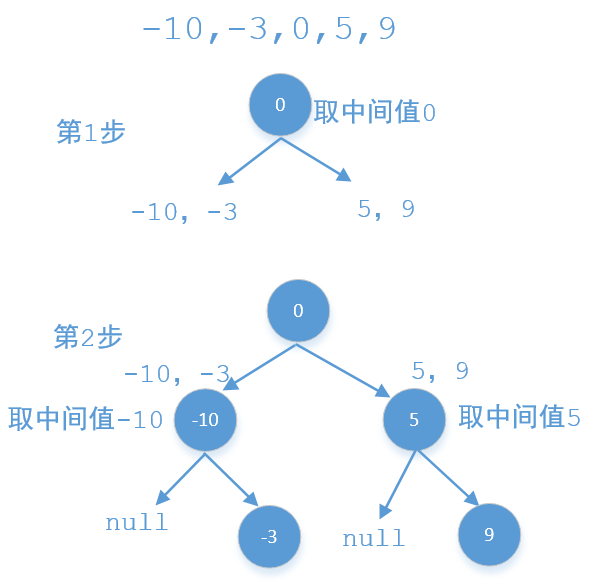
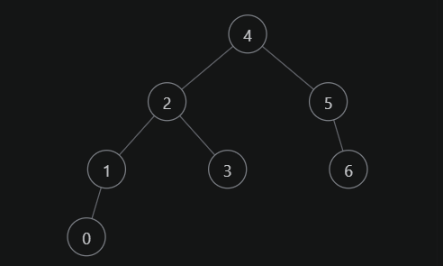

# 位运算解题

### 1. 判断字符是否唯一

实现一个算法，确定一个字符串 s 的所有字符是否全都不同。

1. 示例 1

   输入: s = "leetcode"

   输出: false 

   

2. 示例 2

   输入: s = "abc"
   
   输出: true

限制：

- $0 <= len(s) <= 100$
- 如果你不使用额外的数据结构，会很加分。


#### 解法

我们可以使用一个 int 类型的变量（下文用 **mark** 表示）来代替长度为 $26$ 的 bool数组。假设这个变量占 26 个 bit（在多数语言中，这个值一般不止26，但是，我们只需要后26位即可）。

把它看成 **000...00**(26个0)，这 26 个bit对应着 26 个字符，对于一个字符 $c$，检查对应下标的 bit 值即可判断是否重复。那么难点在于如何检查。这里我们可以通过位运算来完成。

首先计算出字符 char 离 'a' 这个字符的距离，即我们要位移的距离，用 **move\_bit** 表示，那么使用左移运算符 **1 << move\_bit** 则可以得到对应下标为 1，其余下标为 0 的数，如字符 char = 'c'，则得到的数为 **000...00100**，将这个数跟 **mark** 做 **与运算**，由于这个数只有一个位为 1，其他位为 0，那么与运算的结果中，其他位肯定是0，而对应的下标位是否为 0 则取决于之前这个字符有没有出现过，若出现过则被标记为 1，那么与运算的结果就不为 0；若之前没有出现过，则对应位的与运算的结果也是 0，那么整个结果也为 0。

最后，对于没有出现过的字符形成的数字，我们将其跟 **mark** 做 **或运算**，将对应下标位的值置为1。

```java
public static boolean isUnique(String astr) {
    int aa = 0;
    int cc = 1;
    for (int i = 0; i < astr.length(); i++) {
      char t = astr.charAt(i);
      int offset = t - 'a';

      int bb = cc << offset;
      
      // 判断该字符是否已经出现
      if ((aa & bb) != 0) {
        return false;
      }
      
      // 该字符之前未出现，标记该字符
      aa |= bb;
    }

    return true;
  }

```

---


### 2. 回文排列

给定一个字符串，编写一个函数判定其是否为某个回文串的排列之一。

回文串是指正反两个方向都一样的单词或短语。排列是指字母的重新排列。回文串不一定是字典当中的单词。

1. 示例1

   输入："tactcoa"

   输出：true（排列有"tacocat"、"atcocta"，等等）


#### 解法

利用位运算中的 **异或** 运算。

对128位的 ASCII 码的字符，如果是用 int 类型，需要 4 位，但如果使用 long 类型，只需要两位就行了。一个记录 $0-63$，一个记录 $64-127$。每一位对应一个字符。同时对 Long 型的 **1L** 进行左移操作以标识字符串中各个字符。然后进行 **异或** 运算。这样，偶数个字符对应的标识位就会为 0，奇数个字符对应的标识位就会为 1。最后统计两个记录数中 1 的个数即可，若是回文排列，则 1 的个数只能是 0或1。

1. long 型数字，highBit 记录 64-127 位字符，lowBit 记录 0-63 位字符，初值均为 0
2. 遍历字符串，对其中的每一个字符，利用 ASCII 码进行计算确定，$0-63$ 位左移对应的位数，$64-127$ 位减去 64 后左移对应的位数，然后对长整型的 **1L** 进行移位；
3. 将移位后的数组与 highBit 或 lowBit 进行 **异或** 计算；
4. 统计两个记录数中的 1 的个数。

```java
public boolean canPermutePalindrome(String s) {
    long highBit = 0, lowBit = 0;
    for(char ch: s.toCharArray()) {
        if(ch > 63) {
            highBit ^= (1L << (ch-64));
        } else {
            lowBit ^= (1L << ch);
        }
    }
    return Long.bitCount(highBit) + Long.bitCount(lowBit) <= 1;
}

```

---


### 3. 整数转换

整数转换。编写一个函数，确定需要改变几个位才能将整数A转成整数B。

1. 示例1

   输入：A = 29（11101），B = 15（01111）

   输出：2

2. 示例2

   输入：A = 1，B = 2

   输出：2

注意：A，B范围在[-2147483648, 2147483647]之间


#### 解法一：逐位遍历

由于 A，B 均不超过 32 位，因此采用逐位遍历的方式，从低位开始遍历 A 与 B，采用 **&1** 计算比较遍历到的位是否一致，采用 **count** 计数，最后返回 count 即可。

```java
public int convertInteger(int A, int B) {
    int count = 0;
    for (int i = 0; i < 32; i++) {
        if ((A&1) != (B&1)) {
            count++;
        }
        A >>= 1;
        B >>= 1;
    }
    return count;
}

```


#### 解法二：异或运算

**异或运算** 能找出 A、B 中的不同位。因此首先对 A、B 进行异或运算，在统计异或结果中 **1** 的个数即可。

把 C 中的 1 都变为0，需要几次，即为C中1的个数。**C & (C-1)** 会把 C 的最右边的 1 变为0，其余不变。

```java
public int convertInteger(int A, int B) {
    int count = 0;
    int C = A^B;
    while(C != 0) {
        C = C & (C-1);
        count++;
    }
    return count;
}

```

---


### 4. 配对交换

配对交换。编写程序，交换某个整数的奇数位和偶数位，尽量使用较少的指令（也就是说，位0与位1交换，位2与位3交换，以此类推）。

1. 示例1

   输入：num = 2（0b10）

   输出：1(0b01)

2. 示例2

   输入：num = 3

   输出：3

提示：num的范围在 [0, 2^30 - 1] 之间，不会发生整数溢出。


#### 解法

**分别取出奇数位和偶数位，移位后做 或运算。**

题目规定 num 是 int 范围的数，则

- 0x55555555 = 0b0101_0101_0101_0101_0101_0101_0101_0101
- 0xaaaaaaaa = 0b1010_1010_1010_1010_1010_1010_1010_1010

用 num 分别与这两个数做 与运算，就可以把奇数位和偶数位取出来，然后：

1. 左移奇数位，右移偶数位；
2. 奇数位和偶数位做或运算并返回。

```java
public int exchangeBits(int num) {
    // 奇数位
    int odd = num & 0x55555555;
    // 偶数位
    int even = num & 0xaaaaaaaa;

    odd <<= 1;
    even >>= 1;
    
    return odd | even;
}

```

---


### 5. 最大值

编写一个方法，找出两个数字`a`和`b`中最大的那一个。不得使用 if-else 或其他比较运算符。

1. 示例

   输入： a = 1, b = 2

   输出： 2


#### 解法

1. 首先 a - b 得到差值x；
2. 由于是long型，右移63位得到符号位，注意负号不变，那么正数右移63位就是0，负数右移63位就是-1
3. 那么得出我们的计算公式 (1 + k) * a - b * k
   - 当 x >= 0 时，k = 0, 即 a > b；计算公式为 1 * a - b * 0 = a
   - 当 x < 0 时，k = -1, 即 b > a；计算公式为 0 * a - b * ( -1 ) = b

```java
public int maximum(int a, int b) {
    long x = (long)a - (long)b;
    int k = (int) (x >> 63);
    return (1+k)*a - b*k;
}

```


---

# HashMap

### 1. 字符串能否重排

给定两个字符串 s1 和 s2，请编写一个程序，确定其中一个字符串的字符重新排列后，能否变成另一个字符串。

1. 示例 1

   输入: s1 = "abc", s2 = "bca"

   输出: true 

2. 示例 2

   输入: s1 = "abc", s2 = "bad"

   输出: false

说明：

- 0 <= len(s1) <= 100
- 0 <= len(s2) <= 100

#### 解法

一般思路就是利用哈希表记录字符以及各个字符的数量，两个字符串能重排得到相同的字符，则两个字符串的字符以及字符数量均相等。遍历两个字符串，判断两个字符串能否重排。

另一种思路就是将两个字符串以字符数组的形式保存，再进行排序。同步遍历两个排序后的数组，若出现字符不一致的情况，则判定不能重排即可。

```java
public boolean CheckPermutation(String s1, String s2) {
    if(s1.length() != s2.length()) {
        return false;
    }
    char ch;
    HashMap<Character, Integer> chars = new HashMap<Character, Integer>();
    for (int i = 0; i < s1.length(); i++) {
        ch = s1.charAt(i);
        // Java 的哈希表不能直接修改值，只能以 put 的形式来进行修改
        chars.put(ch, chars.getOrDefault(ch,0)+1);
    }
    for (int i = 0; i < s2.length(); i++) {
        ch = s2.charAt(i);
        chars.put(ch, chars.getOrDefault(ch,0)-1);
    }
    for(int x: chars.values()) {
        if (x != 0) {
            return false;
        }
    }
    return true;
}

```

---


### 2. 第一个只出现一次的字符

在字符串 s 中找出第一个只出现一次的字符。如果没有，返回一个单空格。 s 只包含小写字母。

1. 示例 1

   输入：s = "abaccdeff"

   输出：'b'

2. 示例 2

   输入：s = "" 

   输出：' '


#### 解法：类哈希思想

一般的解法便是建立一个哈希表，遍历字符串，利用键存储出现的字符，值存储字符出现的次数，然后在此遍历字符串，针对遍历到的字符，如果其在哈希表中对应的值为 1，则返回该字符。

但是，题中已经明确字符串只包含小写字符，因此，可以使用长度为 26 的整型数组代替哈希表。步骤如下。

1. 创建整型数组 count，遍历字符串，记录每个字符出现的次数。
2. 遍历字符串，针对遍历到的字符，查看 count 中其出现的次数，若为 1，返回该字符。

```java
public char firstUniqChar(String s) {
    int[] count = new int[26];
    char[] chars = s.toCharArray();
    for (char c : chars) {
        count[c - 'a']++;
    }
    for (char c : chars) {
        if (count[c-'a'] == 1) {
            return c;
        }
    }
    return ' ';
}

```

---


---

# 数组

### 1. 合并排序的数组

给定两个排序后的数组 A 和 B，其中 A 的末端有足够的缓冲空间容纳 B。 编写一个方法，将 B 合并入 A 并排序。

初始化 A 和 B 的元素数量分别为 m 和 n。

1. 示例

   输入:

   - A = [1,2,3,0,0,0], m = 3

   - B = [2,5,6],       n = 3

   输出: [1,2,2,3,5,6]

说明：A.length == n + m


#### 解法一：正向双指针

使用双指针方法。这一方法将两个数组看作队列，每次从两个数组头部取出比较小的数字放到结果中。如下面的动画所示：


我们为两个数组分别设置一个指针 $\textit{pa}$ 与 $\textit{pb}$ 来作为队列的头部指针。代码实现如下：

```java
public void merge(int[] A, int m, int[] B, int n) {
    int pa = 0;
    int pb = 0;
    int[] sorted = new int[n+m];
    int cur;
    while (pa < m || pb < n) {
        if (pb == n) {
            cur = A[pa++];
        } else if (A[pa] > B[pb]) {
            cur = B[pb++];
        } else if (pa == m) {
            cur = B[pb++];
        } else {    // 这里同时考虑 A[pa] 小于和等于 B[pb] 两种情况
            cur = A[pa++];
        }
        sorted[pa+pb-1] = cur;
    }
    for (int i = 0; i < sorted.length; i++) {
        A[i] = sorted[i];
    }
}

```


#### 解法二：逆序双指针

方法一中，之所以要使用临时变量，是因为如果直接合并到数组 **A** 中，**A** 中的元素可能会在取出之前被覆盖。那么如何直接避免覆盖 **A** 中的元素呢？观察可知，**A** 的后半部分是空的，可以直接覆盖而不会影响结果。因此可以指针设置为从后向前遍历，每次取两者之中的较大者放进 **A** 的最后面。

严格来说，在此遍历过程中的任意一个时刻，**A** 数组中有 $m-\textit{pa}-1$ 个元素被放入 **A** 的后半部，B 数组中有 $n-\textit{pb}-1$ 个元素被放入 **A** 的后半部，而在指针 $\textit{pa}$ 的后面，**A** 数组有 $m+n-\textit{pa}-1$ 个位置。由于 $m+n-\textit{pa}-1\geq m-\textit{pa}-1+n-\textit{pb}-1$ 等价于 $pb\geq -1$ 永远成立，因此 $\textit{pa}$ 后面的位置永远足够容纳被插入的元素，不会产生 $\textit{pa}$ 的元素被覆盖的情况。

```java
public void merge(int[] A, int m, int[] B, int n) {
    int pa = m - 1, pb = n - 1;
    int tail = m + n - 1;
    int cur;
    while (pa >= 0 || pb >= 0) {
        if (pa == -1) {
            cur = B[pb--];
        } else if (pb == -1) {
            cur = A[pa--];
        } else if (A[pa] > B[pb]) {
            cur = A[pa--];
        } else {
            cur = B[pb--];
        }
        A[tail--] = cur;
    }
}

```

---


### 2. 连续数列

给定一个整数数组，找出总和最大的连续数列，并返回总和。

1. 示例

   输入： [-2,1,-3,4,-1,2,1,-5,4]

   输出： 6

   解释： 连续子数组 [4,-1,2,1] 的和最大，为 6。


#### 解法：动态规划

设置两个变量：cur 和 max，

- cur：记录当前连续子序列的总和，在总和小于等于 0 的情况下，应重置为 0；
- max：记录当前连续子序列的最大值，每次与 cur 比较，不断更新 max 的值。

最后返回 max 的值。

注意：要考虑数组全为负数的情况，为此，max 的初值应该设置为 nums[0]，同时，每次更新 cur 的值后，应该立刻与 max 进行比较，更新 max 的值，再在需要的情况下，重置 cur 的值。

```java
public int maxSubArray(int[] nums) {
    int max = nums[0], cur = 0;
    for (int i = 0; i < nums.length; i++) {
        cur += nums[i];
        max = Math.max(max, cur);
        if (cur <= 0) {
            cur = 0;
        }
    }
    return max;
}

```

---


### 3. 主要元素

数组中占比超过一半的元素称之为主要元素。给你一个 整数 数组，找出其中的主要元素。若没有，返回 -1 。请设计时间复杂度为 O(N) 、空间复杂度为 O(1) 的解决方案。

1. 示例 1

   输入：[1,2,5,9,5,9,5,5,5]

   输出：5

2. 示例 2

   输入：[3,2]

   输出：-1

3. 示例 3

   输入：[2,2,1,1,1,2,2]

   输出：2


#### 解法：Boyer-Moore 投票算法

由于题目要求时间复杂度 $O(n)$ 和空间复杂度 $O(1)$，因此符合要求的解法只有 $\text{Boyer-Moore}$ 投票算法。

$\text{Boyer-Moore}$ 投票算法的基本思想是：在每一轮投票过程中，从数组中删除两个不同的元素，直到投票过程无法继续，此时数组为空或者数组中剩下的元素都相等。

1. 如果数组为空，则数组中不存在主要元素；
2. 如果数组中剩下的元素都相等，则数组中剩下的元素可能为主要元素。

$\text{Boyer-Moore}$ 投票算法的步骤如下：

1. 维护一个候选主要元素 $\textit{candidate}$ 和候选主要元素的出现次数 $\textit{count}$，初始时 $\textit{candidate}$ 为任意值，$\textit{count}=0$；
2. 遍历数组 $\textit{nums}$ 中的所有元素，遍历到元素 $x$ 时，进行如下操作：
   1. 如果 $\textit{count}=0$，则将 $x$ 的值赋给 $\textit{candidate}$，否则不更新 $\textit{candidate}$ 的值；
   2. 如果 $x=candidate$，则 $count$ 加 1，否则 $count$ 减 1。
3. 遍历结束之后，如果数组 $nums$ 中存在主要元素，则 $candidate$ 即为主要元素，否则$candidate$ 可能为数组中的任意一个元素。

由于不一定存在主要元素，因此需要第二次遍历数组，验证 $candidate$ 是否为主要元素。第二次遍历时，统计 $candidate$ 在数组中的出现次数，如果出现次数大于数组长度的一半，则$candidate$ 是主要元素，返回 $candidate$，否则数组中不存在主要元素，返回 −1。

为什么当数组中存在主要元素时，$Boyer-Moore$ 投票算法可以确保得到主要元素？

在 $Boyer-Moore$ 投票算法中，遇到相同的数则将 count 加 1，遇到不同的数则将 count 减 1。根据主要元素的定义，主要元素的出现次数大于其他元素的出现次数之和，因此在遍历过程中，主要元素和其他元素两两抵消，最后一定剩下至少一个主要元素，此时candidate 为主要元素，且 count ≥ 1。

```java
public int majorityElement(int[] nums) {
    int candidate = nums[0];
    int count = 0;
    for(int x: nums) {
        if (count == 0) {
            candidate = x;
        }
        if (x == candidate) {
            count++;
        } else {
            count--;
        }
    }
    count = 0;
    for(int x:nums) {
        if (x == candidate) {
            count++;
        }
    }
    return count>(nums.length/2)? candidate:-1;
}

```

---


### 4. 两数之和

给定一个整数数组 nums 和一个整数目标值 target，请你在该数组中找出 和为目标值 target  的那 两个 整数，并返回它们的数组下标。

你可以假设每种输入只会对应一个答案。但是，数组中同一个元素在答案里不能重复出现。你可以按任意顺序返回答案。

1. 示例 1

   输入：nums = [2,7,11,15], target = 9

   输出：[0,1]

   解释：因为 nums[0] + nums[1] == 9 ，返回 [0, 1] 。

2. 示例 2

   输入：nums = [3,2,4], target = 6

   输出：[1,2]


#### 解法：哈希表

利用哈希表保存已经遍历过的数字及其索引。

遍历数组，针对当前遍历的数字 $num$：

1. 如果 $target-num$ 存在于哈希表中，则返回对应的键值以及 num 的索引值。
2. 如果不存在，以 num 为键，索引值为值存入哈希表中。

```java
public int[] twoSum(int[] nums, int target) {;
    HashMap<Integer, Integer> map = new HashMap<Integer, Integer>();
    for (int i = 0; i < nums.length; i++) {
        if (map.containsKey(target-nums[i])) {
            return new int[]{i, map.get(target-nums[i])};
        } else {
            map.put(nums[i], i);
        }
    }
    return new int[]{};
}

```

---


### 5. 删除有序数组中的重复值

给你一个 升序排列 的数组 nums ，请你 原地 删除重复出现的元素，使每个元素 只出现一次 ，返回删除后数组的新长度。元素的 相对顺序 应该保持 一致 。

由于在某些语言中不能改变数组的长度，所以必须将结果放在数组nums的第一部分。更规范地说，如果在删除重复项之后有 k 个元素，那么 nums 的前 k 个元素应该保存最终结果。

将最终结果插入 nums 的前 k 个位置后返回 k 。

不要使用额外的空间，你必须在 原地 修改输入数组 并在使用 O(1) 额外空间的条件下完成。


#### 解法：快慢指针

这道题目的要求是：对给定的有序数组 $\textit{nums}$ 删除重复元素，在删除重复元素之后，每个元素只出现一次，并返回新的长度，上述操作必须通过原地修改数组的方法，使用 $O(1)$ 的空间复杂度完成。

由于给定的数组 $\textit{nums}$ 是有序的，因此对于任意 $i<j$，如果 $\textit{nums}[i]=\textit{nums}[j]$，则对任意 $i \le k \le j$，必有 $\textit{nums}[i]=\textit{nums}[k]=\textit{nums}[j]$，即相等的元素在数组中的下标一定是连续的。利用数组有序的特点，可以通过双指针的方法删除重复元素。

1. 如果数组 $\textit{nums}$ 的长度为 $0$，则数组不包含任何元素，因此返回 $0$。
2. 当数组 $\textit{nums}$ 的长度大于 $0$ 时，数组中至少包含一个元素，在删除重复元素之后也至少剩下一个元素，因此 $\textit{nums}[0]$ 保持原状即可，从下标 $1$ 开始删除重复元素。
3. 定义两个指针 $\textit{fast}$ 和 $\textit{slow}$ 分别为快指针和慢指针，快指针表示遍历数组到达的下标位置，慢指针表示下一个不同元素要填入的下标位置，初始时两个指针都指向下标 1。
4. 假设数组 $\textit{nums}$ 的长度为 $n$。将快指针 $\textit{fast}$ 依次遍历从 $1$ 到 $n-1$ 的每个位置，对于每个位置，如果 $\textit{nums}[\textit{fast}] \ne \textit{nums}[\textit{fast}-1]$，说明 $\textit{nums}[\textit{fast}]$ 和之前的元素都不同，因此将 $\textit{nums}[\textit{fast}]$ 的值复制到 $\textit{nums}[\textit{slow}]$，然后将 $\textit{slow}$ 的值加 1，即指向下一个位置。
5. 遍历结束之后，从 $\textit{nums}[0]$ 到 $\textit{nums}[\textit{slow}-1]$ 的每个元素都不相同且包含原数组中的每个不同的元素，因此新的长度即为 $\textit{slow}$，返回 $\textit{slow}$ 即可。


```java
public int removeDuplicates(int[] nums) {
    int n = nums.length;
    if (n == 0) {
        return 0;
    }
    int fast = 1, slow = 1;
    while (n > fast) {
        if (nums[fast] != nums[fast-1]) {
            nums[slow] = nums[fast];
            slow++;
        }
        fast++;
    }
    return slow;
}

```

---


### 6. 移除元素

给你一个数组 nums 和一个值 val，你需要 原地 移除所有数值等于 val 的元素，并返回移除后数组的新长度。

不要使用额外的数组空间，你必须仅使用 O(1) 额外空间并 原地 修改输入数组。

元素的顺序可以改变。你不需要考虑数组中超出新长度后面的元素。


#### 解法：双指针

由于数组中元素的位置可以改变，因此，使用双指针，两个指针初始时分别位于数组的首尾，向中间移动遍历该序列。

1. 如果左指针 $\textit{left}$ 指向的元素等于 $\textit{val}$，此时将右指针 $\textit{right}$ 指向的元素复制到左指针 $\textit{left}$ 的位置，然后右指针 $\textit{right}$ 左移一位。如果赋值过来的元素恰好也等于 $\textit{val}$，可以继续把右指针 $\textit{right}$ 指向的元素的值赋值过来（左指针 $\textit{left}$ 指向的等于 $\textit{val}$ 的元素的位置继续被覆盖），直到左指针指向的元素的值不等于 $\textit{val}$ 为止。
2. 当左指针 $\textit{left}$ 和右指针 $\textit{right}$ 重合的时候，左右指针遍历完数组中所有的元素。

```java
public int removeElement(int[] nums, int val) {
    int i = 0, j = nums.length-1;
    while (i <= j) {
        if (nums[i] == val) {
            nums[i] = nums[j];
            j--;
        } else {
            i++;
        }
    }
    return i;
}

```

---


---

# 字符串

### 1. 字符串压缩

字符串压缩。利用字符重复出现的次数，编写一种方法，实现基本的字符串压缩功能。比如，字符串 aabcccccaaa 会变为 a2b1c5a3。若“压缩”后的字符串没有变短，则返回原先的字符串。你可以假设字符串中只包含大小写英文字母（a至z）。

1. 示例1

   输入："aabcccccaaa"

   输出："a2b1c5a3"

2. 示例2

   输入："abbccd"

   输出："abbccd"

   解释："abbccd"压缩后为"a1b2c2d1"，比原字符串长度更长。

提示：字符串长度在[0, 50000]范围内。


#### 解法


考虑借助双指针 $i$ , $j$ 解题，算法流程为：

1. 令 i 指向字符串的首个字符，j 向前遍历，直到访问到不同字符时停止，此时 $j−i$ 便是首个字符的连续出现次数，即可完成首个字符的压缩操作。
2. 接下来，从下个字符开始，重复以上操作，直到遍历完成即可。
3. 根据题目要求，最终返回「原字符串」和「压缩字符串」中长度较短的那个。

```java
public String compressString(String S) {
    int i=0, j=0, ls = S.length();
    StringBuilder sb = new StringBuilder();
    while(i < ls) {
        while(j < ls && S.charAt(i) == S.charAt(j)) {
            j++;
        }
        sb.append(S.charAt(i)).append(j-i);
        i = j;
    }
    return sb.length() < S.length() ? sb.toString(): S;
}

```

---


---

# 链表

这里给出单链表的 Java 实现。

```java
public class utils.ListNode {
    int val;
    utils.ListNode next;

    utils.ListNode (int x) {
        val = x;
    }

}

```


### 1. 移除重复节点

编写代码，移除未排序链表中的重复节点。保留最开始出现的节点。


#### 解法一：哈希表

对给定的链表进行遍历，并用一个集合保存未出现过的值，同时删除已出现的值，为了方便操作，可增加一个哨兵节点指向头结点。这样同时解决链表为空时算法出现异常的问题。

```java
public utils.ListNode removeDuplicateNodes(utils.ListNode head) {
    HashSet<Integer> vals = new HashSet<Integer>();
    utils.ListNode pre = new utils.ListNode(0);
    pre.next = head;
    utils.ListNode node = head;
    while (node != null) {
        if(vals.contains(node.val)) {
            pre.next = node.next;
            node = node.next;
        } else {
            vals.add(node.val);
            pre = node;
            node = node.next;
        }
    }
    return head;
}

```


#### 解法二：双重遍历

考虑题目描述中的「进阶」部分，是否存在一种不使用临时缓冲区（也就是方法一中的哈希表）的方法呢？

不幸的是，在保证方法一时间复杂度 $O(N)$ 的前提下，是不存在这样的方法的。因此我们需要增加时间复杂度，使得我们可以仅使用常数的空间来完成本题。一种简单的方法是，我们在给定的链表上使用两重循环，其中第一重循环从链表的头节点开始，枚举一个保留的节点，这是因为我们保留的是「最开始出现的节点」。第二重循环从枚举的保留节点开始，到链表的末尾结束，将所有与保留节点相同的节点全部移除。

第一重循环枚举保留的节点本身，而为了编码方便，第二重循环可以枚举待移除节点的前驱节点，方便我们对节点进行移除。这样一来，我们使用「时间换空间」的方法，就可以不使用临时缓冲区解决本题了。

```java
public utils.ListNode removeDuplicateNodes(utils.ListNode head) {
    utils.ListNode ob = head;
    while (ob != null) {
        utils.ListNode oc = ob;    // 不使用 ob.next，这是为了防止在链表只有一个节点的情况下，出现异常。
        while (oc.next != null) {
            if (oc.next.val == ob.val) {
                oc.next = oc.next.next;
            } else {
                oc = oc.next;
            }
        }
        ob = ob.next;
    }
    return head;
}

```


### 2. 公共节点

给你两个单链表的头节点 headA 和 headB ，请你找出并返回两个单链表相交的起始节点。如果两个链表没有交点，返回 null 。

图示两个链表在节点 c1 开始相交：


题目数据 保证 整个链式结构中不存在环。

注意，函数返回结果后，链表必须 保持其原始结构 。

1. 示例 1

   输入：intersectVal = 8, listA = [4,1,8,4,5], listB = [5,0,1,8,4,5], skipA = 2, skipB = 3
   
   输出：Intersected at '8'
   
   解释：相交节点的值为 8 （注意，如果两个链表相交则不能为 0）。从各自的表头开始算起，链表 A 为 [4,1,8,4,5]，链表 B 为 [5,0,1,8,4,5]。在 A 中，相交节点前有 2 个节点；在 B 中，相交节点前有 3 个节点。


2. 示例 2

   输入：intersectVal = 0, listA = [2,6,4], listB = [1,5], skipA = 3, skipB = 2
   
   输出：null
   
   解释：从各自的表头开始算起，链表 A 为 [2,6,4]，链表 B 为 [1,5]。由于这两个链表不相交，所以 intersectVal 必须为 0，而 skipA 和 skipB 可以是任意值。这两个链表不相交，因此返回 null 。


提示：

1. listA 中节点数目为 m
2. listB 中节点数目为 n
3. 0 <= m, n <= 3 * 104
4. 1 <= Node.val <= 105
5. 0 <= skipA <= m
6. 0 <= skipB <= n
7. 如果 listA 和 listB 没有交点，intersectVal 为 0
8. 如果 listA 和 listB 有交点，intersectVal == listA[skipA + 1] == listB[skipB + 1]


#### 解法：双指针

设「第一个公共节点」为 node ，「链表 headA」的节点数量为 a，「链表 headB」的节点数量为 b，「两链表的公共尾部」的节点数量为 c，则有：

- 头节点 headA 到 node 前，共有 $a−c$ 个节点；
- 头节点 headB 到 node 前，共有 $b−c$ 个节点；


考虑构建两个节点指针 A , B 分别指向两链表头节点 headA , headB ，做如下操作：

1. 指针 A 先遍历完链表 headA，再开始遍历链表 headB，当走到 node 时，共走步数为：
   $$
   a + (b - c)
   $$
   
2. 指针 B 先遍历完链表 headB ，再开始遍历链表 headA ，当走到 node 时，共走步数为：
   $$
   b + (a - c)
   $$

如下式所示，此时指针 A , B 重合，并有两种情况：
$$
a + (b - c) = b + (a - c)
$$

- 若两链表有公共尾部，即$c>0$：指针 A , B 同时指向「第一个公共节点」node。
- 若两链表无公共尾部，即$c=0$：指针 A , B 同时指向 null。

因此返回 A 即可。

```java
public utils.ListNode getIntersectionNode(utils.ListNode headA, utils.ListNode headB) {
    utils.ListNode A = headA, B = headB;
    while (A != B) {
        A = (A != null ? A.next : headB);
        B = (B != null ? B.next : headA);
    }
    return A;
}

```


---

# 二叉树

### 1. 最小二叉搜索树

给定一个有序整数数组，元素各不相同且按升序排列，编写一个算法，创建一棵高度最小的二叉搜索树。

1. 示例

   给定有序数组: [-10,-3,0,5,9],

   一个可能的答案是：[0,-3,9,-10,null,5]，它可以表示下面这个高度平衡二叉搜索树：

   ```
        0 
       / \ 
     -3   9 
     /   / 
   -10  5 
   ```

   

#### 解法：递归

题中说了要转换为一棵高度平衡的二叉搜索树，并且数组又是排过序的，这就好办了，我们可以使用递归的方式，每次取数组中间的值比如m作为当前节点，m前面的值作为他左子树的结点值，m后面的值作为他右子树的节点值，示例中一个可能的结果是：



代码如下：

```java
public utils.TreeNode sortedArrayToBST(int[] nums) {
    return ArrayToBST(nums, 0, nums.length - 1);
}

public utils.TreeNode ArrayToBST(int[] nums, int start, int end) {
    if (start > end) {
        return null;
    }
    int mid = start + (end-start)/2;
    utils.TreeNode root = new utils.TreeNode(nums[mid]);
    root.left = ArrayToBST(nums, start, mid-1);
    root.right = ArrayToBST(nums, mid+1, end);
    return root;
}

```

---


### 2. 检查平衡性

实现一个函数，检查二叉树是否平衡。在这个问题中，平衡树的定义如下：任意一个节点，其两棵子树的高度差不超过 1。

1. 示例 1

   给定二叉树 [3,9,20,null,null,15,7]

   ```
       3
      / \
     9  20
       /  \
      15   7
   ```

   返回 true 。

   

2. 示例 2：

   给定二叉树 [1,2,2,3,3,null,null,4,4]

   ```
         1
        / \
       2   2
      / \
     3   3
    / \
   4   4
   ```

   返回 false 。


#### 解法：递归遍历

这道题中的平衡二叉树的定义是：二叉树的每个节点的左右子树的高度差的绝对值不超过 1，则二叉树是平衡二叉树。根据定义，一棵二叉树是平衡二叉树，当且仅当其所有子树也都是平衡二叉树，因此可以使用递归的方式判断二叉树是不是平衡二叉树，递归的顺序可以是自顶向下或者自底向上。

##### 1. 自顶向下

定义函数 $height$，用于计算二叉树中的任意一个节点 $p$ 的高度：

$$
\texttt{height}(p) = \begin{cases} 0 & p \text{ 是空节点}\\ \max(\texttt{height}(p.left), \texttt{height}(p.right))+1 & p \text{ 是非空节点} \end{cases}
$$
有了计算节点高度的函数，即可判断二叉树是否平衡。具体做法类似于二叉树的前序遍历，即对于当前遍历到的节点，首先计算左右子树的高度，如果左右子树的高度差是否不超过 1，再分别递归地遍历左右子节点，并判断左子树和右子树是否平衡。这是一个自顶向下的递归的过程。

```java
public boolean isBalanced(utils.TreeNode root) {
    if (root == null) {
        return true;
    }
    return Math.abs(height(root.left)-height(root.right)) <= 1 && (isBalanced(root.left)) && (isBalanced(root.right));
}

public int height(utils.TreeNode node) {
    if (node == null) {
        return 0;
    }
    return Math.max(height(node.left), height(node.right)) + 1;
}

```


##### 2. 自底向上

方法一由于是自顶向下递归，因此对于同一个节点，函数 $\texttt{height}$ 会被重复调用，导致时间复杂度较高。如果使用自底向上的做法，则对于每个节点，函数 $\texttt{height}$ 只会被调用一次。

自底向上递归的做法类似于后序遍历，对于当前遍历到的节点，先递归地判断其左右子树是否平衡，再判断以当前节点为根的子树是否平衡。如果一棵子树是平衡的，则返回其高度（高度一定是非负整数），否则返回 $−1$。如果存在一棵子树不平衡，则整个二叉树一定不平衡。

```java
public boolean isBalanced(utils.TreeNode root) {
    return height(root) >= 0;
}

public int height(utils.TreeNode root) {
    if (root == null) {
        return 0;
    }
    int leftHeight = height(root.left);
    int rightHeight = height(root.right);
    if (leftHeight == -1 || rightHeight == -1 || Math.abs(leftHeight - rightHeight) > 1) {
        return -1;
    } else {
        return Math.max(leftHeight, rightHeight) + 1;
    }
}

```

---


### 3. 二叉搜索树转换单链表

二叉树数据结构 utils.TreeNode 可用来表示单向链表（其中 left 置空，right 为下一个链表节点）。实现一个方法，把二叉搜索树转换为单向链表，要求依然符合二叉搜索树的性质，转换操作应是原址的，也就是在原始的二叉搜索树上直接修改。

返回转换后的单向链表的头节点。

1. 示例

   输入： [4,2,5,1,3,null,6,0]

   输出： [0,null,1,null,2,null,3,null,4,null,5,null,6]


#### 解法：逆中序遍历

1. 二叉搜索树通过中序遍历，可以得到升序的结果。那么在进行中序遍历的时候，记录一下前一个结点，然后让前一个节点的右指针指向当前节点，即可按升序连成链表。
   可以采用递归方式遍历，并使用成员变量记录前一个结点。
2. 注意到，如果按照一般的中序遍历（左，根，右），遍历结束后，确实形成了一个链表，但最终记录的结点是最右边的节点，即链表尾结点，而题目要求返回头结点。所以，我们可以从尾部到头部连接链表，即逆中序遍历（右，根，左），遍历过程中连接节点，遍历结束后，记录的是最左的结点，该节点即为链表头结点。
3. 注意要置空左指针，并且要在遍历完左子树之后再置空。

举例：



如示例中，逆中序的遍历顺序为：6,5,4,3,2,1,0，当遍历到结点2时，6,5,4,3已经遍历过，此时记录的结点为3，修改当前结点2的右指针，使其指向结点3，并修改记录的结点minNode为结点2，接着遍历结点2的左子树。

```java
import utils.TreeNode;

class leetcode.Solution {

   TreeNode minNode;

   public TreeNode convertBiNode (TreeNode root) {
      reverseInorder(root);
      return minNode;
   }

   private void reverseInorder (TreeNode root) {
      if (root == null) {
         return;
      }
      // 遍历右子树
      reverseInorder(root.right);
      // 遍历根节点，根节点是右子树的前驱节点
      root.right = minNode;
      minNode = root;
      //遍历左子树
      reverseInorder(root.left);
      //置空左指针
      root.left = null;
   }
}

```

---

# 栈与队列

### 1. 使用两个栈实现队列

用两个栈实现一个队列。队列的声明如下，请实现它的两个函数 appendTail 和 deleteHead ，分别完成在队列尾部插入整数和在队列头部删除整数的功能。(若队列中没有元素，deleteHead 操作返回 -1 )


#### 解法

使用两个栈实现队列，则一个栈进行入队操作，一个栈进行出队操作。记录两个栈分别为 stack1、stack2。其中，stack1 进行入队操作，stack2 进行出队操作。

1. 入队操作：将要入队列的元素直接进栈 stack1 即可。
2. 出队操作：首先确定 stack2 是否为空，若 stack2 不为空，则直接弹出 stack2 的栈顶元素即可；若 stack2 为空，则判断 stack1 是否为空，若 stack1 也为空，即队中无元素，返回 -1；若 stack1 不为空，则将 stack1 中的元素全部进栈 stack2，再返回 stack2 的栈顶元素即可。

```java
public class CQueue {
    private Stack<Integer> stack1;    // 入队列
    private Stack<Integer> stack2;    // 出队列

    public CQueue () {
        stack1 = new Stack<Integer>();
        stack2 = new Stack<Integer>();
    }

    public void appendTail(int value) {
        stack1.push(value);
    }

    public int deleteHead() {
        if (!stack2.isEmpty()) {
             return stack2.pop();
        }
        if (stack1.isEmpty()) {
            return -1;
        } else {
            while (!stack1.isEmpty()) {
                stack2.push(stack1.pop());
            }
            return stack2.pop();
        }
    }
}

```

---


### 2. 包含min函数的栈

定义栈的数据结构，请在该类型中实现一个能够得到栈的最小元素的 min 函数在该栈中，调用 min、push 及 pop 的时间复杂度都是 O(1)。

1. 示例

   MinStack minStack = new MinStack();

   minStack.push(-2);

   minStack.push(0);

   minStack.push(-3);

   minStack.min();   --> 返回 -3.

   minStack.pop();

   minStack.top();      --> 返回 0.

   minStack.min();   --> 返回 -2.


#### 解法：双栈实现一个栈

普通栈的 push() 和 pop() 函数的复杂度为 $O(1)$；而获取栈最小值 min() 函数需要遍历整个栈，复杂度为 $O(N)$。为将 min() 函数复杂度降为 $O(1)$，可通过建立辅助栈实现。

1. 数据栈 $A$ ：栈 A 用于存储所有元素，保证入栈 push()、pop()、top()的正常逻辑。
2. 辅助栈 $B$ ：栈 B 中存储栈 A 中所有 非严格降序 的元素，则栈 A 中的最小元素始终对应栈 B 的栈顶元素，即 min() 函数只需返回栈 B 的栈顶元素即可。因此，只需设法维护好栈 B 的元素，使其保持非严格降序，即可实现 min() 函数的 $O(1)$ 复杂度。

函数设计:

1. push(x) 函数： 重点为保持栈 B 的元素是 非严格降序 的。
   - 将 x 压入栈 A（即 A.add(x) ）；
   - 若 ① 栈 B 为空 或 ② x 小于等于 栈 B 的栈顶元素，则将 x 压入栈 B。

2. pop() 函数： 重点为保持栈 A, B 的 元素一致性 。
   - 执行栈 A 出栈（即 A.pop() ），将出栈元素记为 y；
   - 若 y 等于栈 B 的栈顶元素，则执行栈 B 出栈（即 B.pop() ）。

3. top() 函数：直接返回栈 A 的栈顶元素即可，即返回 A.peek() 。

4. min() 函数：直接返回栈 B 的栈顶元素即可，即返回 B.peek() 。

```java
import java.util.Stack;

class MinStack {

    private Stack<Integer> min;
    private Stack<Integer> stack;

    /** initialize your data structure here. */
    public MinStack() {
        stack = new Stack<Integer>();
        min = new Stack<Integer>();
    }

    public void push(int x) {
        stack.push(x);
        // 这里是 小于等于 符号，因为 B 维护的是栈中所有的元素的非严格降序排列
        // 若去掉等于符号，因为最小值可能存在多个，B 中对最小值的记录可能不全面
        if (min.isEmpty() || x <= min.peek()) {
            min.push(x);
        }
    }

    public void pop() {
        if (stack.pop().equals(min.peek())) {
            min.pop();
        }
    }

    public int top() {
        return stack.peek();
    }

    public int min() {
        return min.peek();
    }
}

```


---

# 动态规划

### 1. 翻转数位

给定一个32位整数 num，你可以将一个数位从0变为1。请编写一个程序，找出你能够获得的最长的一串1的长度。

1. 示例 1

   输入: num = 1775 (11011101111)

   输出: 8

2. 示例 2

   输入: num = 7(0111)

   输出: 4


#### 解法：动态规划，逐位遍历

本题使用动态规划解决比较容易：使用用两个动态规划数组 current[]，reverse[]

- **current[i]** 表示包含第 $i$ 位的从num二进制低位至第 $i$ 位 连续1的最长长度。
- **reverse[i]** 表示包含第 $i$ 位的从低位到第 $i$ 位最多翻转1个0->1 的连续1的最长长度。
- 用 **num[i]** 表示整数 num 第 $i$ 位的值

当 **num[i]=1** 时，**current[i] = current[i-1]+1**，因为 **current[i-1]** 一定包含 **i-1** 位，也就是和第 $i$ 位连续，所以前 $i-1$ 的最大长度连上第 $i$ 位的长度就等于 **current[i]**，同理 **reverse[i] = reverse[i-1]+1**;

当 **num[i]=0** 时，连续中断，**current[i]=0**，而 **reverse[i]** 允许翻转1次，但是**reverse[i]** 又必须包含第 $i$ 位，也就是说只能翻转第 $i$ 位，所以前面不能出现翻转，必须全是1，这个长度恰好就是 **current[i-1]**，所以 **reverse[i] = current[i-1]+1**。

遍历 num 所有位数，也就是32位后，reverse 数组中的最大值就是答案。

状态方程：

1. **current[i] = num[i] == 1? current[i-1]+1: 0**
2. **reverse[i] = num[i] == 1? reverse[i-1]+1: current[i-1]+1**

观察状态方程，我们发现 current 和 reverse 第 $i$ 位只和第 $i-1$ 位有关，所以可以把动态数组优化成两个变量 current 和 reverse，同时更新最大值 max 并作为结果返回。

```java
public int reverseBits(int num) {
    int current = 0;
    int reverse = 0;
    int max = 0;
    for (int i = 0; i < 32; i++) {
        if ((num & 1) == 1) {
            current++;
            reverse++;
        } else {
            reverse = current+1;
            current = 0;
        }
        if (reverse > max) {
            max = reverse;
        }
        num >>= 1;
    }
    return max;
}

```

---


### 2. 三步问题

三步问题。有个小孩正在上楼梯，楼梯有n阶台阶，小孩一次可以上1阶、2阶或3阶。实现一种方法，计算小孩有多少种上楼梯的方式。结果可能很大，你需要对结果模1000000007。

1. 示例1

   输入：n = 3 

   输出：4

   说明: 有四种走法

2. 示例2

   输入：n = 5

   输出：13

提示：n 范围在 [1, 1000000] 之间。


#### 解法：动态规划

**动态规划思想是希望连续的，也就是说上一个状态和下一个状态(自变量)之间有关系而且连续**。

$dp[i]$：表示爬到第 $i$ 阶楼梯所有的上楼的方式。

当爬第 $i$ 个阶梯时，有三种可能：

1. 从第 $i−1$ 个阶梯爬上来的（选择只爬一层）；
2. 从第 $i−2$ 个阶梯爬上来的（选择爬两层）；
3. 从第 $i−3$ 个阶梯爬上来的（选择爬三层）。

所以，爬到第 $i$ 个阶梯与 $dp[i - 1]、dp[i - 2]、dp[i - 3]$ 都有关系，则状态转移方程：
$$
dp[i] = dp[i - 1] + dp[i - 2] + dp[i - 3]
$$
初始化：由于直接操作了 $dp[i−1]、dp[i−2]、dp[i−3]$，所以 dp[1] = 1，dp[2] = 2，dp[3] = 4（即爬上第 3 层台阶有 4 中方法：[1, 1, 1]，[1, 2]，[2, 1]，[3]）。

注意：$dp[i - 1] + dp[i - 2]$ 在相加时会出现溢出的情况，所以要进行取模操作，并且每次得到一个 $dp[i]$ 后都要对它进行取模操作。

```java
public int waysToStep(int n) {
    if (n == 1) {
        return 1;
    }
    if (n == 2) {
        return 2;
    }
    if (n == 3) {
        return 4;
    }
    int[] dp = new int[n+1];
    dp[1] = 1;
    dp[2] = 2;
    dp[3] = 4;
    for (int i = 4; i < n+1; i++) {
        dp[i] = (dp[i-1] + dp[i-2])%1000000007 + dp[i-3];
        dp[i] %= 1000000007;
    }
    return dp[n];
}

```

---


### 3. 按摩师问题

一个有名的按摩师会收到源源不断的预约请求，每个预约都可以选择接或不接。在每次预约服务之间要有休息时间，因此她不能接受相邻的预约。给定一个预约请求序列，替按摩师找到最优的预约集合（总预约时间最长），返回总的分钟数。

1. 示例 1

   输入： [1,2,3,1]

   输出： 4

   解释： 选择 1 号预约和 3 号预约，总时长 = 1 + 3 = 4。

2. 示例 2

   输入： [2,7,9,3,1]

   输出： 12

   解释： 选择 1 号预约、 3 号预约和 5 号预约，总时长 = 2 + 9 + 1 = 12。

3. 示例 3

   输入： [2,1,4,5,3,1,1,3]

   输出： 12

   解释： 选择 1、3、5、8 号预约，总时长 = 2 + 4 + 3 + 3 = 12。


#### 解法

定义 $dp[i][0]$ 表示考虑前 $i$ 个预约，第 $i$ 个预约不接的最长预约时间，$dp[i][1]$ 表示考虑前 $i$ 个预约，第 $i$ 个预约接的最长预约时间。

从前往后计算 $dp$ 值，假设我们已经计算出前 $i−1$ 个 $dp$ 值，考虑计算 $dp[i][0/1]$ 的答案。

1. 首先考虑 $dp[i][0]$ 的转移方程，由于这个状态下第 $i$ 个预约是不接的，所以第 $i−1$ 个预约接或不接都可以，故可以从 $dp[i−1][0]$ 和 $dp[i−1][1]$ 两个状态转移过来，转移方程即为：$dp[i][0]=max(dp[i−1][0],dp[i−1][1])$
2. 对于 $dp[i][1]$ ，由于这个状态下第 $i$ 个预约要接，根据题目要求按摩师不能接受相邻的预约，所以第 $i−1$ 个预约不能接受，故我们只能从 $dp[i−1][0]$ 这个状态转移过来，转移方程即为：$dp[i][1]=dp[i−1][0]+nums_i$。其中 $nums_i$ 表示第 $i$ 个预约的时长。
3. 最后答案即为 $max(dp[n][0],dp[n][1])$ ，其中 n 表示预约的个数。

再回来看转移方程，我们发现计算 $dp[i][0/1]$ 时，只与前一个状态 $dp[i−1][0/1]$ 有关，所以我们可以不用开数组，只用两个变量 $dp_0$，$dp_1$ 分别存储 $dp[i−1][0]$ 和 $dp[i−1][1]$ 的答案，然后去转移更新答案即可。


---

# 递归

### 1. 汉诺塔问题

在经典汉诺塔问题中，有 3 根柱子及 N 个不同大小的穿孔圆盘，盘子可以滑入任意一根柱子。一开始，所有盘子自上而下按升序依次套在第一根柱子上（即每一个盘子只能放在更大的盘子上面）。移动圆盘时受到以下限制：

1. 每次只能移动一个盘子;
2. 盘子只能从柱子顶端滑出移到下一根柱子;
3. 盘子只能叠在比它大的盘子上。

请编写程序，用栈将所有盘子从第一根柱子移到最后一根柱子。你需要原地修改栈。

1. 示例1

   输入：A = [2, 1, 0], B = [], C = []

   输出：C = [2, 1, 0]

2. 示例2

   输入：A = [1, 0], B = [], C = []

   输出：C = [1, 0]

提示：A中盘子的数目不大于14个。


#### 解法：三步递归

采用递归的思路，三要素如下：

1. 递归结束条件：只剩下最后一个盘子需要移动

2. 递归函数主功能：

   - 首先将 n-1 个盘子，从第一个柱子移动到第二个柱子；
   - 然后将最后一个盘子移动到第三个柱子上；
   - 最后将第二个柱子上的 n-1 个盘子，移动到第三个柱子上

3. 函数的等价关系式：

   f(n,A,B,C) 表示将n个盘子从A移动到C

   $f(n,A,B,C) = f(n-1,A,C,B) + f(1,A,B,C) + f(n-1,B,A,C)$

```java
public void hanota(List<Integer> A, List<Integer> B, List<Integer> C) {
    movePlant(A.size(),A,B,C);
}

/**
 * size      需要移动的盘子的数量
 * start     起始的柱子
 * auxiliary 辅助柱子
 * target    目标柱子
 */
public void movePlant(int size,List<Integer> start,List<Integer> auxiliary,List<Integer> target){
    //当只剩一个盘子时，直接将它从第一个柱子移动到第三个柱子
    if(size == 1){
        target.add(start.remove(start.size()-1));
        return;
    }
    //首先将 n-1 个盘子，从第一个柱子移动到第二个柱子
    movePlant(size - 1,start,target,auxiliary);
    
    //然后将最后一个盘子移动到第三个柱子上
    target.add(start.remove(start.size()-1));
    
    //最后将第二个柱子上的 n-1 个盘子，移动到第三个柱子上
    movePlant(size - 1,auxiliary,start,target);
}

```

---

# 分治

### 1. 最长公共前缀

编写一个函数来查找字符串数组中的最长公共前缀。

如果不存在公共前缀，返回空字符串 ""。

1. 示例 1

   输入：strs = ["flower","flow","flight"]

   输出："fl"

2. 示例 2

   输入：strs = ["dog","racecar","car"]

   输出：""

   解释：输入不存在公共前缀。


#### 解法

用 $\textit{LCP}(S_1 \ldots S_n)$ 表示字符串 $S_1 \ldots S_n$ 的最长公共前缀。可以得到以下结论：
$$
\textit{LCP}(S_1 \ldots S_n) = \textit{LCP}(\textit{LCP}(\textit{LCP}(S_1, S_2),S_3),\ldots S_n)
$$
注意到 $\textit{LCP}$ 的计算满足结合律，有以下结论：

$$
\textit{LCP}(S_1 \ldots S_n) = \textit{LCP}(\textit{LCP}(S_1 \ldots S_k), \textit{LCP} (S_{k+1} \ldots S_n))
$$
其中 $\textit{LCP}(S_1 \ldots S_n)$ 是字符串 $S_1 \ldots S_n$ 的最长公共前缀，$1 < k < n$。

基于上述结论，可以使用分治法得到字符串数组中的最长公共前缀。对于问题 $\textit{LCP}(S_i\cdots S_j)$，可以分解成两个子问题 $\textit{LCP}(S_i \ldots S_{mid})$ 与 $\textit{LCP}(S_{mid+1} \ldots S_j)$，其中 $mid=\frac{i+j}{2}$。对两个子问题分别求解，然后对两个子问题的解计算最长公共前缀，即为原问题的解。

```java
// 返回字符串数组的最长公共前缀
public String longestCommonPrefix(String[] strs) {
    if (strs == null || strs.length == 0) {
        return "";
    } else {
        return longestCommonPrefix(strs, 0, strs.length-1);
    }
}

/**
 * 分治算法
 * @param strs  原始数组
 * @param start 子数组起始索引
 * @param end   子数组结束索引
 * @return 最长公共前缀
 */
public String longestCommonPrefix(String[] strs, int start, int end) {
    if (start == end) {
        return strs[start];
    } else {
        int mid = (end - start ) / 2 + start;
        // 分治，计算左边子数组的最长公共前缀
        String lcpLeft = longestCommonPrefix(strs, start, mid);
        
        // 分治，计算右边子数组的最长公共前缀
        String lcpRight = longestCommonPrefix(strs, mid+1, end);
        
        // 比较两个公共前缀，返回其公共部分
        return commonPrefix(lcpLeft, lcpRight);
    }
}

// 返回两个字符串的最长公共前缀
public String commonPrefix(String lcpLeft, String lcpRight) {
    int minLength = Math.min(lcpLeft.length(), lcpRight.length());
    for (int i = 0; i < minLength; i++) {
        if (lcpLeft.charAt(i) != lcpRight.charAt(i)) {
            return lcpLeft.substring(0, i);
        }
    }
    return lcpLeft.substring(0, minLength);
}

```

---


---

# 数学问题

### 1. 阶乘尾数

设计一个算法，算出 n 阶乘有多少个尾随零。

1. 示例 1

   输入: 3

   输出: 0

   解释: 3! = 6, 尾数中没有零。

2. 示例 2

   输入: 5

   输出: 1

   解释: 5! = 120, 尾数中有 1 个零.


#### 解法

1. 尾数的0都是某一个数乘以10得到的
2. 只有5和一个偶数相乘会得到10或10的倍数，所以有几个5就有几个10，就有几个0
3. 在数的阶乘中，偶数的个数明显多于5的个数，所以只要计算出阶乘中每个数的因数中5的个数，即可得到0的个数。比如26! = 403291461126605635584000000‬，有6个0，【5贡献一个0，10贡献一个0，15贡献一个0，20贡献一个0，25贡献两个0】
4. 但因为25和它的倍数，如50，里面都有两个5，所以遇到25和其倍数都要+2。同理125和它的倍数，如250，里面都有3个5，所以遇到125和其倍数都要+3。所以从n除完5后，再除以25，125，依次类推，这样才不会遗漏。

```java
public int trailingZeroes(int n) {
    int ans = 0;
    while (n > 0) {
        ans += n/5;    // 以 5个数 为一组，有多少组就说明有多少个5
        n /= 5;        // 25、125 等数字中有多个 5，为此，再以 25个数为一组，有多少组就有多少个5，添加到以统计的 5 的个数中去。125等情况以此类推
    }
    return ans;
}

```

---


