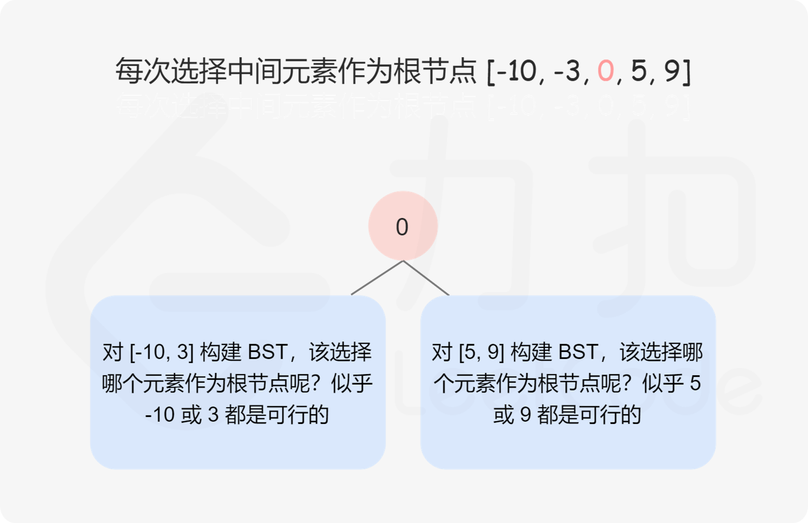

# 位运算解题

### 1. 判断字符是否唯一

实现一个算法，确定一个字符串 s 的所有字符是否全都不同。

1. 示例 1

   输入: s = "leetcode"

   输出: false 

   

2. 示例 2

   输入: s = "abc"
   
   输出: true

限制：

- $0 <= len(s) <= 100$
- 如果你不使用额外的数据结构，会很加分。


#### 解法

我们可以使用一个 int 类型的变量（下文用 **mark** 表示）来代替长度为 $26$ 的 bool数组。假设这个变量占 26 个 bit（在多数语言中，这个值一般不止26，但是，我们只需要后26位即可）。

把它看成 **000...00**(26个0)，这 26 个bit对应着 26 个字符，对于一个字符 $c$，检查对应下标的 bit 值即可判断是否重复。那么难点在于如何检查。这里我们可以通过位运算来完成。

首先计算出字符 char 离 'a' 这个字符的距离，即我们要位移的距离，用 **move\_bit** 表示，那么使用左移运算符 **1 << move\_bit** 则可以得到对应下标为 1，其余下标为 0 的数，如字符 char = 'c'，则得到的数为 **000...00100**，将这个数跟 **mark** 做 **与运算**，由于这个数只有一个位为 1，其他位为 0，那么与运算的结果中，其他位肯定是0，而对应的下标位是否为 0 则取决于之前这个字符有没有出现过，若出现过则被标记为 1，那么与运算的结果就不为 0；若之前没有出现过，则对应位的与运算的结果也是 0，那么整个结果也为 0。

最后，对于没有出现过的字符形成的数字，我们将其跟 **mark** 做 **或运算**，将对应下标位的值置为1。

```java
public static boolean isUnique(String astr) {
    int aa = 0;
    int cc = 1;
    for (int i = 0; i < astr.length(); i++) {
      char t = astr.charAt(i);
      int offset = t - 'a';

      int bb = cc << offset;
      
      // 判断该字符是否已经出现
      if ((aa & bb) != 0) {
        return false;
      }
      
      // 该字符之前未出现，标记该字符
      aa |= bb;
    }

    return true;
  }

```

---


### 2. 回文排列

给定一个字符串，编写一个函数判定其是否为某个回文串的排列之一。

回文串是指正反两个方向都一样的单词或短语。排列是指字母的重新排列。回文串不一定是字典当中的单词。

1. 示例1

   输入："tactcoa"

   输出：true（排列有"tacocat"、"atcocta"，等等）


#### 解法

利用位运算中的 **异或** 运算。

对128位的 ASCII 码的字符，如果是用 int 类型，需要 4 位，但如果使用 long 类型，只需要两位就行了。一个记录 $0-63$，一个记录 $64-127$。每一位对应一个字符。同时对 Long 型的 **1L** 进行左移操作以标识字符串中各个字符。然后进行 **异或** 运算。这样，偶数个字符对应的标识位就会为 0，奇数个字符对应的标识位就会为 1。最后统计两个记录数中 1 的个数即可，若是回文排列，则 1 的个数只能是 0或1。

1. long 型数字，highBit 记录 64-127 位字符，lowBit 记录 0-63 位字符，初值均为 0
2. 遍历字符串，对其中的每一个字符，利用 ASCII 码进行计算确定，$0-63$ 位左移对应的位数，$64-127$ 位减去 64 后左移对应的位数，然后对长整型的 **1L** 进行移位；
3. 将移位后的数组与 highBit 或 lowBit 进行 **异或** 计算；
4. 统计两个记录数中的 1 的个数。

```java
public boolean canPermutePalindrome(String s) {
    long highBit = 0, lowBit = 0;
    for(char ch: s.toCharArray()) {
        if(ch > 63) {
            highBit ^= (1L << (ch-64));
        } else {
            lowBit ^= (1L << ch);
        }
    }
    return Long.bitCount(highBit) + Long.bitCount(lowBit) <= 1;
}

```

---


### 3. 整数转换

整数转换。编写一个函数，确定需要改变几个位才能将整数A转成整数B。

1. 示例1

   输入：A = 29（11101），B = 15（01111）

   输出：2

2. 示例2

   输入：A = 1，B = 2

   输出：2

注意：A，B范围在[-2147483648, 2147483647]之间


#### 解法一：逐位遍历

由于 A，B 均不超过 32 位，因此采用逐位遍历的方式，从低位开始遍历 A 与 B，采用 **&1** 计算比较遍历到的位是否一致，采用 **count** 计数，最后返回 count 即可。

```java
public int convertInteger(int A, int B) {
    int count = 0;
    for (int i = 0; i < 32; i++) {
        if ((A&1) != (B&1)) {
            count++;
        }
        A >>= 1;
        B >>= 1;
    }
    return count;
}

```


#### 解法二：异或运算

**异或运算** 能找出 A、B 中的不同位。因此首先对 A、B 进行异或运算，在统计异或结果中 **1** 的个数即可。

把 C 中的 1 都变为0，需要几次，即为C中1的个数。**C & (C-1)** 会把 C 的最右边的 1 变为0，其余不变。

```java
public int convertInteger(int A, int B) {
    int count = 0;
    int C = A^B;
    while(C != 0) {
        C = C & (C-1);
        count++;
    }
    return count;
}

```

---


### 4. 配对交换

配对交换。编写程序，交换某个整数的奇数位和偶数位，尽量使用较少的指令（也就是说，位0与位1交换，位2与位3交换，以此类推）。

1. 示例1

   输入：num = 2（0b10）

   输出：1(0b01)

2. 示例2

   输入：num = 3

   输出：3

提示：num的范围在 [0, 2^30 - 1] 之间，不会发生整数溢出。


#### 解法

**分别取出奇数位和偶数位，移位后做 或运算。**

题目规定 num 是 int 范围的数，则

- 0x55555555 = 0b0101_0101_0101_0101_0101_0101_0101_0101
- 0xaaaaaaaa = 0b1010_1010_1010_1010_1010_1010_1010_1010

用 num 分别与这两个数做 与运算，就可以把奇数位和偶数位取出来，然后：

1. 左移奇数位，右移偶数位；
2. 奇数位和偶数位做或运算并返回。

```java
public int exchangeBits(int num) {
    // 奇数位
    int odd = num & 0x55555555;
    // 偶数位
    int even = num & 0xaaaaaaaa;

    odd <<= 1;
    even >>= 1;
    
    return odd | even;
}

```

---


### 5. 最大值

编写一个方法，找出两个数字`a`和`b`中最大的那一个。不得使用 if-else 或其他比较运算符。

1. 示例

   输入： a = 1, b = 2

   输出： 2


#### 解法

1. 首先 a - b 得到差值x；
2. 由于是long型，右移63位得到符号位，注意负号不变，那么正数右移63位就是0，负数右移63位就是-1
3. 那么得出我们的计算公式 (1 + k) * a - b * k
   - 当 x >= 0 时，k = 0, 即 a > b；计算公式为 1 * a - b * 0 = a
   - 当 x < 0 时，k = -1, 即 b > a；计算公式为 0 * a - b * ( -1 ) = b

```java
public int maximum(int a, int b) {
    long x = (long)a - (long)b;
    int k = (int) (x >> 63);
    return (1+k)*a - b*k;
}

```

---


### 6. 只出现一次的数字

给定一个**非空**整数数组，除了某个元素只出现一次以外，其余每个元素均出现**两次**。找出那个只出现了一次的元素。

说明：你的算法应该具有线性时间复杂度。 你可以不使用额外空间来实现吗？

1. 示例 1

   输入: [2,2,1]

   输出: 1


#### 解法：异或运算

异或运算有以下三个性质：

1. 任何数和 0 做异或运算，结果仍然是原来的数，即 $a \oplus 0=a$。
2. 任何数和其自身做异或运算，结果是 0，即 $a \oplus a=0$。
3. 异或运算满足交换律和结合律，即 $a \oplus b \oplus a=b \oplus a \oplus a=b \oplus (a \oplus a)=b \oplus0=b$。

假设数组中有 2m+1 个数，其中有 m 个数各出现两次，一个数出现一次。令 $a_{1}、a_{2}、\ldots、a_{m}$ 为出现两次的 m 个数，$a_{m+1}$ 为出现一次的数。根据性质 3，数组中的全部元素的异或运算结果总是可以写成如下形式：
$$
(a_{1} \oplus a_{1}) \oplus (a_{2} \oplus a_{2}) \oplus \cdots \oplus (a_{m} \oplus a_{m}) \oplus a_{m+1}
$$
根据性质 2 和性质 1，上式可化简和计算得到如下结果：
$$
0 \oplus 0 \oplus \cdots \oplus 0 \oplus a_{m+1}=a_{m+1}
$$
因此，数组中的全部元素的异或运算结果即为数组中只出现一次的数字。

```java
public int singleNumber(int[] nums) {
    int ans = nums[0];
    for (int i = 1; i < nums.length; i++) {
        ans ^= nums[i];
    }
    return ans;
}

```

---


### 7. 颠倒二进制位

颠倒给定的 32 位无符号整数的二进制位。

**提示：**请注意，在某些语言（如 Java）中，没有无符号整数类型。在这种情况下，输入和输出都将被指定为有符号整数类型，并且不应影响您的实现，因为无论整数是有符号的还是无符号的，其内部的二进制表示形式都是相同的。在 Java 中，编译器使用二进制补码记法来表示有符号整数。因此，在 示例 2 中，输入表示有符号整数 -3，输出表示有符号整数 -1073741825。

1. 示例 1

   输入：n = 00000010100101000001111010011100

   输出：964176192 (00111001011110000010100101000000)

   解释：输入的二进制串 00000010100101000001111010011100 表示无符号整数 43261596，因此返回 964176192，其二进制表示形式为00111001011110000010100101000000。


#### 解法：逐位颠倒

将 $n$ 视作一个长为 $32$ 的二进制串，从低位往高位枚举 $n$ 的每一位，将其倒序添加到翻转结果 $\textit{rev}$ 中。

代码实现中，每枚举一位就将 n 右移一位，这样当前 n 的最低位就是我们要枚举的比特位。当 n 为 0 时即可结束循环。

需要注意的是，在某些语言（如 $\texttt{Java}$）中，没有无符号整数类型，因此对 n 的右移操作应使用逻辑右移。

```java
public int reverseBits(int n) {
    int rev = 0;
    for (int i = 0; i < 32 && n != 0; ++i) {
        rev |= (n & 1) << (31 - i);
        n >>>= 1;
    }
    return rev;
}

```

---


### 8. 位1的个数

编写一个函数，输入是一个无符号整数（以二进制串的形式），返回其二进制表达式中数字位数为 '1' 的个数（也被称为汉明重量）。

 **提示：**请注意，在某些语言（如 Java）中，没有无符号整数类型。在这种情况下，输入和输出都将被指定为有符号整数类型，并且不应影响您的实现，因为无论整数是有符号的还是无符号的，其内部的二进制表示形式都是相同的。

1. 示例 1

   输入：00000000000000000000000000001011

   输出：3

   解释：输入的二进制串 00000000000000000000000000001011 中，共有三位为 '1'。


#### 解法一：逐位检查

我们可以直接循环检查给定整数 n 的二进制位的每一位是否为 1。

```java
public int hammingWeight(int n) {
    int count = 0;
    while (n != 0) {
       count += (n&1);
       // 由于 Java 中没有无符号整数类型，所以应使用逻辑右移
       n >>>= 1;
    }
    return count;
}

```


#### 解法二：位运算优化

观察这个运算：$n~\&~(n - 1)$，其运算结果恰为把 n 的二进制位中的最低位的 1 变为 0 之后的结果。如：$6~\&~(6-1) = 4、6 = (110)_2、4 = (100)_2$，运算结果 4 即为把 6 的二进制位中的最低位的 1 变为 0 之后的结果。

这样我们可以利用这个位运算的性质加速我们的检查过程，在实际代码中，我们不断让当前的 n 与 n−1 做与运算，直到 n 变为 0 即可。因为每次运算会使得 n 的最低位的 1 被翻转，因此运算次数就等于 n 的二进制位中 1 的个数。

```java
public int hammingWeight(int n) {
    int count = 0;
    while (n != 0) {
       n &= (n-1);
       count++;
    }
    return count;
}

```

---


### 9. 2的幂

给你一个整数 n，请你判断该整数是否是 2 的幂次方。如果是，返回 true ；否则，返回 false 。

1. 示例 1

   输入：n = 1

   输出：true

   解释：$2^0 = 1$

2. 示例 2

   输入：n = 16

   输出：true

   解释：$2^4 = 16$

3. 示例 3

   输入：n = 0

   输出：false


#### 解法：二进制位

**一个数 n 是 2 的幂，当且仅当 n 是正整数，并且 n 的二进制表示中仅包含 1 个 1。**

因此我们可以考虑使用位运算，将 n 的二进制表示中最低位的那个 1 提取出来，再判断剩余的数值是否为 0 即可。下面介绍两种常见的与「二进制表示中最低位」相关的位运算技巧。

**第一个技巧是：**$\texttt{n \& (n - 1)}$

$\texttt{\&}$ 表示按位与运算。该位运算技巧可以直接将 n 二进制表示的最低位 1 移除，它的原理如下：

> 假设 n 的二进制表示为 $(a 10\cdots 0)_2$，其中 a 表示若干个高位，1 表示最低位的那个 1，$0\cdots 0$ 表示后面的若干个 0，那么 n−1 的二进制表示为：$(a 01\cdots1)_2$，我们将 $(a 10\cdots 0)_2$ 与 $(a 01\cdots1)_2$ 进行按位与运算，高位 a 不变，在这之后的所有位都会变为 0，这样我们就将最低位的那个 1 移除了。

因此，如果 n 是正整数并且 $\texttt{n \& (n - 1) = 0}$，那么 n 就是 2 的幂。


**第二个技巧是：**$\texttt{n \& (-n)}$

−n 是 n 的相反数，是一个负数。该位运算技巧可以直接获取 n 二进制表示的最低位 1。

由于负数是按照补码规则在计算机中存储的，-n 的二进制表示为 n 的二进制表示的每一位取反再加上 1，因此它的原理如下：

> 假设 n 的二进制表示为 $(a 10\cdots 0)_2$，其中 a 表示若干个高位，1 表示最低位的那个 1，$0\cdots 0$ 表示后面的若干个 0，那么 −n 的二进制表示为：
>
> $(\bar{a} 01\cdots1)_2 + (1)_2 = (\bar{a} 10\cdots0)_2$ 
>
> 其中 $\bar{a}$ 表示将 a 每一位取反。我们将 $(a 10\cdots 0)_2$ 与 $(\bar{a} 10\cdots0)_2$ 进行按位与运算，高位全部变为 0，最低位的 1 以及之后的所有 0 不变，这样我们就获取了 n 二进制表示的最低位的 11。

因此，如果 n 是正整数并且 $\texttt{n \& (-n) = n}$，那么 n 就是 2 的幂。

```java
public boolean isPowerOfTwo (int n) {
    return n > 0 && (n & - n) == n;

}

```

---


### 10. 比特位计数

给你一个整数 n ，对于 0 <= i <= n 中的每个 i ，计算其二进制表示中 1 的个数 ，返回一个长度为 n + 1 的数组 ans 作为答案。

1. 示例 1

   输入：n = 2

   输出：[0,1,1]

   解释：$0 --> 0，1 --> 1，2 --> 10$

2. 示例 2

   输入：n = 5

   输出：[0,1,1,2,1,2]

   解释：$0 --> 0，1 --> 1，2 --> 10，3 --> 11，4 --> 100，5 --> 101$


#### 解法：动态规划+最高有效位

当计算 i 的「一比特数」时，如果存在 $0 \le j<i$，j 的「一比特数」已知，且 i 和 j 相比，i 的二进制表示只多了一个 1，则可以快速得到 i 的「一比特数」。

令 $\textit{bits}[i]$ 表示 i 的「一比特数」，则上述关系可以表示成：$\textit{bits}[i]= \textit{bits}[j]+1$。

对于正整数 x，如果可以知道最大的正整数 y，使得 $y \le x$ 且 y 是 2 的整数次幂，则 y 的二进制表示中只有最高位是 1，其余都是 0，此时称 y 为 x 的「最高有效位」。令 $z=x-y$，显然 $0 \le z<x$，则 $\textit{bits}[x]=\textit{bits}[z]+1$。

显然，0 的「一比特数」为 0。使用 $\textit{highBit}$ 表示当前的最高有效位，遍历从 1 到 n 的每个正整数 i，进行如下操作。

1. 如果 $i~\&~(i-1)=0$，则令 $\textit{highBit}=i$，更新当前的最高有效位。
2. i 比 $i-\textit{highBit}$ 的「一比特数」多 1，由于是从小到大遍历每个整数，因此遍历到 i 时，$i-\textit{highBit}$ 的「一比特数」已知，令 $\textit{bits}[i]=\textit{bits}[i-\textit{highBit}]+1$。

最终得到的数组 $\textit{bits}$ 即为答案。

```java
public int[] countBits(int n) {
    int[] bits = new int[n+1];
    int highBit = 0;
    for (int i = 1; i <= n; i++) {
        if ((i & (i-1)) == 0) {
            highBit = i;
        }
        bits[i] = bits[i-highBit] + 1;
    }
    return bits;
}

```

---


### 11. 4的幂

给定一个整数，写一个函数来判断它是否是 4 的幂次方。如果是，返回 true ；否则，返回 false。

1. 示例 1

   输入：n = 16

   输出：true


#### 解法

如果 n 是 4 的幂，那么 n 的二进制表示中有且仅有一个 1，并且这个 1 出现在从低位开始的第偶数个二进制位上（这是因为这个 1 后面必须有偶数个 0）。这里我们规定最低位为第 0 位，例如 n=16 时，n 的二进制表示为 $(10000)_2$，唯一的 1 出现在第 4 个二进制位上，因此 n 是 4 的幂。

由于题目保证了 n 是一个 32 位的有符号整数，因此我们可以构造一个整数 $\textit{mask}$，它的所有偶数二进制位都是 0，所有奇数二进制位都是 1。这样一来，我们将 n 和 $\textit{mask}$ 进行按位与运算，如果结果为 0，说明 n 二进制表示中的 1 出现在偶数的位置，否则说明其出现在奇数的位置。

根据上面的思路，$\textit{mask}$ 的二进制表示为：$\textit{mask} = (10101010101010101010101010101010)_2$ 

我们也可以将其表示成 16 进制的形式，使其更加美观：$\textit{mask} = (\text{AAAAAAAA})_{16}$ 

```java
public boolean isPowerOfFour(int n) {
    return n > 0 && ((n & (n-1)) == 0) && (n & (0xaaaaaaaa)) == 0;
}

```

---


### 12. 数字转换为十六进制

给定一个整数，编写一个算法将这个数转换为十六进制数。对于负整数，我们通常使用 补码运算 方法。

**注意：**

- 十六进制中所有字母(a-f)都必须是小写。
- 十六进制字符串中不能包含多余的前导零。如果要转化的数为0，那么以单个字符'0'来表示；对于其他情况，十六进制字符串中的第一个字符将不会是0字符。 
- 给定的数确保在32位有符号整数范围内。
- 不能使用任何由库提供的将数字直接转换或格式化为十六进制的方法。

1. 示例 1

   输入：26

   输出："1a"

2. 示例 2

   输入：-1

   输出："ffffffff"


#### 解法：位运算

题目要求将给定的整数 $\textit{num}$ 转换为十六进制数，负整数使用补码运算方法。

在补码运算中，最高位表示符号位，符号位是 0 表示正整数和零，符号位是 1 表示负整数。32 位有符号整数的二进制数有 32 位，由于一位十六进制数对应四位二进制数，因此 32 位有符号整数的十六进制数有 8 位。将 $\textit{num}$ 的二进制数按照四位一组分成 8 组，依次将每一组转换为对应的十六进制数，即可得到 $num$ 的十六进制数。

假设二进制数的 8 组从低位到高位依次是第 0 组到第 7 组，则对于第 $i$ 组，可以通过$(nums>>(4×i)) \& 0xf$ 得到该组的值，其取值范围是 0 到 15。将每一组的值转换为十六进制数的做法如下：

1. 对于 0 到 9，数字本身就是十六进制数；
2. 对于 10 到 15，将其转换为 $a$ 到 $f$ 中的对应字母。

对于负整数，由于最高位一定不是 0，因此不会出现前导零。对于零和正整数，可能出现前导零。避免前导零的做法如下：

1. 如果 $num=0$，则直接返回 0；

2. 如果 $num>0$，则在遍历每一组的值时，从第一个不是 0 的值开始拼接成十六进制数。

```java
public String toHex(int num) {
    if (num == 0) {
        return "0";
    }
    StringBuffer sb = new StringBuffer();
    for (int i = 7; i >= 0; i --) {
        int val = (num >> (4 * i)) & 0xf;
        if (sb.length() > 0 || val > 0) {
            char digit = val < 10 ? (char) ('0' + val) : (char) ('a' + val - 10);
            sb.append(digit);
        }
    }
    return sb.toString();
}

```

---


### 13 数字的补数

对整数的二进制表示取反（0 变 1 ，1 变 0）后，再转换为十进制表示，可以得到这个整数的补数。

例如，整数 5 的二进制表示是 "101" ，取反后得到 "010" ，再转回十进制表示得到补数 2 。

给你一个整数 num ，输出它的补数。

1. 示例 1

   输入：num = 5

   输出：2

   解释：5 的二进制表示为 101（没有前导零位），其补数为 010，输出 2。

2. 示例 2

   输入：num = 1

   输出：0

   解释：1 的二进制表示为 1（没有前导零位），其补数为 0，输出 0 。

**提示：**$1 \le num < 2^{31}$


#### 解法：位运算

根据题目的要求，我们需要将 $num$ 二进制表示的每一位取反。然而在计算机存储整数时，并不会仅仅存储有效的二进制位。例如当 $num=5$ 时，它的二进制表示为 $(101)$，而使用 $32$ 位整数存储时的结果为：$(0000~0000~0000~0000~0000~0000~0000~0101)_2$

因此我们需要首先找到 $num$ 二进制表示最高位的那个 1，再将这个 1 以及更低的位进行取反。

如果 $num$ 二进制表示最高位的 1 是第 $i$ $(0≤i≤30)$ 位，那么一定有：$2^i \leq \textit{num} < 2^{i+1}$ 因此我们可以使用一次遍历，在 $[0,30]$ 中找出 $i$ 的值。在这之后，我们就可以遍历 $num$ 的第 $0 \sim i$ 个二进制位，将它们依次进行取反。我们也可以用更高效的方式，构造掩码 $\textit{mask} = 2^{i+1} - 1$，它是一个 $i+1$ 位的二进制数，并且每一位都是 1。我们将 $\textit{num}$ 与 $\textit{mask}$ 进行异或运算，即可得到答案。

**细节：**当 $i=30$ 时，构造 $\textit{mask} = 2^{i+1} - 1$ 的过程中需要保证不会产生整数溢出。下面部分语言的代码中对该情况进行了特殊判断。

```java
public int findComplement(int num) {
    int highbit = 0;
    for (int i = 1; i <= 30; ++i) {
        if (num >= 1 << i) {
            highbit = i;
        } else {
            break;
        }
    }
    int mask = highbit == 30 ? 0x7fffffff : (1 << (highbit + 1)) - 1;
    return num ^ mask;
}

```

---


---

# HashMap

### 1. 字符串能否重排

给定两个字符串 s1 和 s2，请编写一个程序，确定其中一个字符串的字符重新排列后，能否变成另一个字符串。

1. 示例 1

   输入: s1 = "abc", s2 = "bca"

   输出: true 

2. 示例 2

   输入: s1 = "abc", s2 = "bad"

   输出: false

说明：

- 0 <= len(s1) <= 100
- 0 <= len(s2) <= 100


#### 解法

一般思路就是利用哈希表记录字符以及各个字符的数量，两个字符串能重排得到相同的字符，则两个字符串的字符以及字符数量均相等。遍历两个字符串，判断两个字符串能否重排。

另一种思路就是将两个字符串以字符数组的形式保存，再进行排序。同步遍历两个排序后的数组，若出现字符不一致的情况，则判定不能重排即可。

```java
public boolean CheckPermutation(String s1, String s2) {
    if(s1.length() != s2.length()) {
        return false;
    }
    char ch;
    HashMap<Character, Integer> chars = new HashMap<Character, Integer>();
    for (int i = 0; i < s1.length(); i++) {
        ch = s1.charAt(i);
        // Java 的哈希表不能直接修改值，只能以 put 的形式来进行修改
        chars.put(ch, chars.getOrDefault(ch,0)+1);
    }
    for (int i = 0; i < s2.length(); i++) {
        ch = s2.charAt(i);
        chars.put(ch, chars.getOrDefault(ch,0)-1);
    }
    for(int x: chars.values()) {
        if (x != 0) {
            return false;
        }
    }
    return true;
}

```

---


### 2. 第一个只出现一次的字符

在字符串 s 中找出第一个只出现一次的字符。如果没有，返回一个单空格。 s 只包含小写字母。

1. 示例 1

   输入：s = "abaccdeff"

   输出：'b'

2. 示例 2

   输入：s = "" 

   输出：' '


#### 解法：类哈希思想

一般的解法便是建立一个哈希表，遍历字符串，利用键存储出现的字符，值存储字符出现的次数，然后在此遍历字符串，针对遍历到的字符，如果其在哈希表中对应的值为 1，则返回该字符。

但是，题中已经明确字符串只包含小写字符，因此，可以使用长度为 26 的整型数组代替哈希表。步骤如下。

1. 创建整型数组 count，遍历字符串，记录每个字符出现的次数。
2. 遍历字符串，针对遍历到的字符，查看 count 中其出现的次数，若为 1，返回该字符。

```java
public char firstUniqChar(String s) {
    int[] count = new int[26];
    char[] chars = s.toCharArray();
    for (char c : chars) {
        count[c - 'a']++;
    }
    for (char c : chars) {
        if (count[c-'a'] == 1) {
            return c;
        }
    }
    return ' ';
}

```

---


### 3. 两数之和

给定一个整数数组 nums 和一个整数目标值 target，请你在该数组中找出 和为目标值 target  的那 两个 整数，并返回它们的数组下标。

你可以假设每种输入只会对应一个答案。但是，数组中同一个元素在答案里不能重复出现。你可以按任意顺序返回答案。

1. 示例 1

   输入：nums = [2,7,11,15], target = 9

   输出：[0,1]

   解释：因为 nums[0] + nums[1] == 9 ，返回 [0, 1] 。

2. 示例 2

   输入：nums = [3,2,4], target = 6

   输出：[1,2]


#### 解法：哈希表

利用哈希表保存已经遍历过的数字及其索引。

遍历数组，针对当前遍历的数字 $num$：

1. 如果 $target-num$ 存在于哈希表中，则返回对应的键值以及 num 的索引值。
2. 如果不存在，以 num 为键，索引值为值存入哈希表中。

```java
public int[] twoSum(int[] nums, int target) {;
    HashMap<Integer, Integer> map = new HashMap<Integer, Integer>();
    for (int i = 0; i < nums.length; i++) {
        if (map.containsKey(target-nums[i])) {
            return new int[]{i, map.get(target-nums[i])};
        } else {
            map.put(nums[i], i);
        }
    }
    return new int[]{};
}

```

---


---

# 双指针

### 1. 合并排序的数组

给定两个排序后的数组 A 和 B，其中 A 的末端有足够的缓冲空间容纳 B。 编写一个方法，将 B 合并入 A 并排序。

初始化 A 和 B 的元素数量分别为 m 和 n。

1. 示例

   输入:

   - A = [1,2,3,0,0,0], m = 3

   - B = [2,5,6],       n = 3

   输出: [1,2,2,3,5,6]

说明：A.length == n + m


#### 解法一：正向双指针

使用双指针方法。这一方法将两个数组看作队列，每次从两个数组头部取出比较小的数字放到结果中。如下面的动画所示：


我们为两个数组分别设置一个指针 $\textit{pa}$ 与 $\textit{pb}$ 来作为队列的头部指针。代码实现如下：

```java
public void merge(int[] A, int m, int[] B, int n) {
    int pa = 0;
    int pb = 0;
    int[] sorted = new int[n+m];
    int cur;
    while (pa < m || pb < n) {
        if (pb == n) {
            cur = A[pa++];
        } else if (A[pa] > B[pb]) {
            cur = B[pb++];
        } else if (pa == m) {
            cur = B[pb++];
        } else {    // 这里同时考虑 A[pa] 小于和等于 B[pb] 两种情况
            cur = A[pa++];
        }
        sorted[pa+pb-1] = cur;
    }
    for (int i = 0; i < sorted.length; i++) {
        A[i] = sorted[i];
    }
}

```


#### 解法二：逆序双指针

方法一中，之所以要使用临时变量，是因为如果直接合并到数组 **A** 中，**A** 中的元素可能会在取出之前被覆盖。那么如何直接避免覆盖 **A** 中的元素呢？观察可知，**A** 的后半部分是空的，可以直接覆盖而不会影响结果。因此可以指针设置为从后向前遍历，每次取两者之中的较大者放进 **A** 的最后面。

严格来说，在此遍历过程中的任意一个时刻，**A** 数组中有 $m-\textit{pa}-1$ 个元素被放入 **A** 的后半部，B 数组中有 $n-\textit{pb}-1$ 个元素被放入 **A** 的后半部，而在指针 $\textit{pa}$ 的后面，**A** 数组有 $m+n-\textit{pa}-1$ 个位置。由于 $m+n-\textit{pa}-1\geq m-\textit{pa}-1+n-\textit{pb}-1$ 等价于 $pb\geq -1$ 永远成立，因此 $\textit{pa}$ 后面的位置永远足够容纳被插入的元素，不会产生 $\textit{pa}$ 的元素被覆盖的情况。

```java
public void merge(int[] A, int m, int[] B, int n) {
    int pa = m - 1, pb = n - 1;
    int tail = m + n - 1;
    int cur;
    while (pa >= 0 || pb >= 0) {
        if (pa == -1) {
            cur = B[pb--];
        } else if (pb == -1) {
            cur = A[pa--];
        } else if (A[pa] > B[pb]) {
            cur = A[pa--];
        } else {
            cur = B[pb--];
        }
        A[tail--] = cur;
    }
}

```

---


### 2. 删除有序数组中的重复值

给你一个 升序排列 的数组 nums ，请你 原地 删除重复出现的元素，使每个元素 只出现一次 ，返回删除后数组的新长度。元素的 相对顺序 应该保持 一致 。

由于在某些语言中不能改变数组的长度，所以必须将结果放在数组nums的第一部分。更规范地说，如果在删除重复项之后有 k 个元素，那么 nums 的前 k 个元素应该保存最终结果。

将最终结果插入 nums 的前 k 个位置后返回 k 。

不要使用额外的空间，你必须在 原地 修改输入数组 并在使用 O(1) 额外空间的条件下完成。


#### 解法：快慢指针

这道题目的要求是：对给定的有序数组 $\textit{nums}$ 删除重复元素，在删除重复元素之后，每个元素只出现一次，并返回新的长度，上述操作必须通过原地修改数组的方法，使用 $O(1)$ 的空间复杂度完成。

由于给定的数组 $\textit{nums}$ 是有序的，因此对于任意 $i<j$，如果 $\textit{nums}[i]=\textit{nums}[j]$，则对任意 $i \le k \le j$，必有 $\textit{nums}[i]=\textit{nums}[k]=\textit{nums}[j]$，即相等的元素在数组中的下标一定是连续的。利用数组有序的特点，可以通过双指针的方法删除重复元素。

1. 如果数组 $\textit{nums}$ 的长度为 $0$，则数组不包含任何元素，因此返回 $0$。
2. 当数组 $\textit{nums}$ 的长度大于 $0$ 时，数组中至少包含一个元素，在删除重复元素之后也至少剩下一个元素，因此 $\textit{nums}[0]$ 保持原状即可，从下标 $1$ 开始删除重复元素。
3. 定义两个指针 $\textit{fast}$ 和 $\textit{slow}$ 分别为快指针和慢指针，快指针表示遍历数组到达的下标位置，慢指针表示下一个不同元素要填入的下标位置，初始时两个指针都指向下标 1。
4. 假设数组 $\textit{nums}$ 的长度为 $n$。将快指针 $\textit{fast}$ 依次遍历从 $1$ 到 $n-1$ 的每个位置，对于每个位置，如果 $\textit{nums}[\textit{fast}] \ne \textit{nums}[\textit{fast}-1]$，说明 $\textit{nums}[\textit{fast}]$ 和之前的元素都不同，因此将 $\textit{nums}[\textit{fast}]$ 的值复制到 $\textit{nums}[\textit{slow}]$，然后将 $\textit{slow}$ 的值加 1，即指向下一个位置。
5. 遍历结束之后，从 $\textit{nums}[0]$ 到 $\textit{nums}[\textit{slow}-1]$ 的每个元素都不相同且包含原数组中的每个不同的元素，因此新的长度即为 $\textit{slow}$，返回 $\textit{slow}$ 即可。


```java
public int removeDuplicates(int[] nums) {
    int n = nums.length;
    if (n == 0) {
        return 0;
    }
    int fast = 1, slow = 1;
    while (n > fast) {
        if (nums[fast] != nums[fast-1]) {
            nums[slow] = nums[fast];
            slow++;
        }
        fast++;
    }
    return slow;
}

```

---


### 3. 移除元素

给你一个数组 nums 和一个值 val，你需要 原地 移除所有数值等于 val 的元素，并返回移除后数组的新长度。

不要使用额外的数组空间，你必须仅使用 O(1) 额外空间并 原地 修改输入数组。

元素的顺序可以改变。你不需要考虑数组中超出新长度后面的元素。


#### 解法：双指针

由于数组中元素的位置可以改变，因此，使用双指针，两个指针初始时分别位于数组的首尾，向中间移动遍历该序列。

1. 如果左指针 $\textit{left}$ 指向的元素等于 $\textit{val}$，此时将右指针 $\textit{right}$ 指向的元素复制到左指针 $\textit{left}$ 的位置，然后右指针 $\textit{right}$ 左移一位。如果赋值过来的元素恰好也等于 $\textit{val}$，可以继续把右指针 $\textit{right}$ 指向的元素的值赋值过来（左指针 $\textit{left}$ 指向的等于 $\textit{val}$ 的元素的位置继续被覆盖），直到左指针指向的元素的值不等于 $\textit{val}$ 为止。
2. 当左指针 $\textit{left}$ 和右指针 $\textit{right}$ 重合的时候，左右指针遍历完数组中所有的元素。

```java
public int removeElement(int[] nums, int val) {
    int i = 0, j = nums.length-1;
    while (i <= j) {
        if (nums[i] == val) {
            nums[i] = nums[j];
            j--;
        } else {
            i++;
        }
    }
    return i;
}

```

---


### 4. 环形链表

给你一个链表的头节点 head ，判断链表中是否有环。

如果链表中有某个节点，可以通过连续跟踪 next 指针再次到达，则链表中存在环。 为了表示给定链表中的环，评测系统内部使用整数 pos 来表示链表尾连接到链表中的位置（索引从 0 开始）。注意：pos 不作为参数进行传递 。仅仅是为了标识链表的实际情况。

如果链表中存在环 ，则返回 true 。 否则，返回 false 。

1. 示例 1

   输入：head = [3,2,0,-4], pos = 1

   输出：true

   解释：链表中有一个环，其尾部连接到第二个节点。


2. 示例 2

   输入：head = [1], pos = -1

   输出：false

   解释：链表中没有环。


#### 解法：龟兔赛跑算法

假想「乌龟」和「兔子」在链表上移动，「兔子」跑得快，「乌龟」跑得慢。当「乌龟」和「兔子」从链表上的同一个节点开始移动时，如果该链表中没有环，那么「兔子」将一直处于「乌龟」的前方；如果该链表中有环，那么「兔子」会先于「乌龟」进入环，并且一直在环内移动。等到「乌龟」进入环时，由于「兔子」的速度快，它一定会在某个时刻与乌龟相遇，即套了「乌龟」若干圈。

我们可以根据上述思路来解决本题。具体地，我们定义两个指针，一快一满。慢指针每次只移动一步，而快指针每次移动两步。初始时，慢指针在位置 head，而快指针在位置 head.next。这样一来，如果在移动的过程中，快指针反过来追上慢指针，就说明该链表为环形链表。否则快指针将到达链表尾部，该链表不为环形链表。

**注意：**

为什么我们要规定初始时慢指针在位置 head，快指针在位置 head.next，而不是两个指针都在位置 head（即与「乌龟」和「兔子」中的叙述相同）？因为我们使用的是 while 循环，循环条件先于循环体。由于循环条件一定是判断快慢指针是否重合，如果我们将两个指针初始都置于 head，那么 while 循环就不会执行。因此，我们可以假想一个在 head 之前的虚拟节点，慢指针从虚拟节点移动一步到达 head，快指针从虚拟节点移动两步到达 head.next，这样我们就可以使用 while 循环了。当然，我们也可以使用 do-while 循环。此时，我们就可以把快慢指针的初始值都置为 head。

```java
public boolean hasCycle(ListNode head) {
    if (head == null || head.next == null) {
        return false;
    }
    ListNode slow = head;
    ListNode fast = head.next;
    while (slow != fast) {
        if (fast == null || fast.next == null) {
            return false;
        }
        slow = slow.next;
        fast = fast.next.next;
    }
    return true;
}

```

---


### 5. 移动0

给定一个数组 nums，编写一个函数将所有 0 移动到数组的末尾，同时保持非零元素的相对顺序。

请注意 ，必须在不复制数组的情况下原地对数组进行操作。

1. 示例 1

   输入: nums = [0,1,0,3,12]

   输出: [1,3,12,0,0]


#### 解法：双指针

这里参考了快速排序的思想，快速排序首先要确定一个待分割的元素做中间点x，然后把所有小于等于x的元素放到x的左边，大于x的元素放到其右边。

这里我们可以用 0 当做这个中间点，把不等于 0 的放到中间点的左边，等于 0 的放到其右边。这里的中间点就是 0 本身，所以实现起来比快速排序简单很多，我们使用两个指针 i 和j，只要 $nums[i]!=0$，我们就交换 nums[i] 和 nums[j]。

请对照动态图来理解：


```java
public void moveZeroes(int[] nums) {
    if(nums==null) {
        return;
    }
    // 两个指针i和j
    int j = 0;
    for(int i=0;i<nums.length;i++) {
        // 当前元素 != 0，就把其交换到左边，等于 0 的交换到右边
        if (nums[i] != 0) {
            int tmp = nums[i];
            nums[i] = nums[j];
            nums[j++] = tmp;
        }
    }
}

```

---


---

# 数组


### 1. 主要元素

数组中占比超过一半的元素称之为主要元素。给你一个 整数 数组，找出其中的主要元素。若没有，返回 -1 。请设计时间复杂度为 O(N) 、空间复杂度为 O(1) 的解决方案。

1. 示例 1

   输入：[1,2,5,9,5,9,5,5,5]

   输出：5

2. 示例 2

   输入：[3,2]

   输出：-1

3. 示例 3

   输入：[2,2,1,1,1,2,2]

   输出：2


#### 解法：Boyer-Moore 投票算法

由于题目要求时间复杂度 $O(n)$ 和空间复杂度 $O(1)$，因此符合要求的解法只有 $\text{Boyer-Moore}$ 投票算法。

$\text{Boyer-Moore}$ 投票算法的基本思想是：在每一轮投票过程中，从数组中删除两个不同的元素，直到投票过程无法继续，此时数组为空或者数组中剩下的元素都相等。

1. 如果数组为空，则数组中不存在主要元素；
2. 如果数组中剩下的元素都相等，则数组中剩下的元素可能为主要元素。

$\text{Boyer-Moore}$ 投票算法的步骤如下：

1. 维护一个候选主要元素 $\textit{candidate}$ 和候选主要元素的出现次数 $\textit{count}$，初始时 $\textit{candidate}$ 为任意值，$\textit{count}=0$；
2. 遍历数组 $\textit{nums}$ 中的所有元素，遍历到元素 $x$ 时，进行如下操作：
   1. 如果 $\textit{count}=0$，则将 $x$ 的值赋给 $\textit{candidate}$，否则不更新 $\textit{candidate}$ 的值；
   2. 如果 $x=candidate$，则 $count$ 加 1，否则 $count$ 减 1。
3. 遍历结束之后，如果数组 $nums$ 中存在主要元素，则 $candidate$ 即为主要元素，否则$candidate$ 可能为数组中的任意一个元素。

由于不一定存在主要元素，因此需要第二次遍历数组，验证 $candidate$ 是否为主要元素。第二次遍历时，统计 $candidate$ 在数组中的出现次数，如果出现次数大于数组长度的一半，则$candidate$ 是主要元素，返回 $candidate$，否则数组中不存在主要元素，返回 −1。

为什么当数组中存在主要元素时，$Boyer-Moore$ 投票算法可以确保得到主要元素？

在 $Boyer-Moore$ 投票算法中，遇到相同的数则将 count 加 1，遇到不同的数则将 count 减 1。根据主要元素的定义，主要元素的出现次数大于其他元素的出现次数之和，因此在遍历过程中，主要元素和其他元素两两抵消，最后一定剩下至少一个主要元素，此时candidate 为主要元素，且 count ≥ 1。

```java
public int majorityElement(int[] nums) {
    int candidate = nums[0];
    int count = 0;
    for(int x: nums) {
        if (count == 0) {
            candidate = x;
        }
        if (x == candidate) {
            count++;
        } else {
            count--;
        }
    }
    count = 0;
    for(int x:nums) {
        if (x == candidate) {
            count++;
        }
    }
    return count>(nums.length/2)? candidate:-1;
}

```

---


### 2. 存在重复的元素

给你一个整数数组 nums 和一个整数 k ，判断数组中是否存在两个 不同的索引 i 和 j ，满足 nums[i] == nums[j] 且 abs(i - j) <= k 。如果存在，返回 true；否则，返回 false。

1. 示例 1

   输入：nums = [1,2,3,1], k = 3

   输出：true

2. 示例 2

   输入：nums = [1,0,1,1], k = 1

   输出：true


#### 解法：滑动窗口

考虑数组 $\textit{nums}$ 中的每个长度不超过 $k + 1$ 的滑动窗口，同一个滑动窗口中的任意两个下标差的绝对值不超过 $k$。如果存在一个滑动窗口，其中有重复元素，则存在两个不同的下标 $i$ 和 $j$ 满足 $\textit{nums}[i] = \textit{nums}[j]$ 且 $|i - j| \le k$。如果所有滑动窗口中都没有重复元素，则不存在符合要求的下标。因此，只要遍历每个滑动窗口，判断滑动窗口中是否有重复元素即可。

如果一个滑动窗口的结束下标是 $i$，则该滑动窗口的开始下标是 $\max(0, i - k)$。可以使用哈希集合存储滑动窗口中的元素。从左到右遍历数组 $\textit{nums}$，当遍历到下标 $i$ 时，具体操作如下：

1. 如果 $i > k$，则下标 $i - k - 1$ 处的元素被移出滑动窗口，因此将 $\textit{nums}[i - k - 1]$ 从哈希集合中删除；
2. 判断 $\textit{nums}[i]$ 是否在哈希集合中，如果在哈希集合中则在同一个滑动窗口中有重复元素，返回 $\text{true}$ ，如果不在哈希集合中则将其加入哈希集合。
3. 当遍历结束时，如果所有滑动窗口中都没有重复元素，返回 $\text{false}$。

```java
public boolean containsNearbyDuplicate(int[] nums, int k) {
    HashSet<Integer> set = new HashSet<>();
    for (int i = 0; i < nums.length; i++) {
        if (i > k) {
            set.remove(nums[i-k-1]);
        }
        if (!set.add(nums[i])) {
            return true;
        }
    }
    return false;
}

```

---


### 3. 数组中消失的数字

给你一个含 n 个整数的数组 nums ，其中 nums[i] 在区间 [1, n] 内。请你找出所有在 [1, n] 范围内但没有出现在 nums 中的数字，并以数组的形式返回结果。

1. 示例 1

   输入：nums = [4,3,2,7,8,2,3,1]

   输出：[5,6]

2. 示例 2

   输入：nums = [1,1]

   输出：[2]


#### 解法：类哈希表，原地修改

我们可以用一个哈希表记录数组 $nums$ 中的数字，由于数字范围均在 $[1,n]$ 中，记录数字后我们再利用哈希表检查 $[1,n]$ 中的每一个数是否出现，从而找到缺失的数字。

由于数字范围均在 $[1,n]$ 中，我们也可以用一个长度为 n 的数组来代替哈希表。这一做法的空间复杂度是 $O(n)$ 的。我们的目标是优化空间复杂度到 $O(1)$。

注意到 $nums$ 的长度恰好也为 n，能否让 $nums$ 充当哈希表呢？

由于 $nums$ 的数字范围均在 $[1,n]$ 中，我们可以利用这一范围之外的数字，来表达「是否存在」的含义。

具体来说，遍历 $nums$，每遇到一个数 $x$，就让 $nums[x−1]$ 增加 $n$。由于 $\textit{nums}$ 中所有数均在 $[1,n]$ 中，增加以后，这些数必然大于 $n$。最后我们遍历 $nums$，若 $nums[i]$ 未大于 $n$，就说明没有遇到过数 $i+1$。这样我们就找到了缺失的数字。

**注意：**当我们遍历到某个位置时，其中的数可能已经被增加过，因此需要对 n 取模来还原出它本来的值。

```java
public List<Integer> findDisappearedNumbers(int[] nums) {
    int n = nums.length;
    for (int num : nums) {
        int x = (num - 1) % n;
        nums[x] += n;
    }
    List<Integer> ret = new ArrayList<Integer>();
    for (int i = 0; i < n; i++) {
        if (nums[i] <= n) {
            ret.add(i + 1);
        }
    }
    return ret;
}

```

---


### 4. 最小操作次数使数组中元素相等

给你一个长度为 n 的整数数组，每次操作将会使 n - 1 个元素增加 1 。返回让数组所有元素相等的最小操作次数。

1. 示例 1

   输入：nums = [1,2,3]

   输出：3

   解释：只需要3次操作（注意每次操作会增加两个元素的值）：
            [1,2,3]  =>  [2,3,3]  =>  [3,4,3]  =>  [4,4,4]

2. 示例 2

   输入：nums = [1,1,1]

   输出：0


#### 解法：数学

因为只需要找出让数组所有元素相等的最小操作次数，所以我们不需要考虑数组中各个元素的绝对大小，即不需要真正算出数组中所有元素相等时的元素值，只需要考虑数组中元素相对大小的变化即可。

因此，每次操作既可以理解为使 $n−1$ 个元素增加 $1$，也可以理解使 $1$ 个元素减少 $1$。显然，后者更利于我们的计算。

于是，要计算让数组中所有元素相等的操作数，我们只需要计算将数组中所有元素都减少到数组中元素最小值所需的操作数，即计算

$$
\sum_{i=0}^{n-1} \textit{nums}[i] - min(\textit{nums}) * n
$$
其中 $n$ 为数组 $nums$ 的长度，$min(nums)$ 为数组 $nums$ 中元素的最小值。

在实现中，为避免溢出，我们可以逐个累加每个元素与数组中元素最小值的差，即计算

$$
\sum_{i=0}^{n-1} (\textit{nums}[i] - \textit{min}(\textit{nums}))
$$

```java
public int minMoves(int[] nums) {
    int minNum = Arrays.stream(nums).min().getAsInt();
    int res = 0;
    for (int num : nums) {
        res += num - minNum;
    }
    return res;
}

```

---


### 5. 提莫攻击

在《英雄联盟》的世界中，有一个叫 “提莫” 的英雄。他的攻击可以让敌方英雄艾希（编者注：寒冰射手）进入中毒状态。

当提莫攻击艾希，艾希的中毒状态正好持续 duration 秒。

正式地讲，提莫在 t 发起发起攻击意味着艾希在时间区间 [t, t + duration - 1]（含 t 和 t + duration - 1）处于中毒状态。如果提莫在中毒影响结束 前 再次攻击，中毒状态计时器将会 重置 ，在新的攻击之后，中毒影响将会在 duration 秒后结束。

给你一个 非递减 的整数数组 timeSeries ，其中 timeSeries[i] 表示提莫在 timeSeries[i] 秒时对艾希发起攻击，以及一个表示中毒持续时间的整数 duration 。

返回艾希处于中毒状态的 总 秒数。

1. 示例 1

   输入：timeSeries = [1,4], duration = 2

   输出：4

   解释：提莫攻击对艾希的影响如下：

   - 第 1 秒，提莫攻击艾希并使其立即中毒。中毒状态会维持 2 秒，即第 1 秒和第 2 秒。
   - 第 4 秒，提莫再次攻击艾希，艾希中毒状态又持续 2 秒，即第 4 秒和第 5 秒。
   - 艾希在第 1、2、4、5 秒处于中毒状态，所以总中毒秒数是 4 。


2. 示例 2

   输入：timeSeries = [1,2], duration = 2

   输出：3

   解释：提莫攻击对艾希的影响如下：

   - 第 1 秒，提莫攻击艾希并使其立即中毒。中毒状态会维持 2 秒，即第 1 秒和第 2 秒。
   - 第 2 秒，提莫再次攻击艾希，并重置中毒计时器，艾希中毒状态需要持续 2 秒，即第 2 秒和第 3 秒。
   - 艾希在第 1、2、3 秒处于中毒状态，所以总中毒秒数是 3 。


#### 解法

由于给出的是一个非递减数组，同时数组的值可以为 0，因此，需要处理最开始的时候，提莫不发动攻击的情况，为此，选择记录艾希中毒与否比较容易解决该问题。

我们只需要对数组进行一次扫描就可以计算出总的中毒持续时间。我们记录艾希恢复为未中毒的起始时间 $expired$，设艾希遭遇第 $i$ 次的攻击的时间为 $timeSeries[i]$。当艾希遭遇第 $i$ 攻击时：

1. 如果当前他正处于未中毒状态，则此时他的中毒持续时间应增加 $duration$，同时更新本次中毒结束时间 $expired$ 等于 $timeSeries[i]+duration$；
2. 如果当前他正处于中毒状态，由于中毒状态不可叠加，我们知道上次中毒后结束时间为$expired$，本次中毒后结束时间为 $\textit{timeSeries}[i] + \textit{duration}$，因此本次中毒增加的持续中毒时间为 $timeSeries[i]+duration−expired$；
3. 我们将每次中毒后增加的持续中毒时间相加即为总的持续中毒时间。

```java
public int findPoisonedDuration(int[] timeSeries, int duration) {
    int ans = 0;
    int expired = 0;
    for (int i = 0; i < timeSeries.length; ++i) {
        if (timeSeries[i] >= expired) {
            ans += duration;
        } else {
            ans += timeSeries[i] + duration - expired;
        }
        expired = timeSeries[i] + duration;
    }
    return ans;
}

```

---


### 6. 下一个更大的元素 |

nums1 中数字 x 的 下一个更大元素 是指 x 在 nums2 中对应位置 右侧 的 第一个 比 x 大的元素。

给你两个 没有重复元素 的数组 nums1 和 nums2 ，下标从 0 开始计数，其中nums1 是 nums2 的子集。

对于每个 0 <= i < nums1.length ，找出满足 nums1[i] == nums2[j] 的下标 j ，并且在 nums2 确定 nums2[j] 的 下一个更大元素 。如果不存在下一个更大元素，那么本次查询的答案是 -1 。

返回一个长度为 nums1.length 的数组 ans 作为答案，满足 ans[i] 是如上所述的 下一个更大元素 。

1. 示例 1

   输入：nums1 = [4,1,2], nums2 = [1,3,4,2].

   输出：[-1,3,-1]

   解释：nums1 中每个值的下一个更大元素如下所述：

   - 4 ，nums2 = [1,3,4,2]。不存在下一个更大元素，所以答案是 -1 。
   - 1 ，nums2 = [1,3,4,2]。下一个更大元素是 3 。
   - 2 ，nums2 = [1,3,4,2]。不存在下一个更大元素，所以答案是 -1 。


#### 解法：单调栈 + 哈希表

我们可以先预处理 $\textit{nums}_2$，使查询 $\textit{nums}_1$ 中的每个元素在 $\textit{nums}_2$ 中对应位置的右边的第一个更大的元素值时不需要再遍历 $\textit{nums}_2$。于是，我们将题目分解为两个子问题：

1. 第 1 个子问题：如何更高效地计算 $\textit{nums}_2$ 中每个元素右边的第一个更大的值；
2. 第 2 个子问题：如何存储第 1 个子问题的结果。

我们可以使用单调栈来解决第 1 个子问题。倒序遍历 $nums_2$，并用单调栈中维护当前位置右边的更大的元素列表，从栈底到栈顶的元素是单调递减的。

具体地，每次我们移动到数组中一个新的位置 $i$，就将当前单调栈中所有小于 $\textit{nums}_2[i]$ 的元素弹出单调栈，当前位置右边的第一个更大的元素即为栈顶元素，如果栈为空则说明当前位置右边没有更大的元素。随后我们将位置 $i$ 的元素入栈。

因为题目规定了 $nums_2$ 是没有重复元素的，所以我们可以使用哈希表来解决第 2 个子问题，将元素值与其右边第一个更大的元素值的对应关系存入哈希表。

因为在这道题中我们只需要用到 $\textit{nums}_2$nums 中元素的顺序而不需要用到下标，所以栈中直接存储 $\textit{nums}_2$ 中元素的值即可。

单调栈可以结合以下例子来理解。

[下一个更大元素 I - 下一个更大元素 I - 力扣（LeetCode） (leetcode-cn.com)](https://leetcode-cn.com/problems/next-greater-element-i/solution/xia-yi-ge-geng-da-yuan-su-i-by-leetcode-bfcoj/)

  

 

  

  

  

  

 

```java
public int[] nextGreaterElement(int[] nums1, int[] nums2) {
    Map<Integer, Integer> map = new HashMap<Integer, Integer>();
    Deque<Integer> stack = new ArrayDeque<Integer>();
    for (int i = nums2.length - 1; i >= 0; --i) {
        int num = nums2[i];
        while (!stack.isEmpty() && num >= stack.peek()) {
            stack.pop();
        }
        map.put(num, stack.isEmpty() ? -1 : stack.peek());
        stack.push(num);
    }
    int[] res = new int[nums1.length];
    for (int i = 0; i < nums1.length; ++i) {
        res[i] = map.get(nums1[i]);
    }
    return res;
}

```

---


### 7. 重塑矩阵

在 MATLAB 中，有一个非常有用的函数 reshape ，它可以将一个 m x n 矩阵重塑为另一个大小不同（r x c）的新矩阵，但保留其原始数据。

给你一个由二维数组 mat 表示的 m x n 矩阵，以及两个正整数 r 和 c ，分别表示想要的重构的矩阵的行数和列数。

重构后的矩阵需要将原始矩阵的所有元素以相同的 行遍历顺序 填充。

如果具有给定参数的 reshape 操作是可行且合理的，则输出新的重塑矩阵；否则，输出原始矩阵。

1. 示例 1

   输入：mat = [[1,2],[3,4]], r = 1, c = 4

   输出：[[1,2,3,4]]


#### 解法：数学计算

对于一个行数为 $m$，列数为 $n$，行列下标都从 $0$ 开始编号的二维数组，我们可以通过下面的方式，将其中的每个元素 $(i,j)$ 映射到整数域内，并且它们按照行优先的顺序一一对应着 $[0,mn)$ 中的每一个整数。形象化地来说，我们把这个二维数组「排扁」成了一个一维数组。如果读者对机器学习有一定了解，可以知道这就是 $flatten$ 操作。

这样的映射即为：$(i, j) \to i \times n+j$

同样地，我们可以将整数 $x$ 映射回其在矩阵中的下标，即

$$
\begin{cases} i = x ~/~ n \\ j = x ~\%~ n \end{cases}
$$
那么题目需要我们做的事情相当于：

1. 将二维数组 $nums$ 映射成一个一维数组；
2. 将这个一维数组映射回 $r$ 行 $c$ 列的二维数组。

我们当然可以直接使用一个一维数组进行过渡，但我们也可以直接从二维数组 $nums$ 得到 $r$ 行 $c$ 列的重塑矩阵：

设 $nums$ 本身为 $m$ 行 $n$ 列，如果 $mn \neq rc$，那么二者包含的元素个数不相同，因此无法进行重塑；

否则，对于 $x \in [0, mn)$，第 $x$ 个元素在 $nums$ 中对应的下标为 $(x ~/~ n, x~\%~ n)$，而在新的重塑矩阵中对应的下标为 $(x ~/~ c, x~\%~ c)$。我们直接进行赋值即可。

```java
public int[][] matrixReshape(int[][] nums, int r, int c) {
    int m = nums.length;
    int n = nums[0].length;
    if (m * n != r * c) {
        return nums;
    }

    int[][] ans = new int[r][c];
    for (int x = 0; x < m * n; ++x) {
        ans[x / c][x % c] = nums[x / n][x % n];
    }
    return ans;
}

```

---


### 8. 最长和谐子序列

和谐数组是指一个数组里元素的最大值和最小值之间的差别 正好是 1 。

现在，给你一个整数数组 nums ，请你在所有可能的子序列中找到最长的和谐子序列的长度。

数组的子序列是一个由数组派生出来的序列，它可以通过删除一些元素或不删除元素、且不改变其余元素的顺序而得到。

1. 示例 1

   输入：nums = [1,3,2,2,5,2,3,7]

   输出：5

   解释：最长的和谐子序列是 [3,2,2,2,3]


#### 解法：哈希表

我们也可以用一个哈希映射来存储每个数出现的次数，这样就能在 $O(1)$ 的时间内得到 $x$ 和 $x+1$ 出现的次数。

我们首先遍历一遍数组，得到哈希映射。随后遍历哈希映射，设当前遍历到的键值对为 $(x,value)$，那么我们就查询 $x+1$ 在哈希映射中对应的统计次数，就得到了 $x$ 和 $x+1$ 出现的次数，和谐子序列的长度等于 $x$ 和 $x+1$ 出现的次数之和。

```java
public int findLHS(int[] nums) {
    HashMap<Integer, Integer> map = new HashMap<>();
    for (int num : nums) {
        map.put(num, map.getOrDefault(num, 0) + 1);
    }
    int maxLen = 0;
    for(int key: map.keySet()) {
        if (map.containsKey(key+1)) {
            maxLen = Math.max(maxLen, (map.get(key+1)+map.get(key)));
        }
    }
    return maxLen;
}

```

---


### 9. 种花问题

假设有一个很长的花坛，一部分地块种植了花，另一部分却没有。可是，花不能种植在相邻的地块上，它们会争夺水源，两者都会死去。

给你一个整数数组  flowerbed 表示花坛，由若干 0 和 1 组成，其中 0 表示没种植花，1 表示种植了花。另有一个数 n ，能否在不打破种植规则的情况下种入 n 朵花？能则返回 true ，不能则返回 false。

1. 示例 1

   输入：flowerbed = [1,0,0,0,1], n = 1

   输出：true

2. 示例 2

   输入：flowerbed = [1,0,0,0,1], n = 2

   输出：false


#### 解法：跳格子问题

题目要求是否能在不打破规则的情况下插入 $n$ 朵花，与直接计算不同，采用“跳格子”的解法只需遍历不到一遍数组，处理以下两种不同的情况即可：

1. 当遍历到 $index$ 遇到 $1$ 时，说明这个位置有花，那必然从 $index+2$ 的位置才有可能种花，因此当碰到 $1$ 时直接跳过下一格。
2. 当遍历到 $index$ 遇到 $0$ 时，由于每次碰到 $1$ 都是跳两格，因此前一格必定是 $0$，此时只需要判断下一格是不是 $1$ 即可得出 $index$ 这一格能不能种花，如果能种则令 $n$ 减一，然后这个位置就按照遇到 $1$ 时处理，即跳两格；如果 $index$ 的后一格是 $1$，说明这个位置不能种花且之后两格也不可能种花（参照【1】），直接跳过 $3$ 格。

当 $n$ 减为 $0$ 时，说明可以种入 $n$ 朵花，则可以直接退出遍历返回 $true$；如果遍历结束 $n$ 没有减到 $0$，说明最多种入的花的数量小于 $n$，则返回 $false$。

```java
public boolean canPlaceFlowers(int[] flowerbed, int n) {
    for (int i = 0, len = flowerbed.length; i < len && n > 0;) {
        if (flowerbed[i] == 1) {
            i += 2;
        } else if (i == flowerbed.length - 1 || flowerbed[i + 1] == 0) {
            n--;
            i += 2;
        } else {
            i += 3;
        }
    }
    return n <= 0;
}

```

---


### 10.三个数的最大乘积

给你一个整型数组 nums ，在数组中找出由三个数组成的最大乘积，并输出这个乘积。

1. 示例 1

   输入：nums = [1,2,3]

   输出：6

2. 示例 2

   输入：nums = [1,2,3,4]

   输出：24

3. 示例 3

   输入：nums = [-1,-2,-3]

   输出：-6


#### 解法：线性扫描

一种简单地做法是将数组先排序，如果数组中全是非负数，则排序后最大的三个数相乘即为最大乘积；如果全是非正数，则最大的三个数相乘同样也为最大乘积。

如果数组中有正数有负数，则最大乘积既可能是三个最大正数的乘积，也可能是两个最小负数（即绝对值最大）与最大正数的乘积。

综上，我们在给数组排序后，分别求出三个最大正数的乘积，以及两个最小负数与最大正数的乘积，二者之间的最大值即为所求答案。

我们实际上只要求出数组中最大的三个数以及最小的两个数，因此我们可以不用排序，用线性扫描直接得出这五个数。

```java
public int maximumProduct(int[] nums) {
    // 最小的和第二小的
    int min1 = Integer.MAX_VALUE, min2 = Integer.MAX_VALUE;
    // 最大的、第二大的和第三大的
    int max1 = Integer.MIN_VALUE, max2 = Integer.MIN_VALUE, max3 = Integer.MIN_VALUE;

    for (int x : nums) {
        if (x < min1) {
            min2 = min1;
            min1 = x;
        } else if (x < min2) {
            min2 = x;
        }

        if (x > max1) {
            max3 = max2;
            max2 = max1;
            max1 = x;
        } else if (x > max2) {
            max3 = max2;
            max2 = x;
        } else if (x > max3) {
            max3 = x;
        }
    }

    return Math.max(min1 * min2 * max1, max1 * max2 * max3);
}

```

---


---

# 字符串

### 1. 字符串压缩

字符串压缩。利用字符重复出现的次数，编写一种方法，实现基本的字符串压缩功能。比如，字符串 aabcccccaaa 会变为 a2b1c5a3。若“压缩”后的字符串没有变短，则返回原先的字符串。你可以假设字符串中只包含大小写英文字母（a至z）。

1. 示例1

   输入："aabcccccaaa"

   输出："a2b1c5a3"

2. 示例2

   输入："abbccd"

   输出："abbccd"

   解释："abbccd"压缩后为"a1b2c2d1"，比原字符串长度更长。

提示：字符串长度在[0, 50000]范围内。


#### 解法


考虑借助双指针 $i$ , $j$ 解题，算法流程为：

1. 令 i 指向字符串的首个字符，j 向前遍历，直到访问到不同字符时停止，此时 $j−i$ 便是首个字符的连续出现次数，即可完成首个字符的压缩操作。
2. 接下来，从下个字符开始，重复以上操作，直到遍历完成即可。
3. 根据题目要求，最终返回「原字符串」和「压缩字符串」中长度较短的那个。

```java
public String compressString(String S) {
    int i=0, j=0, ls = S.length();
    StringBuilder sb = new StringBuilder();
    while(i < ls) {
        while(j < ls && S.charAt(i) == S.charAt(j)) {
            j++;
        }
        sb.append(S.charAt(i)).append(j-i);
        i = j;
    }
    return sb.length() < S.length() ? sb.toString(): S;
}

```

---


### 2. 反转字符串中的元音字母

给你一个字符串 s ，仅反转字符串中的所有元音字母，并返回结果字符串。

元音字母包括 'a'、'e'、'i'、'o'、'u'，且可能以大小写两种形式出现。

1. 示例 1

   输入：s = "hello"

   输出："holle"

2. 示例 2

   输入：s = "leetcode"

   输出："leotcede"


#### 解法：双指针

我们可以使用两个指针 i 和 j 对字符串相向地进行遍历。

具体地，指针 i 初始时指向字符串 s 的首位，指针 j 初始时指向字符串 s 的末位。在遍历的过程中，我们不停地将 i 向右移动，直到 i 指向一个元音字母（或者超出字符串的边界范围）；同时，我们不停地将 j 向左移动，直到 j 指向一个元音字母。此时，如果 i<j，那么我们交换 i 和 j 指向的元音字母，否则说明所有的元音字母均已遍历过，就可以退出遍历的过程。

```java
public String reverseVowels(String s) {
    char[] chars = s.toCharArray();
    int i = 0, j = chars.length-1;
    while (i < j) {
        while (i < j && !isVowel(chars[i])) i++;
        while (i < j && !isVowel(chars[j])) j--;
        swap(chars, i, j);
        i++;
        j--;
    }
    return new String(chars);
}

public boolean isVowel(char ch) {
    return "aeiouAEIOU".indexOf(ch) >= 0;
}

public void swap(char[] arr, int i, int j) {
    char temp = arr[i];
    arr[i] = arr[j];
    arr[j] = temp;
}

```

---


### 3. 找不同

给定两个字符串 s 和 t ，它们只包含小写字母。字符串 t 由字符串 s 随机重排，然后在随机位置添加一个字母。

请找出在 t 中被添加的字母。

1. 示例 1

   输入：s = "abcd", t = "abcde"

   输出："e"

   解释：'e' 是那个被添加的字母。

2. 示例 2

   输入：s = "", t = "y"

   输出："y"

**提示：**

1. 0 <= s.length <= 1000
2. t.length == s.length + 1
3. s 和 t 只包含小写字母


#### 解法：求和

对组成 s、t 的字符进行求和，两者之差就是被添加的字符。

```java
public char findTheDifference(String s, String t) {
    char[] schs = s.toCharArray();
    char[] tchs = t.toCharArray();
    int sum = 0;
    for (int i = 0; i < schs.length; i++) {
        sum -= schs[i];
    }
    for (int i = 0; i < tchs.length; i++) {
        sum += tchs[i];
    }
    return (char)sum;
}

```

---


### 4. 密钥格式化

给定一个许可密钥字符串 s，仅由字母、数字字符和破折号组成。字符串由 n 个破折号分成 n + 1 组。你也会得到一个整数 k 。

我们想要重新格式化字符串 s，使每一组包含 k 个字符，除了第一组，它可以比 k 短，但仍然必须包含至少一个字符。此外，两组之间必须插入破折号，并且应该将所有小写字母转换为大写字母。

返回 重新格式化的许可密钥 。

1. 示例 1

   输入：S = "5F3Z-2e-9-w", k = 4

   输出："5F3Z-2E9W"

   解释：字符串 S 被分成了两个部分，每部分 4 个字符；注意，两个额外的破折号需要删掉。

2. 示例 2

   输入：S = "2-5g-3-J", k = 2

   输出："2-5G-3J"

   解释：字符串 S 被分成了 3 个部分，按照前面的规则描述，第一部分的字符可以少于给定的数量，其余部分皆为 2 个字符。


#### 解法

首先我们取出所有不为破折号的字符，题目要求对取出的字符进行重新分组，使得每个分组恰好包含 $k$ 个字符，且必须满足第一个分组包含的字符个数必须小于等于 $k$，但至少要包含 $1$ 个字符。设已经取出的字符的总数为 $n$，只需满足第一个分组包含的字符数目刚好等于 $n \bmod k$，剩余的分组包含的字符数目刚好等于 $k$。

我们可以从字符串 $s$ 的末尾开始往前取出字符构建新的字符串 $ans$。每次取出字符时首先判断该字符是否为破折号，如果为破折号则跳过；否则将当前的字符计数 $cnt$ 加 1，同时检查如果当前字符为小写字母则将其转化为大写字母，将当前字符加入到字符串 $ans$ 的末尾。

对字符进行计数时，每隔 $k$ 个字符就在字符串 $ans$ 中添加一个破折号。特殊情况需要处理，字符串 $ans$ 的最后一个字符为破折号则将其去掉。我们对已经构建的字符串 $ans$ 进行反转即为返回结果。

```java
public String licenseKeyFormatting(String s, int k) {
    StringBuilder ans = new StringBuilder();
    int cnt = 0;

    for (int i = s.length() - 1; i >= 0; i--) {
        if (s.charAt(i) != '-') {
            cnt++;
            ans.append(Character.toUpperCase(s.charAt(i)));
            if (cnt % k == 0) {
                ans.append("-");
            }
        }
    }
    if (ans.length() > 0 && ans.charAt(ans.length() - 1) == '-') {
        ans.deleteCharAt(ans.length() - 1);
    }

    return ans.reverse().toString();
}

```

---


### 5. 反转字符串 ||

给定一个字符串 s 和一个整数 k，从字符串开头算起，每计数至 2k 个字符，就反转这 2k 字符中的前 k 个字符。

- 如果剩余字符少于 k 个，则将剩余字符全部反转。
- 如果剩余字符小于 2k 但大于或等于 k 个，则反转前 k 个字符，其余字符保持原样。

1. 示例 1

   输入：s = "abcdefg", k = 2

   输出："bacdfeg"

2. 示例 2

   输入：s = "abcd", k = 2

   输出："bacd"


#### 解法：遍历

我们直接按题意进行模拟：反转每个下标从 2k2*k* 的倍数开始的，长度为 k*k* 的子串。若该子串长度不足 k*k*，则反转整个子串。

```java
public String reverseStr(String s, int k) {
    int n = s.length();
    char[] arr = s.toCharArray();
    for (int i = 0; i < n; i += 2 * k) {
        reverse(arr, i, Math.min(i + k, n) - 1);
    }
    return new String(arr);
}

public void reverse(char[] arr, int left, int right) {
    while (left < right) {
        char temp = arr[left];
        arr[left] = arr[right];
        arr[right] = temp;
        left++;
        right--;
    }
}

```

---


---

# 链表

这里给出单链表的 Java 实现。

```java
public class utils.ListNode {
    int val;
    utils.ListNode next;

    utils.ListNode (int x) {
        val = x;
    }

}

```


### 1. 移除重复节点

编写代码，移除未排序链表中的重复节点。保留最开始出现的节点。


#### 解法一：哈希表

对给定的链表进行遍历，并用一个集合保存未出现过的值，同时删除已出现的值，为了方便操作，可增加一个哨兵节点指向头结点。这样同时解决链表为空时算法出现异常的问题。

```java
public utils.ListNode removeDuplicateNodes(utils.ListNode head) {
    HashSet<Integer> vals = new HashSet<Integer>();
    utils.ListNode pre = new utils.ListNode(0);
    pre.next = head;
    utils.ListNode node = head;
    while (node != null) {
        if(vals.contains(node.val)) {
            pre.next = node.next;
            node = node.next;
        } else {
            vals.add(node.val);
            pre = node;
            node = node.next;
        }
    }
    return head;
}

```


#### 解法二：双重遍历

考虑题目描述中的「进阶」部分，是否存在一种不使用临时缓冲区（也就是方法一中的哈希表）的方法呢？

不幸的是，在保证方法一时间复杂度 $O(N)$ 的前提下，是不存在这样的方法的。因此我们需要增加时间复杂度，使得我们可以仅使用常数的空间来完成本题。一种简单的方法是，我们在给定的链表上使用两重循环，其中第一重循环从链表的头节点开始，枚举一个保留的节点，这是因为我们保留的是「最开始出现的节点」。第二重循环从枚举的保留节点开始，到链表的末尾结束，将所有与保留节点相同的节点全部移除。

第一重循环枚举保留的节点本身，而为了编码方便，第二重循环可以枚举待移除节点的前驱节点，方便我们对节点进行移除。这样一来，我们使用「时间换空间」的方法，就可以不使用临时缓冲区解决本题了。

```java
public utils.ListNode removeDuplicateNodes(utils.ListNode head) {
    utils.ListNode ob = head;
    while (ob != null) {
        utils.ListNode oc = ob;    // 不使用 ob.next，这是为了防止在链表只有一个节点的情况下，出现异常。
        while (oc.next != null) {
            if (oc.next.val == ob.val) {
                oc.next = oc.next.next;
            } else {
                oc = oc.next;
            }
        }
        ob = ob.next;
    }
    return head;
}

```


### 2. 公共节点

给你两个单链表的头节点 headA 和 headB ，请你找出并返回两个单链表相交的起始节点。如果两个链表没有交点，返回 null 。

图示两个链表在节点 c1 开始相交：


题目数据 保证 整个链式结构中不存在环。

注意，函数返回结果后，链表必须 保持其原始结构 。

1. 示例 1

   输入：intersectVal = 8, listA = [4,1,8,4,5], listB = [5,0,1,8,4,5], skipA = 2, skipB = 3
   
   输出：Intersected at '8'
   
   解释：相交节点的值为 8 （注意，如果两个链表相交则不能为 0）。从各自的表头开始算起，链表 A 为 [4,1,8,4,5]，链表 B 为 [5,0,1,8,4,5]。在 A 中，相交节点前有 2 个节点；在 B 中，相交节点前有 3 个节点。


2. 示例 2

   输入：intersectVal = 0, listA = [2,6,4], listB = [1,5], skipA = 3, skipB = 2
   
   输出：null
   
   解释：从各自的表头开始算起，链表 A 为 [2,6,4]，链表 B 为 [1,5]。由于这两个链表不相交，所以 intersectVal 必须为 0，而 skipA 和 skipB 可以是任意值。这两个链表不相交，因此返回 null 。


提示：

1. listA 中节点数目为 m
2. listB 中节点数目为 n
3. 0 <= m, n <= 3 * 104
4. 1 <= Node.val <= 105
5. 0 <= skipA <= m
6. 0 <= skipB <= n
7. 如果 listA 和 listB 没有交点，intersectVal 为 0
8. 如果 listA 和 listB 有交点，intersectVal == listA[skipA + 1] == listB[skipB + 1]


#### 解法：双指针

设「第一个公共节点」为 node ，「链表 headA」的节点数量为 a，「链表 headB」的节点数量为 b，「两链表的公共尾部」的节点数量为 c，则有：

- 头节点 headA 到 node 前，共有 $a−c$ 个节点；
- 头节点 headB 到 node 前，共有 $b−c$ 个节点；


考虑构建两个节点指针 A , B 分别指向两链表头节点 headA , headB ，做如下操作：

1. 指针 A 先遍历完链表 headA，再开始遍历链表 headB，当走到 node 时，共走步数为：
   $$
   a + (b - c)
   $$
   
2. 指针 B 先遍历完链表 headB ，再开始遍历链表 headA ，当走到 node 时，共走步数为：
   $$
   b + (a - c)
   $$

如下式所示，此时指针 A , B 重合，并有两种情况：
$$
a + (b - c) = b + (a - c)
$$

- 若两链表有公共尾部，即$c>0$：指针 A , B 同时指向「第一个公共节点」node。
- 若两链表无公共尾部，即$c=0$：指针 A , B 同时指向 null。

因此返回 A 即可。

```java
public ListNode getIntersectionNode(ListNode headA, ListNode headB) {
    utilsListNode A = headA, B = headB;
    while (A != B) {
        A = (A != null ? A.next : headB);
        B = (B != null ? B.next : headA);
    }
    return A;
}

```


---

# 二叉树

### 1. 最小二叉搜索树

给定一个有序整数数组，元素各不相同且按升序排列，编写一个算法，创建一棵高度最小的二叉搜索树。

1. 示例

   给定有序数组: [-10,-3,0,5,9],

   一个可能的答案是：[0,-3,9,-10,null,5]，它可以表示下面这个高度平衡二叉搜索树：

   ```
        0 
       / \ 
     -3   9 
     /   / 
   -10  5 
   ```

   

#### 解法：递归

题中说了要转换为一棵高度平衡的二叉搜索树，并且数组又是排过序的，这就好办了，我们可以使用递归的方式，每次取数组中间的值比如m作为当前节点，m前面的值作为他左子树的结点值，m后面的值作为他右子树的节点值，示例中一个可能的结果是：


代码如下：

```java
public utils.TreeNode sortedArrayToBST(int[] nums) {
    return ArrayToBST(nums, 0, nums.length - 1);
}

public utils.TreeNode ArrayToBST(int[] nums, int start, int end) {
    if (start > end) {
        return null;
    }
    int mid = start + (end-start)/2;
    utils.TreeNode root = new utils.TreeNode(nums[mid]);
    root.left = ArrayToBST(nums, start, mid-1);
    root.right = ArrayToBST(nums, mid+1, end);
    return root;
}

```

---


### 2. 检查平衡性

实现一个函数，检查二叉树是否平衡。在这个问题中，平衡树的定义如下：任意一个节点，其两棵子树的高度差不超过 1。

1. 示例 1

   给定二叉树 [3,9,20,null,null,15,7]

   ```
       3
      / \
     9  20
       /  \
      15   7
   ```

   返回 true 。

   

2. 示例 2：

   给定二叉树 [1,2,2,3,3,null,null,4,4]

   ```
         1
        / \
       2   2
      / \
     3   3
    / \
   4   4
   ```

   返回 false 。


#### 解法：递归遍历

这道题中的平衡二叉树的定义是：二叉树的每个节点的左右子树的高度差的绝对值不超过 1，则二叉树是平衡二叉树。根据定义，一棵二叉树是平衡二叉树，当且仅当其所有子树也都是平衡二叉树，因此可以使用递归的方式判断二叉树是不是平衡二叉树，递归的顺序可以是自顶向下或者自底向上。

##### 1. 自顶向下

定义函数 $height$，用于计算二叉树中的任意一个节点 $p$ 的高度：

$$
\texttt{height}(p) = \begin{cases} 0 & p \text{ 是空节点}\\ \max(\texttt{height}(p.left), \texttt{height}(p.right))+1 & p \text{ 是非空节点} \end{cases}
$$
有了计算节点高度的函数，即可判断二叉树是否平衡。具体做法类似于二叉树的前序遍历，即对于当前遍历到的节点，首先计算左右子树的高度，如果左右子树的高度差是否不超过 1，再分别递归地遍历左右子节点，并判断左子树和右子树是否平衡。这是一个自顶向下的递归的过程。

```java
public boolean isBalanced(TreeNode root) {
    if (root == null) {
        return true;
    } else {
        int left = maxDepth(root.left);
        int right = maxDepth(root.right);
        return Math.abs(left - right) <= 1 && isBalanced(root.left) && isBalanced(root.right);
    }
}

public int maxDepth(TreeNode root) {
    if (root == null) {
        return 0;
    } else {
        int leftHeight = maxDepth(root.left);
        int rightHeight = maxDepth(root.right);
        return Math.max(leftHeight, rightHeight) + 1;
    }
}

```


##### 2. 自底向上

方法一由于是自顶向下递归，因此对于同一个节点，函数 $\texttt{height}$ 会被重复调用，导致时间复杂度较高。如果使用自底向上的做法，则对于每个节点，函数 $\texttt{height}$ 只会被调用一次。

自底向上递归的做法类似于后序遍历，对于当前遍历到的节点，先递归地判断其左右子树是否平衡，再判断以当前节点为根的子树是否平衡。如果一棵子树是平衡的，则返回其高度（高度一定是非负整数），否则返回 $−1$。如果存在一棵子树不平衡，则整个二叉树一定不平衡。

```java
public boolean isBalanced(utils.TreeNode root) {
    return height(root) >= 0;
}

public int height(utils.TreeNode root) {
    if (root == null) {
        return 0;
    }
    int leftHeight = height(root.left);
    int rightHeight = height(root.right);
    if (leftHeight == -1 || rightHeight == -1 || Math.abs(leftHeight - rightHeight) > 1) {
        return -1;
    } else {
        return Math.max(leftHeight, rightHeight) + 1;
    }
}

```

---


### 3. 二叉搜索树转换单链表

二叉树数据结构 utils.TreeNode 可用来表示单向链表（其中 left 置空，right 为下一个链表节点）。实现一个方法，把二叉搜索树转换为单向链表，要求依然符合二叉搜索树的性质，转换操作应是原址的，也就是在原始的二叉搜索树上直接修改。

返回转换后的单向链表的头节点。

1. 示例

   输入： [4,2,5,1,3,null,6,0]

   输出： [0,null,1,null,2,null,3,null,4,null,5,null,6]


#### 解法：逆中序遍历

1. 二叉搜索树通过中序遍历，可以得到升序的结果。那么在进行中序遍历的时候，记录一下前一个结点，然后让前一个节点的右指针指向当前节点，即可按升序连成链表。
   可以采用递归方式遍历，并使用成员变量记录前一个结点。
2. 注意到，如果按照一般的中序遍历（左，根，右），遍历结束后，确实形成了一个链表，但最终记录的结点是最右边的节点，即链表尾结点，而题目要求返回头结点。所以，我们可以从尾部到头部连接链表，即逆中序遍历（右，根，左），遍历过程中连接节点，遍历结束后，记录的是最左的结点，该节点即为链表头结点。
3. 注意要置空左指针，并且要在遍历完左子树之后再置空。

举例：


如示例中，逆中序的遍历顺序为：6,5,4,3,2,1,0，当遍历到结点2时，6,5,4,3已经遍历过，此时记录的结点为3，修改当前结点2的右指针，使其指向结点3，并修改记录的结点minNode为结点2，接着遍历结点2的左子树。

```java
import utils.TreeNode;

class leetcode.Solution {

   TreeNode minNode;

   public TreeNode convertBiNode (TreeNode root) {
      reverseInorder(root);
      return minNode;
   }

   private void reverseInorder (TreeNode root) {
      if (root == null) {
         return;
      }
      // 遍历右子树
      reverseInorder(root.right);
      // 遍历根节点，根节点是右子树的前驱节点
      root.right = minNode;
      minNode = root;
      //遍历左子树
      reverseInorder(root.left);
      //置空左指针
      root.left = null;
   }
}

```

---


### 4. 相同的树

给你两棵二叉树的根节点 p 和 q ，编写一个函数来检验这两棵树是否相同。

如果两个树在结构上相同，并且节点具有相同的值，则认为它们是相同的。

1. 示例 1

   输入：p = [1,2,3], q = [1,2,3]

   输出：true


2. 示例 2

   输入：p = [1,2], q = [1,null,2]

   输出：false


#### 解法：深度优先搜索

如果两个二叉树都为空，则两个二叉树相同。如果两个二叉树中有且只有一个为空，则两个二叉树一定不相同。

如果两个二叉树都不为空，那么首先判断它们的根节点的值是否相同，若不相同则两个二叉树一定不同，若相同，再分别判断两个二叉树的左子树是否相同以及右子树是否相同。这是一个递归的过程，因此可以使用深度优先搜索，递归地判断两个二叉树是否相同。

```java
public boolean isSameTree(TreeNode p, TreeNode q) {
    // 根节点均为空
    if (p == null && q == null) {
        return true;
    }
    // 根节点其中一个为空，另一个不为空
    else if (p == null || q == null) {
        return false;
    }
    // 根节点均不为空，且 值不同
    else if (p.val != q.val) {
        return false;
    }
    // 根节点均不为空，且 值相等
    else {
        return isSameTree(p.left, q.left) && isSameTree(p.right, q.right);
    }
}

```

---


### 5. 对称二叉树

给你一个二叉树的根节点 root ， 检查它是否轴对称。

1. 示例 1

   输入：root = [1,2,2,3,4,4,3]

   输出：true


2. 示例 2

   输入：root = [1,2,2,null,3,null,3]

   输出：false


#### 解法：深度优先搜索

如果一个树的左子树与右子树镜像对称，那么这个树是对称的。

因此，该问题可以转化为：两个树在什么情况下互为镜像？

如果同时满足下面的条件，两个树互为镜像：

1. 它们的两个根结点具有相同的值
2. 每个树的右子树都与另一个树的左子树镜像对称


我们可以实现这样一个递归函数，通过「同步移动」两个指针的方法来遍历这棵树，p 指针和 q 指针一开始都指向这棵树的根，随后 p 右移时，q 左移，p 左移时，q 右移。每次检查当前 p 和 q 节点的值是否相等，如果相等再判断左右子树是否对称。

```java
public boolean isSymmetric(TreeNode root) {
    return isSymmetric(root, root);
}

public boolean isSymmetric(TreeNode left, TreeNode right) {
    if (left == null && right == null) {
        return true;
    } else if (left == null || right == null) {
        return false;
    } else if (left.val != right.val) {
        return false;
    } else {
        return isSymmetric(left.left, right.right) && isSymmetric(left.right, right.left);
    }
}

```

---


### 6. 二叉树的最大深度

给定一个二叉树，找出其最大深度。

二叉树的深度为根节点到最远叶子节点的最长路径上的节点数。

说明: 叶子节点是指没有子节点的节点。

    示例1：给定二叉树 [3,9,20,null,null,15,7]，返回它的最大深度 3 。
        3
       / \
      9  20
        /  \
       15   7


#### 解法：深度优先搜索

如果我们知道了左子树和右子树的最大深度 $l$ 和 $r$，那么该二叉树的最大深度即为

$$
\max(l,r) + 1
$$
而左子树和右子树的最大深度又可以以同样的方式进行计算。因此我们可以用「深度优先搜索」的方法来计算二叉树的最大深度。具体而言，在计算当前二叉树的最大深度时，可以先递归计算出其左子树和右子树的最大深度，然后在 $O(1)$ 时间内计算出当前二叉树的最大深度。递归在访问到空节点时退出。

```java
public int maxDepth(TreeNode root) {
    if (root == null) {
        return 0;
    } else {
        int leftHeight = maxDepth(root.left);
        int rightHeight = maxDepth(root.right);
        return Math.max(leftHeight, rightHeight) + 1;
    }
}

```

---


### 7. 二叉树的最小深度

给定一个二叉树，找出其最小深度。最小深度是从根节点到最近叶子节点的最短路径上的节点数量。

说明：叶子节点是指没有子节点的节点。

1. 示例 1

   输入：root = [3,9,20,null,null,15,7]

   输出：2

2. 示例 2

   输入：root = [2,null,3,null,4,null,5,null,6]

   输出：5


#### 解法：深度优先搜索

首先可以想到使用深度优先搜索的方法，遍历整棵树，记录最小深度。

对于每一个非叶子节点，我们只需要分别计算其左右子树的最小叶子节点深度。这样就将一个大问题转化为了小问题，可以递归地解决该问题。

这里注意与 **二叉树最大深度** 的区别。因为必须到达叶子节点，深度才是有效的，对于一个节点，如果其左子树为空，那么，其深度应该是右子树的深度加 **1**。如果直接采用 **二叉树最大深度** 类似的对空子树的处理策略，在上述情况下，该节点的最小深度会成为 **1**，而不是右子树的深度+1。

```java
public int minDepth(TreeNode root) {
    if (root == null) {
        return 0;
    }

    if (root.left == null && root.right == null) {
        return 1;
    }

    int min_depth = Integer.MAX_VALUE;
    // 分别处理子树为空的情况
    if (root.left != null) {
        min_depth = Math.min(minDepth(root.left), min_depth);
    }
    if (root.right != null) {
        min_depth = Math.min(minDepth(root.right), min_depth);
    }

    return min_depth + 1;
}

```

---


### 8. 将有序数组转换为平衡二叉树

给你一个整数数组 nums ，其中元素已经按 升序 排列，请你将其转换为一棵 高度平衡 二叉搜索树。

高度平衡 二叉树是一棵满足「每个节点的左右两个子树的高度差的绝对值不超过 1 」的二叉树。

1. 示例 1

   输入：nums = [-10,-3,0,5,9]

   输出：[0,-3,9,-10,null,5]

   解释：[0,-10,5,null,-3,null,9] 也将被视为正确答案。

       


#### 解法

二叉搜索树的中序遍历是升序序列，题目给定的数组是按照升序排序的有序数组，因此可以确保数组是二叉搜索树的中序遍历序列。

给定二叉搜索树的中序遍历，是否可以唯一地确定二叉搜索树？答案是否定的。如果没有要求二叉搜索树的高度平衡，则任何一个数字都可以作为二叉搜索树的根节点，因此可能的二叉搜索树有多个。


如果增加一个限制条件，即要求二叉搜索树的高度平衡，是否可以唯一地确定二叉搜索树？答案仍然是否定的。


直观地看，我们可以选择中间数字作为二叉搜索树的根节点，这样分给左右子树的数字个数相同或只相差 11，可以使得树保持平衡。如果数组长度是奇数，则根节点的选择是唯一的，如果数组长度是偶数，则可以选择中间位置左边的数字作为根节点或者选择中间位置右边的数字作为根节点，选择不同的数字作为根节点则创建的平衡二叉搜索树也是不同的。



确定平衡二叉搜索树的根节点之后，其余的数字分别位于平衡二叉搜索树的左子树和右子树中，左子树和右子树分别也是平衡二叉搜索树，因此可以通过递归的方式创建平衡二叉搜索树。

在给定中序遍历序列数组的情况下，每一个子树中的数字在数组中一定是连续的，因此可以通过数组下标范围确定子树包含的数字，下标范围记为 $[\textit{left}, \textit{right}]$。对于整个中序遍历序列，下标范围从 $\textit{left}=0$ 到 $\textit{right}=\textit{nums}.\text{length}-1$。当 $\textit{left}>\textit{right}$ 时，平衡二叉搜索树为空。

选择中间位置左边的数字作为根节点，则根节点的下标为 $\textit{mid}=(\textit{left}+\textit{right})/2$，此处的除法为整数除法。

```java
public TreeNode sortedArrayToBST(int[] nums) {
    return helper(nums, 0, nums.length - 1);
}

public TreeNode helper(int[] nums, int left, int right) {
    if (left > right) {
        return null;
    }

    // 总是选择中间位置左边的数字作为根节点
    int mid = (left + right) / 2;

    TreeNode root = new TreeNode(nums[mid]);
    root.left = helper(nums, left, mid - 1);
    root.right = helper(nums, mid + 1, right);
    return root;
}

```

---


### 9. 路径总和

给你二叉树的根节点 root 和一个表示目标和的整数 targetSum 。判断该树中是否存在 根节点到叶子节点 的路径，这条路径上所有节点值相加等于目标和 targetSum 。如果存在，返回 true ；否则，返回 false 。

叶子节点 是指没有子节点的节点。

1. 示例 1

   输入：root = [5,4,8,11,null,13,4,7,2,null,null,null,1], targetSum = 22

   输出：true

   解释：等于目标和的根节点到叶节点路径如上图所示。


2. 示例 2

   输入：root = [], targetSum = 0

   输出：false

   解释：由于树是空的，所以不存在根节点到叶子节点的路径。


#### 解法：深度优先搜索

观察要求我们完成的函数，我们可以归纳出它的功能：询问是否存在从当前节点 $root$ 到叶子节点的路径，满足其路径和为 $sum$。

假定从根节点到当前节点的值之和为 $val$，我们可以将这个大问题转化为一个小问题：是否存在从当前节点的子节点到叶子的路径，满足其路径和为 $sum - val$。

不难发现这满足递归的性质，若当前节点就是叶子节点，那么我们直接判断 sum 是否等于 val 即可（因为路径和已经确定，就是当前节点的值，我们只需要判断该路径和是否满足条件）。若当前节点不是叶子节点，我们只需要递归地询问它的子节点是否能满足条件即可。

```java
public boolean hasPathSum(TreeNode root, int sum) {
    if (root == null) {
        return false;
    }
    if (root.left == null && root.right == null) {
        return sum == root.val;
    }
    return hasPathSum(root.left, sum - root.val) || hasPathSum(root.right, sum - root.val);
}

```

---


### 10. 从上到下打印二叉树

从上到下按层打印二叉树，同一层的节点按从左到右的顺序打印，每一层打印到一行。

1. 示例1

   ```
   给定二叉树: [3,9,20,null,null,15,7]，返回其层次遍历结果：
      3                               [
     /  \                                [3],
    9   20                               [9,20],
       /  \                              [15,7]
      15   7                          ]
   ```

   


#### 解法：广度优先搜索

1. 按层打印： 题目要求的二叉树的 从上至下 打印（即按层打印），又称为二叉树的 广度优先搜索（BFS）。BFS 通常借助 队列 的先入先出特性来实现。
2. 每层打印到一行： 将本层全部节点打印到一行，并将下一层全部节点加入队列，以此类推，即可分为多行打印。


算法流程：

1. 特例处理： 当根节点为空，则返回空列表 [] ；

2. 初始化： 打印结果列表 res = [] ，包含根节点的队列 queue = [root] ；

3. BFS 循环： 当队列 queue 为空时跳出；

   - 新建一个临时列表 tmp ，用于存储当前层打印结果；
   - 当前层打印循环： 循环次数为当前层节点数（即队列 queue 长度）；
     1. 出队： 队首元素出队，记为 node；
     2. 打印： 将 node.val 添加至 tmp 尾部；
     3. 添加子节点： 若 node 的左（右）子节点不为空，则将左（右）子节点加入队列 queue ；
   - 将当前层结果 tmp 添加入 res 。

4. 返回值： 返回打印结果列表 res 即可。

```java
public List<List<Integer>> levelOrder(TreeNode root) {
    Queue<TreeNode> queue = new LinkedList<>();
    List<List<Integer>> res = new ArrayList<>();
    if(root != null) {
        queue.add(root);
    }
    while(!queue.isEmpty()) {
        List<Integer> tmp = new ArrayList<>();
        // 由于上层节点出队列的同时存在下层节点进队列，因此从 i = queue.size() 开始遍历，确定上层节点的数量
        for(int i = queue.size(); i > 0; i--) {
            TreeNode node = queue.poll();
            tmp.add(node.val);
            if(node.left != null) {
                queue.add(node.left);
            }
            if(node.right != null) {
                queue.add(node.right);
            }
        }
        res.add(tmp);
    }
    return res;
}

```

---


### 11. 从上到下打印二叉树 ||

请实现一个函数按照之字形顺序打印二叉树，即第一行按照从左到右的顺序打印，第二层按照从右到左的顺序打印，第三行再按照从左到右的顺序打印，其他行以此类推。

1. 示例1

    给定二叉树: [3,9,20,null,null,15,7]，返回其层次遍历结果：
        3                                  [
       / \                                    [3],
      9  20                                   [20, 9],
        /  \                                  [15, 7]
       15   7                              ]
    


#### 解法：层序遍历 + 双端队列

利用双端队列的两端皆可添加元素的特性，设打印列表（双端队列） tmp ，并规定：

1. 奇数层 则添加至 tmp 尾部 ，
2. 偶数层 则添加至 tmp 头部 。

算法流程：

1. 特例处理： 当树的根节点为空，则直接返回空列表 [] ；

2. 初始化： 打印结果空列表 res ，包含根节点的双端队列 deque ；

3. BFS 循环： 当 deque 为空时跳出；

   - 新建列表 tmp ，用于临时存储当前层打印结果；

   - 当前层打印循环： 循环次数为当前层节点数（即 deque 长度）；

     1. 出队： 队首元素出队，记为 node；
     2. 打印： 若为奇数层，将 node.val 添加至 tmp 尾部；否则，添加至 tmp 头部；
     3. 添加子节点： 若 node 的左（右）子节点不为空，则加入 deque ；

   - 将当前层结果 tmp 转化为 list 并添加入 res ；

4. 返回值： 返回打印结果列表 res 即可；

```java
public List<List<Integer>> levelOrder(TreeNode root) {
    Queue<TreeNode> queue = new LinkedList<>();
    List<List<Integer>> res = new ArrayList<>();
    if(root != null) {
        queue.add(root);
    }
    while(!queue.isEmpty()) {
        LinkedList<Integer> tmp = new LinkedList<>();
        for(int i = queue.size(); i > 0; i--) {
            TreeNode node = queue.poll();

            // 偶数层 -> 队列头部
            if(res.size() % 2 == 0) {
                tmp.addLast(node.val); 
            } else {
                // 奇数层 -> 队列尾部
                tmp.addFirst(node.val); 
            }
            if(node.left != null) {
                queue.add(node.left);
            }
            if(node.right != null) {
                queue.add(node.right);
            }
        }
        res.add(tmp);
    }
    return res;
}

```

---


### 12. 树的子结构

输入两棵二叉树A和B，判断B是不是A的子结构。(约定空树不是任意一个树的子结构)

B 是 A 的子结构， 即 A 中有出现和 B 相同的结构和节点值。

例如：

    给定的树 A:                 给定的树 B：
         3                         4
        / \                       /
       4   5                     1
      / \
     1   2
    
    返回 true，因为 B 与 A 的一个子树拥有相同的结构和节点值。


#### 解法：

若树 B 是树 A 的子结构，则子结构的根节点可能为树 A 的任意一个节点。因此，判断树 B 是否是树 AA 的子结构，需完成以下两步工作：

1. 先序遍历树 A 中的每个节点 $n_A$；（对应函数 isSubStructure(A, B)）
2. 判断树 A 中 以 $n_A$ 为根节点的子树 是否包含树 B。（对应函数 recur(A, B)）。

**算法流程：**

> 名词规定：树 A 的根节点记作 节点 A ，树 B 的根节点称为 节点 B。

**recur(A, B) 函数：**

1. 终止条件：
   - 当节点 B 为空：说明树 B 已匹配完成（越过叶子节点），因此返回 true；
   - 当节点 A 为空：说明已经越过树 A 叶子节点，即匹配失败，返回 false；
   - 当节点 A 和 B 的值不同：说明匹配失败，返回 false；
2. 返回值：

   - 判断 A 和 B 的左子节点是否相等，即 recur(A.left, B.left) ；
   - 判断 A 和 B 的右子节点是否相等，即 recur(A.right, B.right) ；


**isSubStructure(A, B) 函数：**

1. 特例处理： 当树 A 为空 或 树 B 为空 时，直接返回 false；

2. 返回值：若树 B 是树 A 的子结构，则必满足以下三种情况之一，因此用或 || 连接：

   - 以 节点 A 为根节点的子树 包含树 B ，对应 recur(A, B)；
   - 树 B 是 树 A 左子树 的子结构，对应 isSubStructure(A.left, B)；
   - 树 B 是 树 A 右子树 的子结构，对应 isSubStructure(A.right, B)；

   以上 2. 3. 实质上是在对树 A 做 先序遍历 。

```java
public boolean isSubStructure(TreeNode A, TreeNode B) {
    return (A != null && B != null) && (recur(A, B) || isSubStructure(A.left, B) || isSubStructure(A.right, B));
}
boolean recur(TreeNode A, TreeNode B) {
    if(B == null) {
        return true;
    }
    if(A == null || A.val != B.val) {
        return false;
    }
    return recur(A.left, B.left) && recur(A.right, B.right);
}

```

---


### 13. 翻转二叉树

给你一棵二叉树的根节点 `root` ，翻转这棵二叉树，并返回其根节点。

1. 示例1


#### 解法：递归

显然，我们从根节点开始，递归地对树进行遍历，并从叶子节点先开始翻转。如果当前遍历到的节点 $\textit{root}$ 的左右两棵子树都已经翻转，那么我们只需要交换两棵子树的位置，即可完成以 $\textit{root}$ 为根节点的整棵子树的翻转。


```java
public TreeNode invertTree(TreeNode root) {
    if (root == null) {
        return null;
    }
    TreeNode left = invertTree(root.left);
    TreeNode right = invertTree(root.right);
    root.left = right;
    root.right = left;
    return root;
}

```

---


### 14. 二叉搜索树的最近公共祖先

给定一个二叉搜索树, 找到该树中两个指定节点的最近公共祖先。

最近公共祖先的定义为：“对于有根树 T 的两个结点 p、q，最近公共祖先表示为一个结点 x，满足 x 是 p、q 的祖先且 x 的深度尽可能大（一个节点也可以是它自己的祖先）。

1. 示例 1

   输入: root = [6,2,8,0,4,7,9,null,null,3,5], p = 2, q = 8

   输出: 6 

   解释: 节点 2 和节点 8 的最近公共祖先是 6。


#### 解法：遍历

注意到题目中给出的是一棵「二叉搜索树」，因此我们可以快速地找出树中的某个节点以及从根节点到该节点的路径，例如我们需要找到节点 p：

1. 我们从根节点开始遍历；
2. 如果当前节点就是 p，那么成功地找到了节点；
3. 如果当前节点的值大于 p 的值，说明 p 应该在当前节点的左子树，因此将当前节点移动到它的左子节点；
4. 如果当前节点的值小于 p 的值，说明 p 应该在当前节点的右子树，因此将当前节点移动到它的右子节点。

为此，遍历二叉搜索树找到最近公共祖先的算法如下：

1. 我们从根节点开始遍历；
2. 如果当前节点的值大于 p 和 q 的值，说明 p 和 q 应该在当前节点的左子树，因此将当前节点移动到它的左子节点；
3. 如果当前节点的值小于 p 和 q 的值，说明 p 和 q 应该在当前节点的右子树，因此将当前节点移动到它的右子节点；
4. 如果当前节点的值不满足上述两条要求，那么说明当前节点就是「分岔点」。此时，p 和 q 要么在当前节点的不同的子树中，要么其中一个就是当前节点。

```java
/**
 * 采用递归的方式进行求解
 */
public TreeNode lowestCommonAncestor(TreeNode root, TreeNode p, TreeNode q) {
    if (p.val < root.val && q.val < root.val) {
        return lowestCommonAncestor(root.left, p, q);
    } else if (p.val > root.val && q.val > root.val) {
        return lowestCommonAncestor(root.right, p, q);
    } else {
        return root;
    }
}

/**
 * 采用非递归的方式进行求解
 */
public TreeNode lowestCommonAncestor(TreeNode root, TreeNode p, TreeNode q) {
    TreeNode ancestor = root;
    while (true) {
        if (p.val < ancestor.val && q.val < ancestor.val) {
            ancestor = ancestor.left;
        } else if (p.val > ancestor.val && q.val > ancestor.val) {
            ancestor = ancestor.right;
        } else {
            break;
        }
    }
    return ancestor;
}

```

---


### 15. 二叉树的所有路径

给你一个二叉树的根节点 `root` ，按 **任意顺序** ，返回所有从根节点到叶子节点的路径。

1. 示例 1

   输入：root = [1,2,3,null,5]

   输出：["1->2->5","1->3"]


#### 解法：深度优先搜索

最直观的方法是使用深度优先搜索。在深度优先搜索遍历二叉树时，我们需要考虑当前的节点以及它的孩子节点。

1. 如果当前节点不是叶子节点，则在当前的路径末尾添加该节点，并继续递归遍历该节点的每一个孩子节点。
2. 如果当前节点是叶子节点，则在当前路径末尾添加该节点后我们就得到了一条从根节点到叶子节点的路径，将该路径加入到答案即可。

如此，当遍历完整棵二叉树以后我们就得到了所有从根节点到叶子节点的路径。

```java
public List<String> binaryTreePaths(TreeNode root) {
    List<String> paths = new ArrayList<String>();
    constructPaths(root, "", paths);
    return paths;
}

public void constructPaths(TreeNode root, String path, List<String> paths) {
    if (root != null) {
        StringBuffer pathSB = new StringBuffer(path);
        pathSB.append(Integer.toString(root.val));
        if (root.left == null && root.right == null) {  // 当前节点是叶子节点
            paths.add(pathSB.toString());  // 把路径加入到答案中
        } else {
            pathSB.append("->");  // 当前节点不是叶子节点，继续递归遍历
            constructPaths(root.left, pathSB.toString(), paths);
            constructPaths(root.right, pathSB.toString(), paths);
        }
    }
}

```

---


### 16. 左叶子之和

给定二叉树的根节点 root ，返回所有左叶子之和。

1. 示例 1

   输入: root = [3,9,20,null,null,15,7] 

   输出: 24 

   解释: 在这个二叉树中，有两个左叶子，分别是 9 和 15，所以返回 24


#### 解法：深度优先搜索

一个节点为「左叶子」节点，当且仅当它是某个节点的左子节点，并且它是一个叶子结点。因此我们可以考虑对整棵树进行遍历，当我们遍历到节点 $\textit{node}$ 时，如果它的左子节点是一个叶子结点，那么就将它的左子节点的值累加计入答案。

```java
public int sumOfLeftLeaves(TreeNode root) {
    return root != null ? dfs(root) : 0;
}

public int dfs(TreeNode node) {
    int ans = 0;
    if (node.left != null) {
        ans += isLeafNode(node.left) ? node.left.val : dfs(node.left);
    }
    if (node.right != null && !isLeafNode(node.right)) {
        ans += dfs(node.right);
    }
    return ans;
}

public boolean isLeafNode(TreeNode node) {
    return node.left == null && node.right == null;
}

```

---


### 17. 二叉搜索树中的众数

给你一个含重复值的二叉搜索树（BST）的根节点 root ，找出并返回 BST 中的所有 众数（即，出现频率最高的元素）。

如果树中有不止一个众数，可以按 任意顺序 返回。

1. 示例 1

   输入：root = [1,null,2,2]

   输出：[2]


2. 示例 2

   输入：root = [0]

   输出：[0]


#### 解法：中序遍历

首先我们一定能想到一个最朴素的做法：因为这棵树的中序遍历是一个有序的序列，所以我们可以先获得这棵树的中序遍历，然后从扫描这个中序遍历序列，然后用一个哈希表来统计每个数字出现的个数，这样就可以找到出现次数最多的数字。但是这样做的空间复杂度显然不是 $O(1)$ 的，原因是哈希表和保存中序遍历序列的空间代价都是 $O(n)$。

首先，我们考虑在寻找出现次数最多的数时，不使用哈希表。 这个优化是基于二叉搜索树中序遍历的性质：一棵二叉搜索树的中序遍历序列是一个非递减的有序序列。例如：


          1
        /   \
       0     2
      / \    /
    -1   0  2

这样一颗二叉搜索树的中序遍历序列是 $\{−1,0,0,1,2,2\}$。我们可以发现重复出现的数字一定是一个连续出现的，例如这里的 $0$ 和 $2$，它们都重复出现了，并且所有的 $0$ 都集中在一个连续的段内，所有的 $2$ 也集中在一个连续的段内。我们可以顺序扫描中序遍历序列，用 $\textit{base}$ 记录当前的数字，用 $\textit{count}$ 记录当前数字重复的次数，用 $maxCount$ 来维护已经扫描过的数当中出现最多的那个数字的出现次数，用 $answer$ 数组记录出现的众数。每次扫描到一个新的元素：

1. 首先更新 $base$ 和 $count$:
   - 如果该元素和 $base$ 相等，那么 $count$ 自增 $1$；
   - 否则将 $base$ 更新为当前数字，$count$ 复位为 1。

2. 然后更新 $maxCount$：
   - 如果 $count=maxCount$，说明当前数字为众数，将 $base$ 加入 $answer$ 数组；
   - 如果 $count>maxCount$，那么说明当前的这个数字（$base$）出现的次数大于当前众数出现的次数，因此，我们需要将 $maxCount$ 更新为 $count$，清空 $answer$ 数组后将 $base$ 加入 $answer$ 数组。

我们可以把这个过程写成一个 $update$ 函数。这样我们在寻找出现次数最多的数字的时候就可以省去一个哈希表带来的空间消耗。

然后，我们考虑不存储这个中序遍历序列。 如果我们在递归进行中序遍历的过程中，访问当了某个点的时候直接使用上面的 $update$ 函数，就可以省去中序遍历序列的空间，代码如下。

```java
List<Integer> answer = new ArrayList<Integer>();
int base, count, maxCount;

public int[] findMode(TreeNode root) {
    dfs(root);
    int[] mode = new int[answer.size()];
    for (int i = 0; i < answer.size(); ++i) {
        mode[i] = answer.get(i);
    }
    return mode;
}

public void dfs(TreeNode o) {
    if (o == null) {
        return;
    }
    dfs(o.left);
    update(o.val);
    dfs(o.right);
}

public void update(int x) {
    if (x == base) {
        ++count;
    } else {
        count = 1;
        base = x;
    }
    if (count == maxCount) {
        answer.add(base);
    }
    if (count > maxCount) {
        maxCount = count;
        answer.clear();
        answer.add(base);
    }
}

```

---


### 18. 二叉搜索树的最小绝对差

给你一个二叉搜索树的根节点 `root` ，返回 **树中任意两不同节点值之间的最小差值** 。

差值是一个正数，其数值等于两值之差的绝对值。

1. 示例 1

   输入：root = [4,2,6,1,3]

   输出：1


2. 示例 2

   输入：root = [1,0,48,null,null,12,49]

   输出：1


#### 解法：中序遍历

考虑对升序数组 aa 求任意两个元素之差的绝对值的最小值，答案一定为相邻两个元素之差的最小值，即

$$
\textit{ans}=\min_{i=0}^{n-2}\left\{a[i+1]-a[i]\right\}
$$
其中 $n$ 为数组 $a$ 的长度。其他任意间隔距离大于等于 $2$ 的下标对 $(i,j)$ 的元素之差一定大于下标对 $(i,i+1)$ 的元素之差，故不需要再被考虑。

回到本题，本题要求二叉搜索树任意两节点差的绝对值的最小值，而我们知道二叉搜索树有个性质为二叉搜索树中序遍历得到的值序列是递增有序的，因此我们只要得到中序遍历后的值序列即能用上文提及的方法来解决。

朴素的方法是经过一次中序遍历将值保存在一个数组中再进行遍历求解，我们也可以在中序遍历的过程中用 $base$ 变量保存前驱节点的值，这样即能边遍历边更新答案，不再需要显式创建数组来保存，需要注意的是 $base$ 的初始值应该设置为 $Integer.MAX\_VALUE$，这样就能消除 $base$ 初值对代码设计的影响。

```java
int base = Integer.MAX_VALUE;
int min = Integer.MAX_VALUE;
public int getMinimumDifference(TreeNode root) {
    dfs(root);
    return min;
}

public void dfs(TreeNode node) {
    if (node == null) {
        return;
    }
    dfs(node.left);
    update(node.val);
    dfs(node.right);
}

public void update(int val) {
    min = Math.min(Math.abs(val-base), min);
    base = val;
}

```

---


### 19. 二叉树的直径

给定一棵二叉树，你需要计算它的直径长度。一棵二叉树的直径长度是任意两个结点路径长度中的最大值。这条路径可能穿过也可能不穿过根结点。

**注意：**两结点之间的路径长度是以它们之间边的数目表示。

1. 示例 

    给定二叉树：           输出：返回 3, 它的长度是路径 [4,2,1,3] 或者 [5,2,1,3]。
          1
         / \
        2   3
       / \     
      4   5    


#### 解法：深度优先搜索

 首先我们知道一条路径的长度为该路径经过的节点数减一，所以求直径（即求路径长度的最大值）等效于求路径经过节点数的最大值减一。

而任意一条路径均可以被看作由某个节点为起点，从其左儿子和右儿子向下遍历的路径拼接得到。


如图我们可以知道路径 [9, 4, 2, 5, 7, 8] 可以被看作以 $2$ 为起点，从其左儿子向下遍历的路径 [2, 4, 9] 和从其右儿子向下遍历的路径 [2, 5, 7, 8] 拼接得到。

假设我们知道对于该节点的左儿子向下遍历经过最多的节点数 $L$ （即以左儿子为根的子树的深度） 和其右儿子向下遍历经过最多的节点数 $R$ （即以右儿子为根的子树的深度），那么以该节点为起点的路径经过节点数的最大值即为 $L+R+1$ 。

我们记节点 $node$ 为起点的路径经过节点数的最大值为 $d_{node}$，那么二叉树的直径就是所有节点 $d_{\textit{node}}$ 的最大值减一。

最后的算法流程为：我们定义一个递归函数 **depth(node)** 计算 $d_{node}$ ，函数返回该节点为根的子树的深度。先递归调用左儿子和右儿子求得它们为根的子树的深度 $L$ 和 $R$ ，则该节点为根的子树的深度即为 $max(L,R)+1$，该节点的 $d_{node}$ 值为 $L+R+1$。

递归搜索每个节点并设一个全局变量 $ans$ 记录 $d_{node}$ 的最大值，最后返回 ans-1 即为树的直径。

```java
int maxCount = 0;

public int diameterOfBinaryTree(TreeNode root) {
    depth(root);
    return maxCount-1;
}

public int depth(TreeNode root) {
    if (root == null) {
        return 0;
    } else {
        // 左子树深度
        int leftHeight = depth(root.left);
        
        // 右子树深度
        int rightHeight = depth(root.right);
        
        // 更新 maxCount
        maxCount = Math.max(leftHeight+rightHeight+1, maxCount);
        
        // 返回当前节点的深度
        return Math.max(leftHeight, rightHeight) + 1;
    }
}

```

---


### 20. N 叉树的最大深度

给定一个 N 叉树，找到其最大深度。最大深度是指从根节点到最远叶子节点的最长路径上的节点总数。

N 叉树输入按层序遍历序列化表示，每组子节点由空值分隔（请参见示例）。

1. 示例 1

   输入：root = [1,null,3,2,4,null,5,6]

   输出：3


#### 解法一：深度优先搜索

如果根节点有 $N$ 个子节点，则这 $N$ 个子节点对应 $N$ 个子树。记 $N$ 个子树的最大深度中的最大值为 $maxChildDepth$，则该 $N$ 叉树的最大深度为 $maxChildDepth+1$。

每个子树的最大深度又可以以同样的方式进行计算。因此我们可以用「深度优先搜索」的方法计算 $N$ 叉树的最大深度。具体而言，在计算当前 $N$ 叉树的最大深度时，可以先递归计算出其每个子树的最大深度，然后在 $O(1)$ 的时间内计算出当前 $N$ 叉树的最大深度。递归在访问到空节点时退出。

```java
public int maxDepth(Node root) {
    if (root == null) {
        return 0;
    }
    int maxChildDepth = 0;
    List<Node> children = root.children;
    for (Node child : children) {
        int childDepth = maxDepth(child);
        maxChildDepth = Math.max(maxChildDepth, childDepth);
    }
    return maxChildDepth + 1;
}

```


#### 解法二：广度优先搜索

我们也可以用「广度优先搜索」的方法来解决这道题目，但我们需要对其进行一些修改，此时我们广度优先搜索的队列里存放的是「当前层的所有节点」。每次拓展下一层的时候，不同于广度优先搜索的每次只从队列里拿出一个节点，我们需要将队列里的所有节点都拿出来进行拓展，这样能保证每次拓展完的时候队列里存放的是当前层的所有节点，即我们是一层一层地进行拓展。最后我们用一个变量 $ans$ 来维护拓展的次数，该 $N$ 叉树的最大深度即为 $ans$。

```java
public int maxDepth(Node root) {
    if (root == null) {
        return 0;
    }
    Queue<Node> queue = new LinkedList<Node>();
    queue.offer(root);
    int ans = 0;
    while (!queue.isEmpty()) {
        int size = queue.size();
        while (size > 0) {
            Node node = queue.poll();
            List<Node> children = node.children;
            for (Node child : children) {
                queue.offer(child);
            }
            size--;
        }
        ans++;
    }
    return ans;
}

```

---


### 21. 二叉树的坡度

给你一个二叉树的根节点 root ，计算并返回 整个树 的坡度 。

一个树的 节点的坡度 定义即为，该节点左子树的节点之和和右子树节点之和的 差的绝对值 。如果没有左子树的话，左子树的节点之和为 0 ；没有右子树的话也是一样。空结点的坡度是 0 。

整个树 的坡度就是其所有节点的坡度之和。

1. 示例 1

   输入：root = [1,2,3]

   输出：1

   解释：
         节点 2 的坡度：|0-0| = 0（没有子节点）
         节点 3 的坡度：|0-0| = 0（没有子节点）
         节点 1 的坡度：|2-3| = 1（左子树就是左子节点，所以和是 2 ；右子树就是右子  节点，所以和是 3 ）
         坡度总和：0 + 0 + 1 = 1


#### 解法：深度搜索优先

根据题意，我们需要累计二叉树中所有结点的左子树结点之和与右子树结点之和的差的绝对值。因此，我们可以使用深度优先搜索，在遍历每个结点时，累加其左子树结点之和与右子树结点之和的差的绝对值，并返回以其为根结点的树的结点之和。

**注意：**

1. 返回值是二叉树的坡度，因此，在进行深度遍历时，应将深度遍历单独写为一个方法。
2. 由于坡度的计算是 左子树结点之和与右子树结点之和的差的绝对值。因此，进行深度优先搜索时，应采用 **后序遍历** 的方式。

具体地，我们实现算法如下：

1. 从根结点开始遍历，设当前遍历的结点为 $node$；
2. 遍历 $node$ 的左子结点，得到左子树结点之和 $sum\_left$；
3. 遍历 $node$ 的右子结点，得到右子树结点之和 $sum\_right$；
4. 将左子树结点之和与右子树结点之和的差的绝对值累加到结果变量 $ans$；
5. 返回以 $node$ 作为根结点的树的结点之和 $sum\_left+sum\_right+node.val$。

```java
int tilt = 0;
public int findTilt(TreeNode root) {
    dfs(root);
    return tilt;
}

public int dfs(TreeNode root) {
    if (root == null) {
        return 0;
    }
    int sumOfLeft = dfs(root.left);
    int sunOfRight = dfs(root.right);
    tilt += Math.abs(sumOfLeft-sunOfRight);
    return sumOfLeft+sunOfRight+ root.val;
}

```

---


### 22. N 叉树的前序遍历

给定一个 n 叉树的根节点  root ，返回 其节点值的 前序遍历 。

n 叉树 在输入中按层序遍历进行序列化表示，每组子节点由空值 null 分隔（请参见示例）。

1. 示例 1

   输入：root = [1,null,3,2,4,null,5,6]

   输出：[1,3,5,6,2,4]


#### 解法：深度优先搜索

递归思路比较简单，$N$ 叉树的前序遍历与二叉树的前序遍历的思路和方法基本一致，可以参考「144. 二叉树的前序遍历」的方法，每次递归时，先访问根节点，然后依次递归访问每个孩子节点即可。

```java
List<Integer> ans = new ArrayList<Integer>();
public List<Integer> preorder(Node root) {
    if (root == null) {
        return ans;
    }
    ans.add(root.val);
    List<Node> children = root.children;
    for (Node child : children) {
        preorder(child);
    }
    return ans;
}

```

---


### 23. 根据二叉树创建字符串

你需要采用前序遍历的方式，将一个二叉树转换成一个由括号和整数组成的字符串。

空节点则用一对空括号 "()" 表示。而且你需要省略所有不影响字符串与原始二叉树之间的一对一映射关系的空括号对。

1. 示例 1

```
输入: 二叉树：[1,2,3,4]           输出：输出: "1(2(4))(3)"
       1                        解释：原本将是 "1(2(4)())(3())"，在省略不必
     /   \                           的空括号对之后，将是 "1(2(4))(3)" 
    2     3
   /    
  4    
```

 

2. 示例 2

```
输入: 二叉树：[1,2,3,null,4]        输出："1(2()(4))(3)"
       1                          解释：和第一个示例相似， 除了我们不能省略第一
     /   \                             个对括号来中断输入和输出之间的一对一映
    2     3                            射关系。
     \  
      4 
```


#### 解法：递归遍历

我们可以使用递归的方法得到二叉树的前序遍历，并在递归时加上额外的括号。

会有以下 $4$ 种情况：

1. 如果当前节点有两个孩子，那我们在递归时，需要在两个孩子的结果外都加上一层括号；
2. 如果当前节点没有孩子，那我们不需要在节点后面加上任何括号；
3. 如果当前节点只有左孩子，那我们在递归时，只需要在左孩子的结果外加上一层括号，而不需要给右孩子加上任何括号；
4. 如果当前节点只有右孩子，那我们在递归时，需要先加上一层空的括号 $()$ 表示左孩子为空，再对右孩子进行递归，并在结果外加上一层括号。

```java
public String tree2str(TreeNode root) {
    if (root == null) {
        return "";
    }
    if (root.left == null && root.right == null) {
        return Integer.toString(root.val);
    }
    if (root.right == null) {
        return new StringBuffer().append(root.val).append("(").append(tree2str(root.left)).append(")").toString();
    }
    return new StringBuffer().append(root.val).append("(").append(tree2str(root.left)).append(")(").append(tree2str(root.right)).append(")").toString();
}

```

---


### 24. 合并二叉树

给你两棵二叉树： root1 和 root2 。

想象一下，当你将其中一棵覆盖到另一棵之上时，两棵树上的一些节点将会重叠（而另一些不会）。你需要将这两棵树合并成一棵新二叉树。合并的规则是：如果两个节点重叠，那么将这两个节点的值相加作为合并后节点的新值；否则，不为 null 的节点将直接作为新二叉树的节点。

返回合并后的二叉树。

注意: 合并过程必须从两个树的根节点开始。

1. 示例 1

   输入：root1 = [1,3,2,5], root2 = [2,1,3,null,4,null,7]

   输出：[3,4,5,5,4,null,7]


#### 解法：深度优先搜索

可以使用深度优先搜索合并两个二叉树。从根节点开始同时遍历两个二叉树，每次遍历生成一个新的节点来保存将对应的节点合并后的结果。这样遍历完成后就生成一个新的二叉树，返回这颗二叉树。

两个二叉树的对应节点可能存在以下三种情况，对于每种情况使用不同的合并方式。

1. 如果两个二叉树的对应节点都为空，则合并后的二叉树的对应节点也为空；
2. 如果两个二叉树的对应节点只有一个为空，则合并后的二叉树的对应节点为其中的非空节点；
3. 如果两个二叉树的对应节点都不为空，则合并后的二叉树的对应节点的值为两个二叉树的对应节点的值之和，此时需要显性合并两个节点。

对一个节点进行合并之后，还要对该节点的左右子树分别进行合并。这是一个递归的过程。

```java
public TreeNode mergeTrees (TreeNode t1, TreeNode t2) {
    if (t1 == null) {
        return t2;
    }
    if (t2 == null) {
        return t1;
    }
    TreeNode merged = new TreeNode(t1.val + t2.val);
    merged.left = mergeTrees(t1.left, t2.left);
    merged.right = mergeTrees(t1.right, t2.right);
    return merged;
}

```

---


---

# 栈与队列

### 1. 使用两个栈实现队列

用两个栈实现一个队列。队列的声明如下，请实现它的两个函数 appendTail 和 deleteHead ，分别完成在队列尾部插入整数和在队列头部删除整数的功能。(若队列中没有元素，deleteHead 操作返回 -1 )


#### 解法

使用两个栈实现队列，则一个栈进行入队操作，一个栈进行出队操作。记录两个栈分别为 stack1、stack2。其中，stack1 进行入队操作，stack2 进行出队操作。

1. 入队操作：将要入队列的元素直接进栈 stack1 即可。
2. 出队操作：首先确定 stack2 是否为空，若 stack2 不为空，则直接弹出 stack2 的栈顶元素即可；若 stack2 为空，则判断 stack1 是否为空，若 stack1 也为空，即队中无元素，返回 -1；若 stack1 不为空，则将 stack1 中的元素全部进栈 stack2，再返回 stack2 的栈顶元素即可。

```java
public class CQueue {
    private Stack<Integer> stack1;    // 入队列
    private Stack<Integer> stack2;    // 出队列

    public CQueue () {
        stack1 = new Stack<Integer>();
        stack2 = new Stack<Integer>();
    }

    public void appendTail(int value) {
        stack1.push(value);
    }

    public int deleteHead() {
        if (!stack2.isEmpty()) {
             return stack2.pop();
        }
        if (stack1.isEmpty()) {
            return -1;
        } else {
            while (!stack1.isEmpty()) {
                stack2.push(stack1.pop());
            }
            return stack2.pop();
        }
    }
}

```

---


### 2. 包含min函数的栈

定义栈的数据结构，请在该类型中实现一个能够得到栈的最小元素的 min 函数在该栈中，调用 min、push 及 pop 的时间复杂度都是 O(1)。

1. 示例

   MinStack minStack = new MinStack();

   minStack.push(-2);

   minStack.push(0);

   minStack.push(-3);

   minStack.min();   --> 返回 -3.

   minStack.pop();

   minStack.top();      --> 返回 0.

   minStack.min();   --> 返回 -2.


#### 解法：双栈实现一个栈

普通栈的 push() 和 pop() 函数的复杂度为 $O(1)$；而获取栈最小值 min() 函数需要遍历整个栈，复杂度为 $O(N)$。为将 min() 函数复杂度降为 $O(1)$，可通过建立辅助栈实现。

1. 数据栈 $A$ ：栈 A 用于存储所有元素，保证入栈 push()、pop()、top()的正常逻辑。
2. 辅助栈 $B$ ：栈 B 中存储栈 A 中所有 非严格降序 的元素，则栈 A 中的最小元素始终对应栈 B 的栈顶元素，即 min() 函数只需返回栈 B 的栈顶元素即可。因此，只需设法维护好栈 B 的元素，使其保持非严格降序，即可实现 min() 函数的 $O(1)$ 复杂度。

函数设计:

1. push(x) 函数： 重点为保持栈 B 的元素是 非严格降序 的。
   - 将 x 压入栈 A（即 A.add(x) ）；
   - 若 ① 栈 B 为空 或 ② x 小于等于 栈 B 的栈顶元素，则将 x 压入栈 B。

2. pop() 函数： 重点为保持栈 A, B 的 元素一致性 。
   - 执行栈 A 出栈（即 A.pop() ），将出栈元素记为 y；
   - 若 y 等于栈 B 的栈顶元素，则执行栈 B 出栈（即 B.pop() ）。

3. top() 函数：直接返回栈 A 的栈顶元素即可，即返回 A.peek() 。

4. min() 函数：直接返回栈 B 的栈顶元素即可，即返回 B.peek() 。

```java
import java.util.Stack;

class MinStack {

    private Stack<Integer> min;
    private Stack<Integer> stack;

    /** initialize your data structure here. */
    public MinStack() {
        stack = new Stack<Integer>();
        min = new Stack<Integer>();
    }

    public void push(int x) {
        stack.push(x);
        // 这里是 小于等于 符号，因为 B 维护的是栈中所有的元素的非严格降序排列
        // 若去掉等于符号，因为最小值可能存在多个，B 中对最小值的记录可能不全面
        if (min.isEmpty() || x <= min.peek()) {
            min.push(x);
        }
    }

    public void pop() {
        if (stack.pop().equals(min.peek())) {
            min.pop();
        }
    }

    public int top() {
        return stack.peek();
    }

    public int min() {
        return min.peek();
    }
}

```

---


### 3. 用队列实现栈

请你仅使用两个队列实现一个后入先出（LIFO）的栈，并支持普通栈的全部四种操作（push、top、pop 和 empty）。

实现 MyStack 类：

- void push(int x) 将元素 x 压入栈顶。
- int pop() 移除并返回栈顶元素。
- int top() 返回栈顶元素。
- boolean empty() 如果栈是空的，返回 true ；否则，返回 false 。

注意：

1. 你只能使用队列的基本操作 —— 也就是 push to back、peek/pop from front、size 和 is empty 这些操作。
2. 你所使用的语言也许不支持队列。 你可以使用 list （列表）或者 deque（双端队列）来模拟一个队列 , 只要是标准的队列操作即可。


#### 解法：一个队列

使用一个队列时，为了满足栈的特性，即最后入栈的元素最先出栈，同样需要满足队列前端的元素是最后入栈的元素。

入栈操作时，首先获得入栈前的元素个数 n，然后将元素入队到队列，再将队列中的前 n 个元素（即除了新入栈的元素之外的全部元素）依次出队并入队到队列，此时队列的前端的元素即为新入栈的元素，且队列的前端和后端分别对应栈顶和栈底。

由于每次入栈操作都确保队列的前端元素为栈顶元素，因此出栈操作和获得栈顶元素操作都可以简单实现。出栈操作只需要移除队列的前端元素并返回即可，获得栈顶元素操作只需要获得队列的前端元素并返回即可（不移除元素）。

由于队列用于存储栈内的元素，判断栈是否为空时，只需要判断队列是否为空即可。

```java
public class MyStack {

    Deque<Integer> queue1;
    int count;

    public MyStack() {
        queue1 = new LinkedList<Integer>();
        count = 0;
    }

    public void push(int x) {
        queue1.addLast(x);
        count += 1;
    }

    public int pop() {
        for (int i = 1; i < count; i++) {
            queue1.addLast(queue1.removeFirst());
        }
        count -= 1;
        return queue1.removeFirst();
    }

    public int top() {
        for (int i = 1; i < count; i++) {
            queue1.addLast(queue1.removeFirst());
        }
        int x = queue1.removeFirst();
        queue1.addLast(x);
        return x;
    }

    public boolean empty() {
        return count == 0;
    }
}

```

---


---

# 动态规划

### 1. 翻转数位

给定一个32位整数 num，你可以将一个数位从0变为1。请编写一个程序，找出你能够获得的最长的一串1的长度。

1. 示例 1

   输入: num = 1775 (11011101111)

   输出: 8

2. 示例 2

   输入: num = 7(0111)

   输出: 4


#### 解法：动态规划，逐位遍历

本题使用动态规划解决比较容易：使用用两个动态规划数组 current[]，reverse[]

- **current[i]** 表示包含第 $i$ 位的从num二进制低位至第 $i$ 位 连续1的最长长度。
- **reverse[i]** 表示包含第 $i$ 位的从低位到第 $i$ 位最多翻转1个0->1 的连续1的最长长度。
- 用 **num[i]** 表示整数 num 第 $i$ 位的值

当 **num[i]=1** 时，**current[i] = current[i-1]+1**，因为 **current[i-1]** 一定包含 **i-1** 位，也就是和第 $i$ 位连续，所以前 $i-1$ 的最大长度连上第 $i$ 位的长度就等于 **current[i]**，同理 **reverse[i] = reverse[i-1]+1**;

当 **num[i]=0** 时，连续中断，**current[i]=0**，而 **reverse[i]** 允许翻转1次，但是**reverse[i]** 又必须包含第 $i$ 位，也就是说只能翻转第 $i$ 位，所以前面不能出现翻转，必须全是1，这个长度恰好就是 **current[i-1]**，所以 **reverse[i] = current[i-1]+1**。

遍历 num 所有位数，也就是32位后，reverse 数组中的最大值就是答案。

状态方程：

1. **current[i] = num[i] == 1? current[i-1]+1: 0**
2. **reverse[i] = num[i] == 1? reverse[i-1]+1: current[i-1]+1**

观察状态方程，我们发现 current 和 reverse 第 $i$ 位只和第 $i-1$ 位有关，所以可以把动态数组优化成两个变量 current 和 reverse，同时更新最大值 max 并作为结果返回。

```java
public int reverseBits(int num) {
    int current = 0;
    int reverse = 0;
    int max = 0;
    for (int i = 0; i < 32; i++) {
        if ((num & 1) == 1) {
            current++;
            reverse++;
        } else {
            reverse = current+1;
            current = 0;
        }
        if (reverse > max) {
            max = reverse;
        }
        num >>= 1;
    }
    return max;
}

```

---


### 2. 三步问题

三步问题。有个小孩正在上楼梯，楼梯有n阶台阶，小孩一次可以上1阶、2阶或3阶。实现一种方法，计算小孩有多少种上楼梯的方式。结果可能很大，你需要对结果模1000000007。

1. 示例1

   输入：n = 3 

   输出：4

   说明: 有四种走法

2. 示例2

   输入：n = 5

   输出：13

提示：n 范围在 [1, 1000000] 之间。


#### 解法：动态规划

**动态规划思想是希望连续的，也就是说上一个状态和下一个状态(自变量)之间有关系而且连续**。

$dp[i]$：表示爬到第 $i$ 阶楼梯所有的上楼的方式。

当爬第 $i$ 个阶梯时，有三种可能：

1. 从第 $i−1$ 个阶梯爬上来的（选择只爬一层）；
2. 从第 $i−2$ 个阶梯爬上来的（选择爬两层）；
3. 从第 $i−3$ 个阶梯爬上来的（选择爬三层）。

所以，爬到第 $i$ 个阶梯与 $dp[i - 1]、dp[i - 2]、dp[i - 3]$ 都有关系，则状态转移方程：
$$
dp[i] = dp[i - 1] + dp[i - 2] + dp[i - 3]
$$
初始化：由于直接操作了 $dp[i−1]、dp[i−2]、dp[i−3]$，所以 dp[1] = 1，dp[2] = 2，dp[3] = 4（即爬上第 3 层台阶有 4 中方法：[1, 1, 1]，[1, 2]，[2, 1]，[3]）。

注意：$dp[i - 1] + dp[i - 2]$ 在相加时会出现溢出的情况，所以要进行取模操作，并且每次得到一个 $dp[i]$ 后都要对它进行取模操作。

```java
public int waysToStep(int n) {
    if (n == 1) {
        return 1;
    }
    if (n == 2) {
        return 2;
    }
    if (n == 3) {
        return 4;
    }
    int[] dp = new int[n+1];
    dp[1] = 1;
    dp[2] = 2;
    dp[3] = 4;
    for (int i = 4; i < n+1; i++) {
        dp[i] = (dp[i-1] + dp[i-2])%1000000007 + dp[i-3];
        dp[i] %= 1000000007;
    }
    return dp[n];
}

```

---


### 3. 按摩师问题

一个有名的按摩师会收到源源不断的预约请求，每个预约都可以选择接或不接。在每次预约服务之间要有休息时间，因此她不能接受相邻的预约。给定一个预约请求序列，替按摩师找到最优的预约集合（总预约时间最长），返回总的分钟数。

1. 示例 1

   输入： [1,2,3,1]

   输出： 4

   解释： 选择 1 号预约和 3 号预约，总时长 = 1 + 3 = 4。

2. 示例 2

   输入： [2,7,9,3,1]

   输出： 12

   解释： 选择 1 号预约、 3 号预约和 5 号预约，总时长 = 2 + 9 + 1 = 12。

3. 示例 3

   输入： [2,1,4,5,3,1,1,3]

   输出： 12

   解释： 选择 1、3、5、8 号预约，总时长 = 2 + 4 + 3 + 3 = 12。


#### 解法

定义 $dp[i][0]$ 表示考虑前 $i$ 个预约，第 $i$ 个预约不接的最长预约时间，$dp[i][1]$ 表示考虑前 $i$ 个预约，第 $i$ 个预约接的最长预约时间。

从前往后计算 $dp$ 值，假设我们已经计算出前 $i−1$ 个 $dp$ 值，考虑计算 $dp[i][0/1]$ 的答案。

1. 首先考虑 $dp[i][0]$ 的转移方程，由于这个状态下第 $i$ 个预约是不接的，所以第 $i−1$ 个预约接或不接都可以，故可以从 $dp[i−1][0]$ 和 $dp[i−1][1]$ 两个状态转移过来，转移方程即为：$dp[i][0]=max(dp[i−1][0],dp[i−1][1])$
2. 对于 $dp[i][1]$ ，由于这个状态下第 $i$ 个预约要接，根据题目要求按摩师不能接受相邻的预约，所以第 $i−1$ 个预约不能接受，故我们只能从 $dp[i−1][0]$ 这个状态转移过来，转移方程即为：$dp[i][1]=dp[i−1][0]+nums_i$。其中 $nums_i$ 表示第 $i$ 个预约的时长。
3. 最后答案即为 $max(dp[n][0],dp[n][1])$ ，其中 n 表示预约的个数。

再回来看转移方程，我们发现计算 $dp[i][0/1]$ 时，只与前一个状态 $dp[i−1][0/1]$ 有关，所以我们可以不用开数组，只用两个变量 $dp_0$，$dp_1$ 分别存储 $dp[i−1][0]$ 和 $dp[i−1][1]$ 的答案，然后去转移更新答案即可。

```java
public int massage(int[] nums) {
    int n = nums.length;
    if (n == 0) {
        return 0;
    }
    int dp0 = 0, dp1 = nums[0];
    int tdp0 = 0, tdp1 = 0;
    for (int i = 1; i < n; i++) {
        tdp0 = Math.max(dp0, dp1);
        tdp1 = dp0 + nums[i];
        dp0 = tdp0;
        dp1 = tdp1;
    }
    return Math.max(dp0, dp1);
}

```

---


### 4. 连续数列

给定一个整数数组，找出总和最大的连续数列，并返回总和。

1. 示例

   输入： [-2,1,-3,4,-1,2,1,-5,4]

   输出： 6

   解释： 连续子数组 [4,-1,2,1] 的和最大，为 6。


#### 解法：动态规划

设置两个变量：cur 和 max，

- cur：记录当前连续子序列的总和，在总和小于等于 0 的情况下，应重置为 0；
- max：记录当前连续子序列的最大值，每次与 cur 比较，不断更新 max 的值。

最后返回 max 的值。

注意：要考虑数组全为负数的情况，为此，max 的初值应该设置为 nums[0]，同时，每次更新 cur 的值后，应该立刻与 max 进行比较，更新 max 的值，再在需要的情况下，重置 cur 的值。

```java
public int maxSubArray(int[] nums) {
    int max = nums[0], cur = 0;
    for (int i = 0; i < nums.length; i++) {
        cur += nums[i];
        max = Math.max(max, cur);
        if (cur <= 0) {
            cur = 0;
        }
    }
    return max;
}

```

---


### 5. 买卖股票的时机

假设把某股票的价格按照时间先后顺序存储在数组中，请问买卖该股票一次可能获得的最大利润是多少？

1. 示例 1

   输入: [7,1,5,3,6,4]

   输出: 5

   解释: 在第 2 天（股票价格 = 1）的时候买入，在第 5 天（股票价格 = 6）的时候卖出，最大利润 = 6-1 = 5。注意利润不能是 7-1 = 6, 因为卖出价格需要大于买入价格。

2. 示例 2

   输入: [7,6,4,3,1]

   输出: 0

   解释: 在这种情况下, 没有交易完成, 所以最大利润为 0。


#### 解法：动态规划

假设给定的数组为：[7, 1, 5, 3, 6, 4]

如果我们在图表上绘制给定数组中的数字，我们将会得到：


我们来假设自己来购买股票。随着时间的推移，每天我们都可以选择出售股票与否。那么，假设在第 i 天，如果我们要在今天卖股票，那么我们能赚多少钱呢？

显然，如果我们真的在买卖股票，我们肯定会想：如果我是在历史最低点买的股票就好了！太好了，在题目中，我们只要用一个变量记录一个历史最低价格 minprice，我们就可以假设自己的股票是在那天买的。那么我们在第 i 天卖出股票能得到的利润就是 prices[i] - minprice。

因此，我们只需要遍历价格数组一遍，记录历史最低点，然后在每一天考虑这么一个问题：如果我是在历史最低点买进的，那么我今天卖出能赚多少钱？当考虑完所有天数之时，我们就得到了最好的答案。

```java
public int maxProfit(int prices[]) {
    int minprice = Integer.MAX_VALUE;
    int maxprofit = 0;
    for (int i = 0; i < prices.length; i++) {
        if (prices[i] < minprice) {
            minprice = prices[i];
        } else if (prices[i] - minprice > maxprofit) {
            maxprofit = prices[i] - minprice;
        }
    }
    return maxprofit;
}

```

---


### 6. 礼物的最大价值

在一个 m*n 的棋盘的每一格都放有一个礼物，每个礼物都有一定的价值（价值大于 0。你可以从棋盘的左上角开始拿格子里的礼物，并每次向右或者向下移动一格、直到到达棋盘的右下角。给定一个棋盘及其上面的礼物的价值，请计算你最多能拿到多少价值的礼物？

1. 示例 1

```
输入:                     输出: 12
[                        解释: 路径 1→3→5→2→1 可以拿到最多价值的礼物
  [1,3,1],
  [1,5,1],
  [4,2,1]
]

```


#### 解法

题目说明：从棋盘的左上角开始拿格子里的礼物，并每次 向右 或者 向下 移动一格、直到到达棋盘的右下角。

根据题目说明，易得某单元格只可能从上边单元格或左边单元格到达。

设 $f(i, j)$ 为从棋盘左上角走至单元格 $(i ,j)$ 的礼物最大累计价值，易得到以下递推关系：
$$
f(i,j) = \max[f(i,j-1), f(i-1,j)] + grid(i,j)
$$
因此，可用动态规划解决此问题，以上公式便为转移方程。


**动态规划解析：**

状态定义： 设动态规划矩阵 $dp$ ，$dp(i,j)$ 代表从棋盘的左上角开始，到达单元格 $(i,j)$ 时能拿到礼物的最大累计价值。

**转移方程：**

1. 当 $i = 0$ 且 $j = 0$ 时，为起始元素；
2. 当 $i = 0$ 且 $j \ne 0$ 时，为矩阵第一行元素，只可从左边到达；
3. 当 $i \ne 0$ 且 $j = 0$ 时，为矩阵第一列元素，只可从上边到达；
4. 当 $i \ne 0$ 且 $j \ne 0$ 时，可从左边或上边到达；

$$
dp(i,j)= \begin{cases} grid(i,j) & {,i=0, j=0}\\ grid(i,j) + dp(i,j-1) & {,i=0, j \ne 0}\\ grid(i,j) + dp(i-1,j) & {,i \ne 0, j=0}\\ grid(i,j) + \max[dp(i-1,j),dp(i,j-1)]& ,{i \ne 0, j \ne 0} \end{cases}
$$

**初始状态：**$dp[0][0] = grid[0][0]$，即到达单元格 $(0,0)$ 时能拿到礼物的最大累计价值为 $grid[0][0]$；

**返回值：**$dp[m-1][n-1]$，m、n分别为矩阵的行高和列宽，即返回 dp 矩阵右下角元素。

**空间复杂度优化：**由于 $dp[i][j]$ 只与 $dp[i-1][j]$、$dp[i][j-1]$、$grid[i][j]$ 有关系，因此可以将原矩阵 grid 用作 dp 矩阵，即直接在 grid 上修改即可。应用此方法可省去 dp 矩阵使用的额外空间，因此空间复杂度从 $O(MN)$ 降至 $O(1)$。

```java
public int maxValue(int[][] grid) {
    int m = grid.length, n = grid[0].length;
    for(int i = 0; i < m; i++) {
        for(int j = 0; j < n; j++) {
            if(i == 0 && j == 0) {
                continue;
            }
            if(i == 0) {
                grid[i][j] += grid[i][j - 1] ;
            } else if(j == 0) {
                grid[i][j] += grid[i - 1][j];
            } else {
                grid[i][j] += Math.max(grid[i][j - 1], grid[i - 1][j]);
            }
        }
    }
    return grid[m - 1][n - 1];
}

```

---


---

# 递归

### 1. 汉诺塔问题

在经典汉诺塔问题中，有 3 根柱子及 N 个不同大小的穿孔圆盘，盘子可以滑入任意一根柱子。一开始，所有盘子自上而下按升序依次套在第一根柱子上（即每一个盘子只能放在更大的盘子上面）。移动圆盘时受到以下限制：

1. 每次只能移动一个盘子;
2. 盘子只能从柱子顶端滑出移到下一根柱子;
3. 盘子只能叠在比它大的盘子上。

请编写程序，用栈将所有盘子从第一根柱子移到最后一根柱子。你需要原地修改栈。

1. 示例1

   输入：A = [2, 1, 0], B = [], C = []

   输出：C = [2, 1, 0]

2. 示例2

   输入：A = [1, 0], B = [], C = []

   输出：C = [1, 0]

提示：A中盘子的数目不大于14个。


#### 解法：三步递归

采用递归的思路，三要素如下：

1. 递归结束条件：只剩下最后一个盘子需要移动

2. 递归函数主功能：

   - 首先将 n-1 个盘子，从第一个柱子移动到第二个柱子；
   - 然后将最后一个盘子移动到第三个柱子上；
   - 最后将第二个柱子上的 n-1 个盘子，移动到第三个柱子上

3. 函数的等价关系式：

   f(n,A,B,C) 表示将n个盘子从A移动到C

   $f(n,A,B,C) = f(n-1,A,C,B) + f(1,A,B,C) + f(n-1,B,A,C)$

```java
public void hanota(List<Integer> A, List<Integer> B, List<Integer> C) {
    movePlant(A.size(),A,B,C);
}

/**
 * size      需要移动的盘子的数量
 * start     起始的柱子
 * auxiliary 辅助柱子
 * target    目标柱子
 */
public void movePlant(int size,List<Integer> start,List<Integer> auxiliary,List<Integer> target){
    //当只剩一个盘子时，直接将它从第一个柱子移动到第三个柱子
    if(size == 1){
        target.add(start.remove(start.size()-1));
        return;
    }
    //首先将 n-1 个盘子，从第一个柱子移动到第二个柱子
    movePlant(size - 1,start,target,auxiliary);
    
    //然后将最后一个盘子移动到第三个柱子上
    target.add(start.remove(start.size()-1));
    
    //最后将第二个柱子上的 n-1 个盘子，移动到第三个柱子上
    movePlant(size - 1,auxiliary,start,target);
}

```

---

# 分治

### 1. 最长公共前缀

编写一个函数来查找字符串数组中的最长公共前缀。

如果不存在公共前缀，返回空字符串 ""。

1. 示例 1

   输入：strs = ["flower","flow","flight"]

   输出："fl"

2. 示例 2

   输入：strs = ["dog","racecar","car"]

   输出：""

   解释：输入不存在公共前缀。


#### 解法

用 $\textit{LCP}(S_1 \ldots S_n)$ 表示字符串 $S_1 \ldots S_n$ 的最长公共前缀。可以得到以下结论：
$$
\textit{LCP}(S_1 \ldots S_n) = \textit{LCP}(\textit{LCP}(\textit{LCP}(S_1, S_2),S_3),\ldots S_n)
$$
注意到 $\textit{LCP}$ 的计算满足结合律，有以下结论：

$$
\textit{LCP}(S_1 \ldots S_n) = \textit{LCP}(\textit{LCP}(S_1 \ldots S_k), \textit{LCP} (S_{k+1} \ldots S_n))
$$
其中 $\textit{LCP}(S_1 \ldots S_n)$ 是字符串 $S_1 \ldots S_n$ 的最长公共前缀，$1 < k < n$。

基于上述结论，可以使用分治法得到字符串数组中的最长公共前缀。对于问题 $\textit{LCP}(S_i\cdots S_j)$，可以分解成两个子问题 $\textit{LCP}(S_i \ldots S_{mid})$ 与 $\textit{LCP}(S_{mid+1} \ldots S_j)$，其中 $mid=\frac{i+j}{2}$。对两个子问题分别求解，然后对两个子问题的解计算最长公共前缀，即为原问题的解。

```java
// 返回字符串数组的最长公共前缀
public String longestCommonPrefix(String[] strs) {
    if (strs == null || strs.length == 0) {
        return "";
    } else {
        return longestCommonPrefix(strs, 0, strs.length-1);
    }
}

/**
 * 分治算法
 * @param strs  原始数组
 * @param start 子数组起始索引
 * @param end   子数组结束索引
 * @return 最长公共前缀
 */
public String longestCommonPrefix(String[] strs, int start, int end) {
    if (start == end) {
        return strs[start];
    } else {
        int mid = (end - start ) / 2 + start;
        // 分治，计算左边子数组的最长公共前缀
        String lcpLeft = longestCommonPrefix(strs, start, mid);
        
        // 分治，计算右边子数组的最长公共前缀
        String lcpRight = longestCommonPrefix(strs, mid+1, end);
        
        // 比较两个公共前缀，返回其公共部分
        return commonPrefix(lcpLeft, lcpRight);
    }
}

// 返回两个字符串的最长公共前缀
public String commonPrefix(String lcpLeft, String lcpRight) {
    int minLength = Math.min(lcpLeft.length(), lcpRight.length());
    for (int i = 0; i < minLength; i++) {
        if (lcpLeft.charAt(i) != lcpRight.charAt(i)) {
            return lcpLeft.substring(0, i);
        }
    }
    return lcpLeft.substring(0, minLength);
}

```

---

# 二分查找

### 1. 二分查找模板

二分查找的思路不难理解，但是边界条件容易出错，比如 循环结束条件中 left 和 right 的关系，更新 left 和 right 位置时要不要加 1 减 1。以下为模板

```java
class Solution {
    public int searchInsert(int[] nums, int target) {
        int left = 0, right = nums.length - 1; // 注意
        // 二分法不断缩短区间，最后跳出来的left==right就是最终结果
        while(left < right) { 
            int mid = (left + right) / 2; // 注意
            if(nums[mid] == target) { // 注意
                // 相关逻辑
            } else if(nums[mid] < target) {
                left = mid + 1; // 注意，左边界值，考虑是否 +1
            } else {
                right = mid - 1; // 注意，右边界值，考虑是否 -1
            }
        }
        // 由于当left==right退出循环，一般 left 即要找的值
        return left;
    }
}

```

---


### 2. 搜索插入位置

给定一个排序数组和一个目标值，在数组中找到目标值，并返回其索引。如果目标值不存在于数组中，返回它将会被按顺序插入的位置。

请必须使用时间复杂度为 O(log n) 的算法。

1. 示例 1

   输入: nums = [1,3,5,6], target = 5

   输出: 2

2. 示例 2

   输入: nums = [1,3,5,6], target = 2

   输出: 1


#### 解法

考虑这个插入的位置 $\textit{pos}$，它成立的条件为：

$$
\textit{nums}[pos-1]<\textit{target}\le \textit{nums}[pos]
$$
其中 $\textit{nums}$ 代表排序数组。由于如果存在这个目标值，我们返回的索引也是 $\textit{pos}$，因此我们可以将两个条件合并得出最后的目标：在一个有序数组中找第一个大于等于 $\textit{target}$ 的下标。

问题转化到这里，直接套用二分法即可，即不断用二分法逼近查找第一个大于等于 $\textit{target}$ 的下标。

```java
public int searchInsert(int[] nums, int target) {
    int start = 0, end = nums.length-1, ans = nums.length;
    int mid;
    while (start <= end) {
        mid =  ((end - start)>>1) + start;
        if (nums[mid] >= target) {
            ans = mid;
            end = mid - 1;
        } else {
            start = mid + 1;
        }
    }
    return ans;
}

```

---


### 3. 第一个错误的版本

你是产品经理，目前正在带领一个团队开发新的产品。不幸的是，你的产品的最新版本没有通过质量检测。由于每个版本都是基于之前的版本开发的，所以错误的版本之后的所有版本都是错的。

假设你有 n 个版本 [1, 2, ..., n]，你想找出导致之后所有版本出错的第一个错误的版本。

你可以通过调用 bool isBadVersion(version) 接口来判断版本号 version 是否在单元测试中出错。实现一个函数来查找第一个错误的版本。你应该尽量减少对调用 API 的次数。

1. 示例 1

   输入：n = 5, bad = 4

   输出：4

   解释：
       调用 isBadVersion(3) -> false 
       调用 isBadVersion(5) -> true 
       调用 isBadVersion(4) -> true
       所以，4 是第一个错误的版本。


#### 解法：二分查找

因为要使得调用 API 的次数最少，应该采用二分查找法。

```java
public int firstBadVersion(int n) {
    int left = 1, right = n;
    int mid = 1;
    while (left < right) {
        mid = (right - left) / 2 + left;
        if (isBadVersion(mid)) {
            right = mid;
        } else {
            left = mid+1;
        }
    }
    return left;
}

```

---


### 4. 有效的完全平方数

给定一个 正整数 num ，编写一个函数，如果 num 是一个完全平方数，则返回 true ，否则返回 false 。

**注意：**不要 使用任何内置的库函数，如  sqrt 。

1. 示例 1：

   输入：num = 16

   输出：true

2. 示例 2

   输入：num = 14

   输出：false


#### 解法：二分查找

考虑使用二分查找来优化方法二中的搜索过程。因为 $\textit{num}$ 是正整数，所以若正整数 $x$ 满足 $x \times x = \textit{num}$，则 $x$ 一定满足 $1 \le x \le \textit{num}/2$。于是我们可以将 1 和 $\textit{num}/2$ 作为二分查找搜索区间的初始边界。

**注意：**如果全程使用 int 型变量，则需要考虑 mid*mid 可能出现的溢出问题，为此，将 $mid * mid == num$ 转为 $num / mid == mid$，同时考虑到 Java 中除法是取整运算，为确保结果正确，同时还应该加上 $num \% mid == 0$ 这个判定条件。

```java
public boolean isPerfectSquare(int num) {
    int left = 1, right = num/2;
    int mid = 0;
    while (left < right) {
        mid = (right - left) / 2 + left;
        if ((num/mid) == mid) {
            if (num % mid == 0) {
                return true;
            } else {
                return false;
            }
        } else if ((num / mid) < mid) {
            right = mid-1;
        } else {
            left = mid+1;
        }
    }
    return left*left == num;
}

```

---


### 5. 猜数字大小

猜数字游戏的规则如下：

每轮游戏，我都会从 1 到 n 随机选择一个数字。 请你猜选出的是哪个数字。
如果你猜错了，我会告诉你，你猜测的数字比我选出的数字是大了还是小了。

你可以通过调用一个预先定义好的接口 int guess(int num) 来获取猜测结果，返回值一共有 3 种可能的情况（-1，1 或 0）：

- -1：我选出的数字比你猜的数字小 pick < num
- 1：我选出的数字比你猜的数字大 pick > num
- 0：我选出的数字和你猜的数字一样。恭喜！你猜对了！pick == num

返回我选出的数字。

1. 示例 1

   输入：n = 10, pick = 6

   输出：6


#### 解法：二分查找

二分时，记当前区间为 $[\textit{left},\textit{right}]$，初始时 $\textit{left}=1$，$\textit{right}=n$。记区间中间元素为 $\textit{mid}$ 

1. $\texttt{guess}(mid) == -1$，则说明 $\textit{pick} \in [\textit{left},\textit{mid-1}]$。
2. $\texttt{guess}(mid) == 1$，则说明 $pick \in [mid+1,right]$。
3. $\texttt{guess}(mid) == 0$，则说明找到了答案，返回 $mid$。
4. 当区间左右端点相同时，则说明我们找到了答案，退出循环。

```java
public int guessNumber(int n) {
    int left = 1, right = n;
    int mid = 0;
    while (left < right) {
        mid = (right - left) / 2 + left;
        if (guess(mid) == 0) {
            return mid;
        } else if (guess(mid) == 1) {
            left = mid+1;
        } else if (guess(mid) == -1){
            right = mid-1;
        }
    }
    return left;
}

```

---


---

# 数学问题

### 1. 阶乘尾数

设计一个算法，算出 n 阶乘有多少个尾随零。

1. 示例 1

   输入: 3

   输出: 0

   解释: 3! = 6, 尾数中没有零。

2. 示例 2

   输入: 5

   输出: 1

   解释: 5! = 120, 尾数中有 1 个零.


#### 解法

1. 尾数的0都是某一个数乘以10得到的
2. 只有5和一个偶数相乘会得到10或10的倍数，所以有几个5就有几个10，就有几个0
3. 在数的阶乘中，偶数的个数明显多于5的个数，所以只要计算出阶乘中每个数的因数中5的个数，即可得到0的个数。比如26! = 403291461126605635584000000‬，有6个0，【5贡献一个0，10贡献一个0，15贡献一个0，20贡献一个0，25贡献两个0】
4. 但因为25和它的倍数，如50，里面都有两个5，所以遇到25和其倍数都要+2。同理125和它的倍数，如250，里面都有3个5，所以遇到125和其倍数都要+3。所以从n除完5后，再除以25，125，依次类推，这样才不会遗漏。

```java
public int trailingZeroes(int n) {
    int ans = 0;
    while (n > 0) {
        ans += n/5;    // 以 5个数 为一组，有多少组就说明有多少个5
        n /= 5;        // 25、125 等数字中有多个 5，为此，再以 25个数为一组，有多少组就有多少个5，添加到以统计的 5 的个数中去。125等情况以此类推
    }
    return ans;
}

```

---


### 2. 杨辉三角

给定一个非负整数 numRows，生成「杨辉三角」的前 numRows 行。

在「杨辉三角」中，每个数是它左上方和右上方的数的和。


1. 示例 1

   输入: numRows = 5

   输出: [[1],[1,1],[1,2,1],[1,3,3,1],[1,4,6,4,1]]

   

2. 示例 2

   输入: numRows = 1

   输出: [[1]]


#### 解法

杨辉三角，是二项式系数在三角形中的一种几何排列。它是中国古代数学的杰出研究成果之一，它把二项式系数图形化，把组合数内在的一些代数性质直观地从图形中体现出来，是一种离散型的数与形的结合。

杨辉三角具有以下性质：

1. 每行数字左右对称，由 1 开始逐渐变大再变小，并最终回到 1。
2. 第 n 行（从 0 开始编号）的数字有 n+1 项，前 n 行共有 $\frac{n(n+1)}{2}$ 个数。
3. 第 n 行的第 m 个数（从 0 开始编号）可表示为可以被表示为组合数 $\mathcal{C}(n,m)$，记作 $\mathcal{C}_n^m$ 或 $\binom{n}{m}$，即为从 n 个不同元素中取 m 个元素的组合数。我们可以用公式来表示它：$\mathcal{C}_n^m=\dfrac{n!}{m!\times (n-m)!}$。
4. 每个数字等于上一行的左右两个数字之和，可用此性质写出整个杨辉三角。即第 n 行的第 i 个数等于第 n−1 行的第 i−1 个数和第 i 个数之和。这也是组合数的性质之一，即 $\mathcal{C}_n^i=\mathcal{C}_{n-1}^i+\mathcal{C}_{n-1}^{i-1}$。
5. $(a+b)^n$ 的展开式（二项式展开）中的各项系数依次对应杨辉三角的第 n 行中的每一项。

依据性质 4，我们可以一行一行地计算杨辉三角。每当我们计算出第 i 行的值，我们就可以在线性时间复杂度内计算出第 i+1 行的值。

```java
public List<List<Integer>> generate(int numRows) {
    List<List<Integer>> ret = new ArrayList<List<Integer>>();
    for (int i = 0; i < numRows; ++i) {
        List<Integer> row = new ArrayList<Integer>();
        for (int j = 0; j <= i; ++j) {
            if (j == 0 || j == i) {
                row.add(1);
            } else {
                row.add(ret.get(i - 1).get(j - 1) + ret.get(i - 1).get(j));
            }
        }
        ret.add(row);
    }
    return ret;
}

```

---


### 3. 杨辉三角 ||

给定一个非负索引 `rowIndex`，返回「杨辉三角」的第 `rowIndex` 行。

在「杨辉三角」中，每个数是它左上方和右上方的数的和。


#### 解法

由组合数公式 $\mathcal{C}_n^m=\dfrac{n!}{m!(n-m)!}$，可以得到同一行的相邻组合数的关系：
$$
\mathcal{C}_n^m= \mathcal{C}_n^{m-1} \times \dfrac{n-m+1}{m}
$$
由于 $\mathcal{C}_n^0=1$，利用上述公式我们可以在线性时间计算出第 n 行的所有组合数。

```java
public List<Integer> getRow(int rowIndex) {
    List<Integer> row = new ArrayList<Integer>();
    row.add(1);
    for (int i = 1; i <= rowIndex; ++i) {
        row.add((int) ((long) row.get(i - 1) * (rowIndex - i + 1) / i));
    }
    return row;
}

```

---


### 4. 快乐数

编写一个算法来判断一个数 n 是不是快乐数。

「快乐数」 定义为：

- 对于一个正整数，每一次将该数替换为它每个位置上的数字的平方和。
- 然后重复这个过程直到这个数变为 1，也可能是 无限循环 但始终变不到 1。
- 如果这个过程 结果为 1，那么这个数就是快乐数。
- 如果 n 是 快乐数 就返回 true ；不是，则返回 false 。

 

1. 示例 1

   输入：n = 19

   输出：true

   解释：$1^2 + 9^2 = 82、8^2 + 2^2 = 6^8、6^2 + 8^2 = 100、1^2 + 0^2 + 0^2 = 1$

2. 示例 2

   输入：n = 2

   输出：false


#### 解法一：哈希表检测循环

我们可以先举几个例子。我们从 7 开始。则下一个数字是 49，然后下一个数字是 97。我们可以不断重复该的过程，直到我们得到 1。因为我们得到了 1，我们知道 7 是一个快乐数，函数应该返回 true。


再举一个例子，让我们从 116 开始。通过反复通过平方和计算下一个数字，我们最终得到 58，再继续计算之后，我们又回到 58。由于我们回到了一个已经计算过的数字，可以知道有一个循环，因此不可能达到 1。所以对于 116，函数应该返回 false。


根据我们的探索，我们猜测会有以下三种可能。

1. 最终会得到 1。
2. 最终会进入循环。
3. 值会越来越大，最后接近无穷大。

第三个情况比较难以检测和处理。我们怎么知道它会继续变大，而不是最终得到 1 呢？我们可以仔细想一想，每一位数的最大数字的下一位数是多少。

| Digits | Largest       | Next |
| ------ | ------------- | ---- |
| 1      | 9             | 81   |
| 2      | 99            | 162  |
| 3      | 999           | 243  |
| 4      | 9999          | 324  |
| 13     | 9999999999999 | 1053 |

对于 3 位数的数字，它不可能大于 243。这意味着它要么被困在 243 以下的循环内，要么跌到 1。4 位或 4 位以上的数字在每一步都会丢失一位，直到降到 3 位为止。所以我们知道，最坏的情况下，算法可能会在 243 以下的所有数字上循环，然后回到它已经到过的一个循环或者回到 1。但它不会无限期地进行下去，所以我们排除第三种选择。

```java
public boolean isHappy(int n) {
    HashSet<Integer> set = new HashSet<Integer>();
    while (n != 1 && !set.contains(n)) {
        set.add(n);
        n = getNext(n);
    }
    return n == 1;
}

public int getNext(int n) {
    int ans = 0;
    int d = 0;
    while (n != 0) {
        d = n % 10;
        n = n / 10;
        ans += (d*d);
    }
    return ans;
}

```


#### 解法二：龟兔赛跑算法

通过反复调用 getNext(n) 得到的链是一个隐式的链表。隐式意味着我们没有实际的链表节点和指针，但数据仍然形成链表结构。起始数字是链表的头 “节点”，链中的所有其他数字都是节点。next 指针是通过调用 getNext(n) 函数获得。

意识到我们实际有个链表，那么这个问题就可以转换为检测一个链表是否有环。因此我们在这里可以使用弗洛伊德循环查找算法。这个算法是两个奔跑选手，一个跑的快，一个跑得慢。在龟兔赛跑的寓言中，跑的慢的称为 “乌龟”，跑得快的称为 “兔子”。

不管乌龟和兔子在循环中从哪里开始，它们最终都会相遇。这是因为兔子每走一步就向乌龟靠近一个节点（在它们的移动方向上）。

我们不是只跟踪链表中的一个值，而是跟踪两个值，称为快跑者和慢跑者。在算法的每一步中，慢速在链表中前进 1 个节点，快跑者前进 2 个节点（对 getNext(n) 函数的嵌套调用）。因此，

1. 如果 n 是一个快乐数，即没有循环，那么快跑者最终会比慢跑者先到达数字 1。
2. 如果 n 不是一个快乐的数字，那么最终快跑者和慢跑者将在同一个数字上相遇。

```java
public boolean isHappy(int n) {
    int slow = n;
    int fast = getNext(n);
    while (fast != 1 && fast != slow ) {
        fast = getNext(getNext(fast));
        slow = getNext(slow);
    }
    return fast == 1;
}

public int getNext(int n) {
    int ans = 0;
    int d = 0;
    while (n != 0) {
        d = n % 10;
        n = n / 10;
        ans += (d*d);
    }
    return ans;
}

```

---


