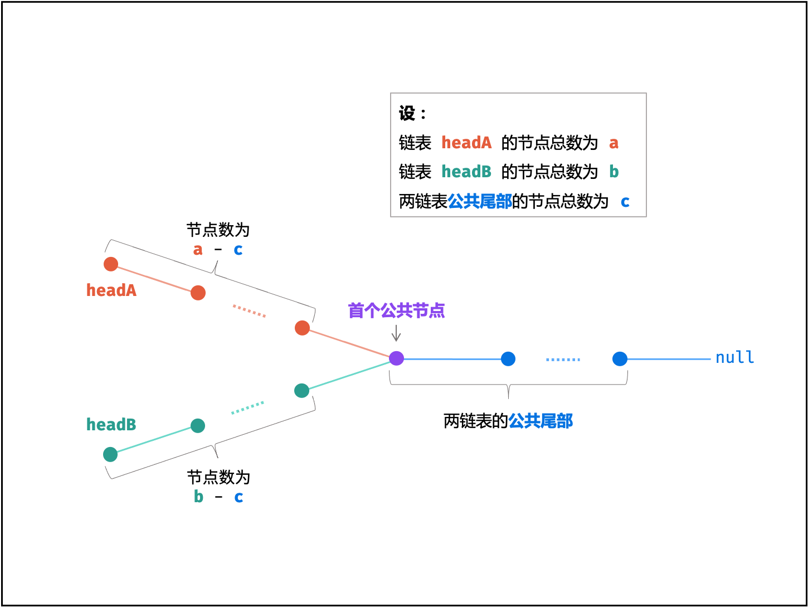

# Java实现链表

这里给出单链表的 Java 实现。

```java
public class utils.ListNode {
    int val;
    utils.ListNode next;

    utils.ListNode (int x) {
        val = x;
    }

}

```

---


# 移除重复节点

编写代码，移除未排序链表中的重复节点。保留最开始出现的节点。


## 解法一：哈希表

对给定的链表进行遍历，并用一个集合保存未出现过的值，同时删除已出现的值，为了方便操作，可增加一个哨兵节点指向头结点。这样同时解决链表为空时算法出现异常的问题。

```java
public utils.ListNode removeDuplicateNodes(utils.ListNode head) {
    HashSet<Integer> vals = new HashSet<Integer>();
    utils.ListNode pre = new utils.ListNode(0);
    pre.next = head;
    utils.ListNode node = head;
    while (node != null) {
        if(vals.contains(node.val)) {
            pre.next = node.next;
            node = node.next;
        } else {
            vals.add(node.val);
            pre = node;
            node = node.next;
        }
    }
    return head;
}

```


## 解法二：双重遍历

考虑题目描述中的「进阶」部分，是否存在一种不使用临时缓冲区（也就是方法一中的哈希表）的方法呢？

不幸的是，在保证方法一时间复杂度 $O(N)$ 的前提下，是不存在这样的方法的。因此我们需要增加时间复杂度，使得我们可以仅使用常数的空间来完成本题。一种简单的方法是，我们在给定的链表上使用两重循环，其中第一重循环从链表的头节点开始，枚举一个保留的节点，这是因为我们保留的是「最开始出现的节点」。第二重循环从枚举的保留节点开始，到链表的末尾结束，将所有与保留节点相同的节点全部移除。

第一重循环枚举保留的节点本身，而为了编码方便，第二重循环可以枚举待移除节点的前驱节点，方便我们对节点进行移除。这样一来，我们使用「时间换空间」的方法，就可以不使用临时缓冲区解决本题了。

```java
public utils.ListNode removeDuplicateNodes(utils.ListNode head) {
    utils.ListNode ob = head;
    while (ob != null) {
        utils.ListNode oc = ob;    // 不使用 ob.next，这是为了防止在链表只有一个节点的情况下，出现异常。
        while (oc.next != null) {
            if (oc.next.val == ob.val) {
                oc.next = oc.next.next;
            } else {
                oc = oc.next;
            }
        }
        ob = ob.next;
    }
    return head;
}

```

---


# 公共节点

给你两个单链表的头节点 headA 和 headB ，请你找出并返回两个单链表相交的起始节点。如果两个链表没有交点，返回 null 。

图示两个链表在节点 c1 开始相交：


题目数据 保证 整个链式结构中不存在环。

注意，函数返回结果后，链表必须 保持其原始结构 。

1. 示例 1

   输入：intersectVal = 8, listA = [4,1,8,4,5], listB = [5,0,1,8,4,5], skipA = 2, skipB = 3

   输出：Intersected at '8'

   解释：相交节点的值为 8 （注意，如果两个链表相交则不能为 0）。从各自的表头开始算起，链表 A 为 [4,1,8,4,5]，链表 B 为 [5,0,1,8,4,5]。在 A 中，相交节点前有 2 个节点；在 B 中，相交节点前有 3 个节点。


2. 示例 2

   输入：intersectVal = 0, listA = [2,6,4], listB = [1,5], skipA = 3, skipB = 2

   输出：null

   解释：从各自的表头开始算起，链表 A 为 [2,6,4]，链表 B 为 [1,5]。由于这两个链表不相交，所以 intersectVal 必须为 0，而 skipA 和 skipB 可以是任意值。这两个链表不相交，因此返回 null 。


提示：

1. listA 中节点数目为 m
2. listB 中节点数目为 n
3. 0 <= m, n <= 3 * 104
4. 1 <= Node.val <= 105
5. 0 <= skipA <= m
6. 0 <= skipB <= n
7. 如果 listA 和 listB 没有交点，intersectVal 为 0
8. 如果 listA 和 listB 有交点，intersectVal == listA[skipA + 1] == listB[skipB + 1]


## 解法：双指针

设「第一个公共节点」为 node ，「链表 headA」的节点数量为 a，「链表 headB」的节点数量为 b，「两链表的公共尾部」的节点数量为 c，则有：

- 头节点 headA 到 node 前，共有 $a−c$ 个节点；
- 头节点 headB 到 node 前，共有 $b−c$ 个节点；




考虑构建两个节点指针 A , B 分别指向两链表头节点 headA , headB ，做如下操作：

1. 指针 A 先遍历完链表 headA，再开始遍历链表 headB，当走到 node 时，共走步数为：
   $$
   a + (b - c)
   $$

2. 指针 B 先遍历完链表 headB ，再开始遍历链表 headA ，当走到 node 时，共走步数为：
   $$
   b + (a - c)
   $$

如下式所示，此时指针 A , B 重合，并有两种情况：
$$
a + (b - c) = b + (a - c)
$$

- 若两链表有公共尾部，即$c>0$：指针 A , B 同时指向「第一个公共节点」node。
- 若两链表无公共尾部，即$c=0$：指针 A , B 同时指向 null。

因此返回 A 即可。

```java
public ListNode getIntersectionNode(ListNode headA, ListNode headB) {
    utilsListNode A = headA, B = headB;
    while (A != B) {
        A = (A != null ? A.next : headB);
        B = (B != null ? B.next : headA);
    }
    return A;
}

```

---


# 合并两个有序链表

将两个升序链表合并为一个新的 **升序** 链表并返回。新链表是通过拼接给定的两个链表的所有节点组成的。

**示例 1：**


```
输入：l1 = [1,2,4], l2 = [1,3,4]
输出：[1,1,2,3,4,4]
```


**示例 2：**

```
输入：l1 = [], l2 = []
输出：[]
```


**示例 3：**

```
输入：l1 = [], l2 = [0]
输出：[0]
```

 

**提示：**

- 两个链表的节点数目范围是 `[0, 50]`
- `-100 <= Node.val <= 100`
- `l1` 和 `l2` 均按 **非递减顺序** 排列


## 解法一：递归

我们可以如下递归地定义两个链表里的 merge 操作（忽略边界情况，比如空链表等）：

$$
\left\{ 
\begin{array}{ll} 
list1[0] + merge(list1[1:], list2) & list1[0] < list2[0] 
\\ list2[0] + merge(list1, list2[1:]) & otherwise 
\end{array} \right.
$$

也就是说，两个链表头部值较小的一个节点与剩下元素的 merge 操作结果合并。

我们直接将以上递归过程建模，同时需要考虑边界情况：

如果 l1 或者 l2 一开始就是空链表 ，那么没有任何操作需要合并，所以我们只需要返回非空链表。否则，我们要判断 l1 和 l2 哪一个链表的头节点的值更小，然后递归地决定下一个添加到结果里的节点。如果两个链表有一个为空，递归结束。

```java
public ListNode mergeTwoLists(ListNode l1, ListNode l2) {
    if (l1 == null) {
        return l2;
    } else if (l2 == null) {
        return l1;
    } else if (l1.val < l2.val) {
        l1.next = mergeTwoLists(l1.next, l2);
        return l1;
    } else {
        l2.next = mergeTwoLists(l1, l2.next);
        return l2;
    }
}
```


## 解法二：迭代

我们可以用迭代的方法来实现上述算法。当 l1 和 l2 都不是空链表时，判断 l1 和 l2 哪一个链表的头节点的值更小，将较小值的节点添加到结果里，当一个节点被添加到结果里之后，将对应链表中的节点向后移一位。

首先，我们设定一个哨兵节点 ==prehead== ，这可以在最后让我们比较容易地返回合并后的链表。我们维护一个 ==prev== 指针，我们需要做的是调整它的 next 指针。然后，我们重复以下过程，直到 l1 或者 l2 指向了 null：

1. l1.val <= l2.val: 我们就把 l1 当前的节点接在 prev 节点的后面同时将 l1 指针往后移一位。
2. l1.val > l2.val: 将 l2 当前节点接在 prev 节点的后面，同时将 l2 指针往后移一位。

不管我们将哪一个元素接在了后面，我们都需要把 prev 向后移一位。

在循环终止的时候， l1 和 l2 至多有一个是非空的。由于输入的两个链表都是有序的，所以不管哪个链表是非空的，它包含的所有元素都比前面已经合并链表中的所有元素都要大。这意味着我们只需要简单地将非空链表接在合并链表的后面，并返回合并链表即可。

```java
public ListNode mergeTwoLists(ListNode l1, ListNode l2) {
    ListNode prehead = new ListNode(-1);

    ListNode prev = prehead;
    while (l1 != null && l2 != null) {
        if (l1.val <= l2.val) {
            prev.next = l1;
            l1 = l1.next;
        } else {
            prev.next = l2;
            l2 = l2.next;
        }
        prev = prev.next;
    }

    // 合并后 l1 和 l2 最多只有一个还未被合并完，我们直接将链表末尾指向未合并完的链表即可
    prev.next = l1 == null ? l2 : l1;

    return prehead.next;
}
```

---


# 环形链表

给你一个链表的头节点 head ，判断链表中是否有环。

如果链表中有某个节点，可以通过连续跟踪 next 指针再次到达，则链表中存在环。 为了表示给定链表中的环，评测系统内部使用整数 pos 来表示链表尾连接到链表中的位置（索引从 0 开始）。注意：pos 不作为参数进行传递 。仅仅是为了标识链表的实际情况。

如果链表中存在环 ，则返回 true 。 否则，返回 false 。

1. 示例 1

   输入：head = [3,2,0,-4], pos = 1

   输出：true

   解释：链表中有一个环，其尾部连接到第二个节点。


2. 示例 2

   输入：head = [1], pos = -1

   输出：false

   解释：链表中没有环。


## 解法：龟兔赛跑算法

假想「乌龟」和「兔子」在链表上移动，「兔子」跑得快，「乌龟」跑得慢。当「乌龟」和「兔子」从链表上的同一个节点开始移动时，如果该链表中没有环，那么「兔子」将一直处于「乌龟」的前方；如果该链表中有环，那么「兔子」会先于「乌龟」进入环，并且一直在环内移动。等到「乌龟」进入环时，由于「兔子」的速度快，它一定会在某个时刻与乌龟相遇，即套了「乌龟」若干圈。

我们可以根据上述思路来解决本题。具体地，我们定义两个指针，一快一满。慢指针每次只移动一步，而快指针每次移动两步。初始时，慢指针在位置 head，而快指针在位置 head.next。这样一来，如果在移动的过程中，快指针反过来追上慢指针，就说明该链表为环形链表。否则快指针将到达链表尾部，该链表不为环形链表。

**注意：**

为什么我们要规定初始时慢指针在位置 head，快指针在位置 head.next，而不是两个指针都在位置 head（即与「乌龟」和「兔子」中的叙述相同）？因为我们使用的是 while 循环，循环条件先于循环体。由于循环条件一定是判断快慢指针是否重合，如果我们将两个指针初始都置于 head，那么 while 循环就不会执行。因此，我们可以假想一个在 head 之前的虚拟节点，慢指针从虚拟节点移动一步到达 head，快指针从虚拟节点移动两步到达 head.next，这样我们就可以使用 while 循环了。当然，我们也可以使用 do-while 循环。此时，我们就可以把快慢指针的初始值都置为 head。

```java
public boolean hasCycle(ListNode head) {
    if (head == null || head.next == null) {
        return false;
    }
    ListNode slow = head;
    ListNode fast = head.next;
    while (slow != fast) {
        if (fast == null || fast.next == null) {
            return false;
        }
        slow = slow.next;
        fast = fast.next.next;
    }
    return true;
}

```

---

